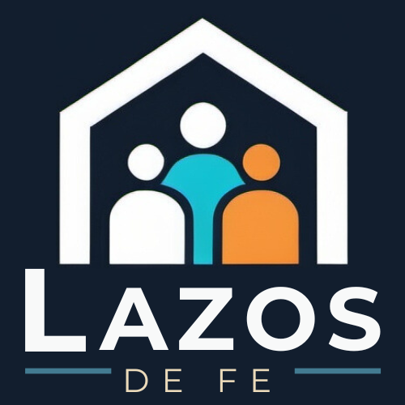

<p align="center">
  
</p>

<h1 align="center">Lazos de Fe</h1>

<p align="center">
  <em>Plataforma web de gestión de miembros y emprendimientos para una comunidad basada en la fe.</em>
</p>

<p align="center">
  
  
  
  
  
  
</p>

---

Permite a los miembros registrarse, publicar emprendimientos (ideas de negocio o proyectos), y participar en un flujo de aprobación administrado. Construida con Laravel 11 y Filament 3 como panel de administración.

## 📑 Tabla de Contenidos

- [✨ Características Principales](#-características-principales)
- [🛠️ Stack Tecnológico](#️-stack-tecnológico)
- [📋 Prerequisitos](#-prerequisitos)
- [🚀 Instalación y Configuración](#-instalación-y-configuración)
- [🐳 Servicios Docker](#-servicios-docker)
- [🏗️ Arquitectura de la Aplicación](#️-arquitectura-de-la-aplicación)
- [📊 Modelo de Datos](#-modelo-de-datos)
- [🔄 Flujos de Trabajo](#-flujos-de-trabajo)
- [⌨️ Comandos Útiles](#️-comandos-útiles)
- [🧪 Testing](#-testing)
- [🌐 Despliegue en Producción](#-despliegue-en-producción)

## ✨ Características Principales

- **Gestión de Membresías** — Registro, aprobación y renovación de miembros con sistema de patrocinio (invitaciones)
- **Publicación de Emprendimientos** — Los miembros crean y envían emprendimientos para aprobación
- **Flujo de Aprobación** — Los administradores aprueban o rechazan emprendimientos con retroalimentación
- **Favoritos y Calificaciones** — Los miembros pueden marcar emprendimientos como favoritos y calificarlos
- **Comentarios** — Sistema polimórfico de comentarios sobre emprendimientos y miembros
- **Categorías Jerárquicas** — Clasificación de emprendimientos en categorías padre-hijo
- **Gestión de Medios** — Adjuntar imágenes y archivos a emprendimientos
- **Registro de Actividad** — Auditoría de cambios con Spatie Activity Log
- **Control de Acceso por Roles** — Permisos personalizados para usuarios administrativos
- **Contenido Dinámico** — Textos editables para correos electrónicos y elementos de la interfaz
- **Captcha** — Protección contra bots en formularios públicos

## 🛠️ Stack Tecnológico

| Tecnología | Versión | Propósito |
|------------|---------|-----------|
| PHP | ^8.3 | Lenguaje del servidor |
| Laravel | ^11.0 | Framework backend |
| Filament | ^3.3 | Paneles de administración y formularios |
| MySQL | 8.0 | Base de datos (desarrollo) |
| MariaDB | jammy | Base de datos (producción) |
| Tailwind CSS | ^3.4 | Estilos del frontend |
| Vite | ^4.0 | Empaquetador de assets |
| Laravel Sail | ^1.25 | Entorno Docker para desarrollo |
| Pest | ^2.34 | Framework de pruebas |
| Caddy | 2.10 | Servidor web en producción (HTTPS automático) |

### Dependencias Destacadas

- **laravel/sanctum** — Autenticación de API
- **spatie/laravel-activitylog** — Registro de auditoría
- **lorisleiva/laravel-actions** — Patrón de acciones
- **codewithdennis/filament-select-tree** — Selección jerárquica en formularios
- **marcogermani87/filament-captcha** — Protección CAPTCHA
- **jenssegers/agent** — Detección de navegador/dispositivo

## 📋 Prerequisitos

- **Docker** y **Docker Compose** instalados
- **Git** para clonar el repositorio

> No se necesita instalar PHP, Composer, ni Node.js localmente — todo se ejecuta dentro de los contenedores Docker.

## 🚀 Instalación y Configuración

### 1. Clonar el repositorio

```bash
git clone <url-del-repositorio> lazos-de-fe
cd lazos-de-fe
```

### 2. Instalar dependencias de Composer

```bash
docker run --rm -v "$(pwd):/app" -w /app composer:latest composer install --ignore-platform-reqs
```

### 3. Configurar el entorno

```bash
cp .env.example .env
```

> Si no existe `.env.example`, crear `.env` manualmente con las siguientes variables mínimas:

```env
APP_NAME="Lazos de Fe"
APP_ENV=local
APP_KEY=
APP_DEBUG=true
APP_URL=http://localhost

DB_CONNECTION=mysql
DB_HOST=mysql
DB_PORT=3306
DB_DATABASE=laravel
DB_USERNAME=sail
DB_PASSWORD=password

MAIL_MAILER=smtp
MAIL_HOST=mailpit
MAIL_PORT=1025

WWWGROUP=1000
WWWUSER=1000
```

### 4. Construir y levantar los contenedores

```bash
docker compose build
docker compose up -d
```

### 5. Generar la clave de la aplicación

```bash
docker compose exec app php artisan key:generate
```

### 6. Ejecutar migraciones y seeders

```bash
docker compose exec app php artisan migrate --seed
```

Esto crea las tablas de la base de datos y ejecuta los seeders iniciales: `RoleSeeder`, `UserSeeder`, y `ConfigSeeder`.

### 7. Corregir permisos de almacenamiento

```bash
docker compose exec app chown -R sail:sail /var/www/html/storage /var/www/html/bootstrap/cache
```

### 8. Verificar la instalación

Abre [http://localhost](http://localhost) en tu navegador. La aplicación debería estar corriendo.

## 🐳 Servicios Docker

### Desarrollo (`docker-compose.yml`)

| Servicio | Contenedor | Puerto(s) | Descripción |
|----------|------------|-----------|-------------|
| App | app-lazosdefe | 80, 5173 | Aplicación Laravel con PHP 8.4 (Sail) |
| MySQL | mysql-lazosdefe | 3306 | Base de datos MySQL 8.0 |
| Mailpit | mailpit-lazosdefe | 1025 (SMTP), 8025 (UI) | Captura de correos en desarrollo |
| phpMyAdmin | phpmyadmin-lazosdefe | 8000 | Interfaz web para la base de datos |

### Producción (`docker-compose.prod.yml`)

| Servicio | Contenedor | Descripción |
|----------|------------|-------------|
| App | app-lazosdefe | PHP 8.4 FPM Alpine |
| Caddy | caddy-lazosdefe | Servidor web con HTTPS automático |
| MariaDB | mariadb-lazosdefe | Base de datos MariaDB |
| phpMyAdmin | phpmyadmin-lazosdefe | Solo con perfil `dev` |
| Mailpit | mailpit-lazosdefe | Solo con perfil `dev` |

## 🏗️ Arquitectura de la Aplicación

La aplicación tiene tres paneles construidos con Filament:

### Panel Admin (`/admin`)

Panel de administración para el equipo interno. Gestiona:

- **Miembros** — Aprobación, rechazo y administración de miembros
- **Emprendimientos** — Aprobación, rechazo y gestión de contenido
- **Categorías** — Clasificación jerárquica de emprendimientos
- **Usuarios** — Usuarios administrativos del sistema
- **Roles** — Control de acceso basado en permisos
- **Textos** — Plantillas de correo y contenido dinámico de la UI
- **Configuraciones** — Ajustes generales de la aplicación

### Panel Miembro (`/member`)

Panel para miembros registrados de la comunidad:

- **Mis Emprendimientos** — Crear, editar y ver emprendimientos propios
- **Favoritos** — Emprendimientos marcados como favoritos
- **Perfil** — Editar información personal y de contacto
- **Registro** — Formulario de registro con términos y condiciones

### Panel Emprendimientos (`/app`)

Panel público para explorar emprendimientos:

- **Lista de Emprendimientos** — Navegar emprendimientos activos y aprobados
- **Detalle** — Ver información completa de un emprendimiento
- **Vista Previa** — Previsualizar emprendimientos con fecha de expiración

## 📊 Modelo de Datos

### Entidades Principales

```
Miembro ────┬──── crea ──────→ Emprendimiento ←──── clasificado por ──── Categoría
            │                       ↑                                       ↑
            ├──── favorito ──→ Favorito                               (jerárquica)
            │
            ├──── comenta ───→ Comentario (polimórfico)
            │
            └──── patrocinado → Invitación ← Miembro (padrino)
```

- **Miembro** — Participante de la comunidad. Tipos: visitante o miembro. Estados de membresía: indefinido, pendiente, aprobado, rechazado. Puede tener contactos, emprendimientos, favoritos y comentarios.
- **Emprendimiento** — Idea de negocio o proyecto creado por un miembro. Tiene categorías (muchos a muchos), medios, comentarios, favoritos, adjuntos, tags y contadores de vistas.
- **Categoría** — Sistema jerárquico padre-hijo para clasificar emprendimientos.
- **Rol** — Permisos de acceso para usuarios administrativos (array JSON de permisos).
- **Favorito** — Relación miembro-emprendimiento con calificación opcional.
- **Comentario** — Polimórfico: puede pertenecer a un emprendimiento o a un miembro.

## 🔄 Flujos de Trabajo

### Estados de Aprobación de Emprendimientos

```
Nuevo → Aprobación → Aprobado
                   ↘ Rechazado → Actualizado → Aprobación → ...
```

| Estado | Descripción |
|--------|-------------|
| Nuevo | Emprendimiento recién creado |
| Actualizado | Emprendimiento rechazado y re-enviado con cambios |
| Aprobación | En revisión por un administrador |
| Aprobado | Activo y visible públicamente |
| Rechazado | Rechazado con motivo explicado |

### Estados de Membresía

```
Indefinido → Pendiente → Aprobado
                       ↘ Rechazado
```

| Estado | Descripción |
|--------|-------------|
| Indefinido | Estado inicial al registrarse |
| Pendiente | Solicitud enviada, esperando aprobación |
| Aprobado | Miembro activo de la comunidad |
| Rechazado | Solicitud de membresía rechazada |

## ⌨️ Comandos Útiles

### Artisan (dentro del contenedor)

```bash
# Ejecutar migraciones
docker compose exec app php artisan migrate

# Ejecutar migraciones con seeders
docker compose exec app php artisan migrate --seed

# Revertir última migración
docker compose exec app php artisan migrate:rollback

# Consola interactiva (Tinker)
docker compose exec app php artisan tinker

# Limpiar caché
docker compose exec app php artisan cache:clear
docker compose exec app php artisan config:clear
docker compose exec app php artisan route:clear
docker compose exec app php artisan view:clear

# Listar rutas
docker compose exec app php artisan route:list

# Actualizar assets de Filament
docker compose exec app php artisan filament:upgrade

# Crear usuario de Filament
docker compose exec app php artisan make:filament-user
```

### Docker

```bash
# Levantar todos los servicios
docker compose up -d

# Detener todos los servicios
docker compose down

# Ver logs de la aplicación
docker compose logs -f app

# Acceder al contenedor de la aplicación
docker compose exec app bash
```

### Frontend (dentro del contenedor)

```bash
# Instalar dependencias de Node.js
docker compose exec app npm install

# Compilar assets para desarrollo (con hot reload)
docker compose exec app npm run dev

# Compilar assets para producción
docker compose exec app npm run build
```

## 🧪 Testing

El proyecto usa [Pest](https://pestphp.com/) como framework de pruebas.

```bash
# Ejecutar todas las pruebas
docker compose exec app php artisan test

# Ejecutar pruebas con Pest directamente
docker compose exec app ./vendor/bin/pest

# Ejecutar pruebas de una carpeta específica
docker compose exec app php artisan test --testsuite=Feature
docker compose exec app php artisan test --testsuite=Unit
```

## 🌐 Despliegue en Producción

El archivo `docker-compose.prod.yml` define la configuración de producción con:

- **PHP 8.4 FPM Alpine** como servidor de aplicación
- **Caddy 2.10** como servidor web con HTTPS automático
- **MariaDB** como base de datos
- Red externa `caddynet` para comunicación entre servicios

Los servicios de desarrollo (phpMyAdmin, Mailpit) están disponibles solo con el perfil `dev`.

```bash
# Levantar en producción
docker compose -f docker-compose.prod.yml --profile prod up -d

# Levantar con herramientas de desarrollo incluidas
docker compose -f docker-compose.prod.yml --profile prod --profile dev up -d
```

---

<p align="center">
  <strong>Lazos de Fe</strong> — Construyendo comunidad a través de la fe y el emprendimiento.
</p>
