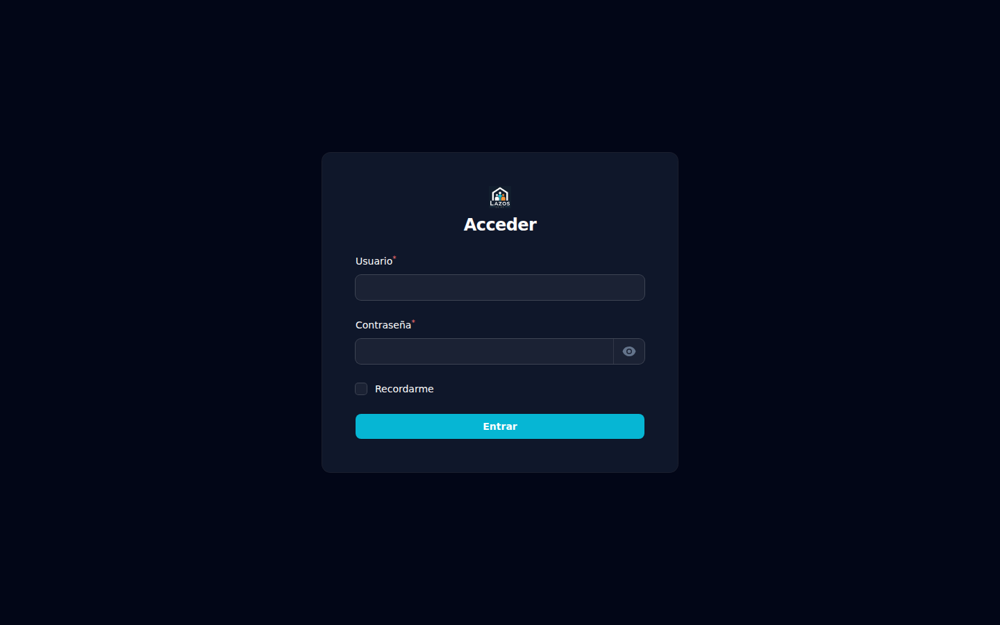

# Capítulo 2 — Acceso y sesión

Este capítulo explica cómo iniciar sesión en el panel `/admin`, identificar visualmente el rol con el que ha entrado y cerrar la sesión de forma segura. Incluye, además, las medidas que el sistema aplica para prevenir intentos automatizados de acceso y cómo proceder cuando un inicio de sesión falla repetidamente.

## 2.1 Requisitos previos

Antes de intentar el primer acceso, verifique los siguientes puntos. Si alguno no se cumple, contacte al equipo de implementación antes de continuar:

- Su usuario administrador fue creado previamente. El panel no permite el auto-registro: las cuentas se crean desde la propia interfaz por otro administrador con permisos suficientes (capítulo 7).
- Conoce el **nombre de usuario** (campo `username`) y la contraseña inicial que le entregaron. El panel `/admin` usa nombre de usuario, no correo electrónico, a diferencia del panel `/member` ([`app/Filament/Admin/Pages/Auth/Login.php:22`](../../../app/Filament/Admin/Pages/Auth/Login.php)).
- La URL del panel administrativo es `<URL_BASE>/admin`, donde `<URL_BASE>` es el dominio del despliegue. En el entorno local Sail, la URL típica es `http://localhost/admin`.
- Su navegador acepta cookies de sesión y no está en modo privado con bloqueo de almacenamiento, dado que Filament requiere sesión persistente para mantener la autenticación.

> **Nota.** En la primera sesión es recomendable cambiar la contraseña inicial inmediatamente después del primer login. El procedimiento se describe en la sección 2.5.

## 2.2 Iniciar sesión

*Figura 2.1 — Pantalla de inicio de sesión del panel `/admin`. El campo superior es **Nombre de usuario** (no correo electrónico); el inferior es la contraseña; el botón principal envía las credenciales.*

Para iniciar sesión:

1. Abra `<URL_BASE>/admin` en su navegador.
2. Ingrese su nombre de usuario en el primer campo.
3. Ingrese su contraseña en el segundo campo. Puede mostrarla momentáneamente pulsando el ícono del ojo a la derecha del campo.
4. Si el entorno está configurado para producción, aparecerá un componente **CAPTCHA** que deberá resolver para confirmar que no es un acceso automatizado. En entornos de desarrollo (`local` y `testing`) este componente se omite intencionalmente ([`app/Filament/Admin/Pages/Auth/Login.php:33-35`](../../../app/Filament/Admin/Pages/Auth/Login.php)).
5. Si desea que el navegador recuerde su sesión, marque la casilla **Recordarme**.
6. Pulse el botón **Iniciar sesión**.

**Qué esperar después.** El sistema valida las credenciales y, si son correctas, lo redirige al dashboard administrativo (Figura 1.1). En la esquina superior derecha verá una etiqueta que indica el rol con el que ha entrado, junto a un menú con su perfil y la opción de cierre de sesión.

## 2.3 Indicador visual del rol activo

El panel inserta un texto descriptivo a la derecha del buscador global con el formato `ADMIN - <NOMBRE DEL ROL>`. Esta marca se renderiza desde el render hook `GLOBAL_SEARCH_AFTER` definido en [`app/Providers/Filament/AdminPanelProvider.php:71-74`](../../../app/Providers/Filament/AdminPanelProvider.php) y sirve como recordatorio constante del contexto en el que está operando.

> **Buena práctica.** Si administra varios entornos (producción, staging, local) en pestañas paralelas, fíjese siempre en este badge antes de ejecutar una acción destructiva. Es la indicación más visible de qué cuenta y qué entorno está operando en la pestaña activa.

## 2.4 Errores de autenticación

Cuando las credenciales no son válidas, el sistema muestra un mensaje genérico bajo el campo de nombre de usuario. El mensaje no distingue entre "usuario inexistente" y "contraseña incorrecta" para no facilitar la enumeración de cuentas, según se implementa en [`app/Filament/Admin/Pages/Auth/Login.php:49-54`](../../../app/Filament/Admin/Pages/Auth/Login.php).

Si el problema persiste, considere lo siguiente antes de pedir ayuda:

- Verifique que está en el panel correcto: `/admin` es para super-administradores y moderadores; `/member` es para organizaciones y candidatos. Las cuentas no se comparten entre paneles.
- Verifique que el campo **Nombre de usuario** contiene su usuario, no su correo electrónico.
- Pruebe en una ventana privada para descartar problemas con cookies viejas.
- Si recibe un usuario nuevo y la contraseña inicial no funciona, contacte al administrador que creó la cuenta para que regenere la contraseña: la auto-recuperación por correo no está habilitada en el panel `/admin` por decisión de seguridad.

> **Importante.** Tras múltiples intentos fallidos en producción, el componente CAPTCHA puede solicitarle un desafío adicional. Si el bloqueo persiste, abandone la pantalla, espere algunos minutos y reintente. No solicite al equipo técnico restablecer su cuenta hasta haber agotado estos pasos: la mayoría de los bloqueos se resuelven con paciencia y verificación cuidadosa de la contraseña.

## 2.5 Cambiar su contraseña

El propio panel ofrece una página de edición del perfil donde puede actualizar su contraseña sin asistencia del equipo técnico. La ruta es accesible desde el menú de usuario en la esquina superior derecha.

Para cambiar su contraseña:

1. Haga clic sobre su nombre de usuario en la esquina superior derecha.
2. Seleccione **Editar perfil** en el menú desplegable.
3. En el formulario, complete el campo de contraseña actual con su contraseña vigente.
4. Introduzca la nueva contraseña en el campo correspondiente y vuelva a escribirla en el campo de confirmación.
5. Pulse **Guardar**.

**Qué esperar después.** El sistema valida que la contraseña actual sea correcta y que la nueva cumpla los requisitos mínimos de longitud y complejidad. Si todo es correcto, los cambios se aplican inmediatamente y la sesión actual continúa activa. La próxima vez que cierre sesión y vuelva a entrar deberá usar la nueva contraseña.

> **Buena práctica.** Use un gestor de contraseñas. El panel `/admin` no envía recordatorios ni preguntas de seguridad: si pierde la contraseña, la única vía de recuperación es que otro administrador la regenere desde la sección de usuarios (capítulo 7).

## 2.6 Cerrar sesión

Para cerrar sesión:

1. Haga clic sobre su nombre de usuario en la esquina superior derecha.
2. Seleccione **Cerrar sesión** en el menú desplegable.

**Qué esperar después.** El sistema invalida la sesión actual, borra las cookies de Filament asociadas y lo redirige a la pantalla de inicio de sesión. La opción **Recordarme**, si la usó previamente, no sobrevive al cierre explícito: deberá ingresar credenciales completas en el próximo acceso.

> **Atención.** Cerrar la pestaña del navegador **no** equivale a cerrar sesión: la sesión persiste durante el tiempo configurado del sistema y puede ser reabierta si otra persona accede al equipo. Cierre sesión explícitamente cuando deje el equipo desatendido en entornos compartidos.

## 2.7 Sesiones simultáneas

El sistema permite que su cuenta esté activa en varios navegadores o dispositivos a la vez. Cada sesión es independiente: cerrar sesión en un dispositivo no cierra las demás. Si sospecha que su cuenta está abierta en un equipo al que ya no tiene acceso, contacte al administrador para que regenere su contraseña, lo que invalida implícitamente las sesiones activas en otros dispositivos en el próximo intento de uso.

## 2.8 Resumen

| Acción | Ruta o ubicación |
|---|---|
| Iniciar sesión | `<URL_BASE>/admin` |
| Identificar el rol activo | Etiqueta `ADMIN - <ROL>` a la derecha del buscador global |
| Cambiar contraseña | Menú de usuario → **Editar perfil** |
| Cerrar sesión | Menú de usuario → **Cerrar sesión** |

En este punto usted ha entrado al panel y conoce los mecanismos básicos de gestión de su propia sesión. El capítulo siguiente describe el dashboard y los cuatro widgets que componen la vista de bienvenida.
