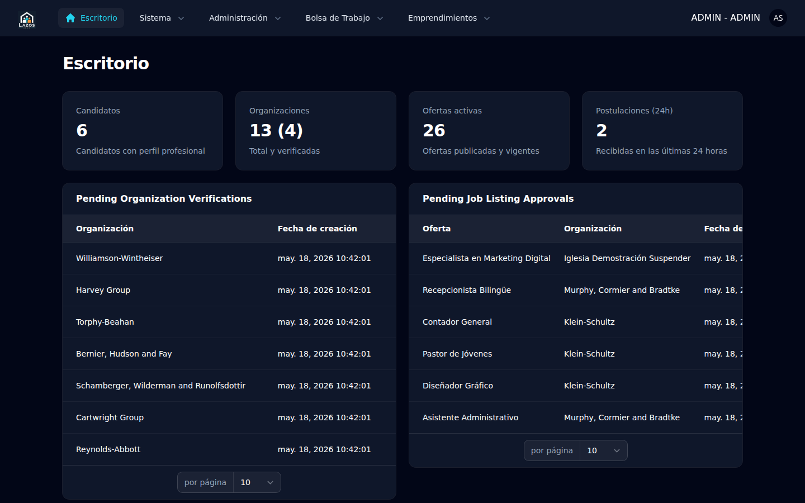

# Capítulo 3 — Dashboard y widgets

El dashboard es la primera vista del panel `/admin` tras iniciar sesión. En la versión 1.0 reúne cuatro widgets introducidos por la especificación 009 que entregan, en una sola pantalla, las métricas globales del módulo Bolsa de Trabajo y las dos colas de trabajo más relevantes para el administrador: organizaciones por verificar y empleos por aprobar. Este capítulo describe cada widget, las consultas que ejecuta, cuándo se actualizan y cómo navegar desde ellos al detalle correspondiente.

*Figura 3.1 — Dashboard administrativo de CBC Workplace v1.0. De arriba abajo: panel de estadísticas globales, lista de verificaciones de organizaciones pendientes, lista de empleos pendientes de aprobación, y postulaciones recientes.*

## 3.1 Visibilidad

Los cuatro widgets sólo se renderizan para usuarios con permiso de administrador. La comprobación se hace en el método `canView()` de cada widget contra `User->isAdmin()`; por ejemplo, en [`app/Filament/Admin/Widgets/JobBoardStatsOverview.php:29-34`](../../../app/Filament/Admin/Widgets/JobBoardStatsOverview.php). Si su cuenta no tiene el rol adecuado, no verá los widgets aunque sí pueda entrar al panel.

> **Nota.** Si entra al panel y el dashboard aparece vacío o sólo muestra el saludo de Filament, su cuenta probablemente no tiene el rol de administrador asignado. Solicite al equipo de soporte que revise su asignación en la sección de **Usuarios** (capítulo 7).

## 3.2 Widget 1 — Estadísticas globales del módulo

El widget *JobBoardStatsOverview* ocupa el ancho completo del dashboard y muestra cuatro métricas resumen:

| Métrica | Valor mostrado | Fuente |
|---|---|---|
| Candidatos registrados | Cuenta total de perfiles de candidato existentes | Tabla `candidate_profiles` |
| Organizaciones | Total y, entre paréntesis, cuántas están verificadas | Tabla `organizations`, agregando `verification_state = VERIFIED` |
| Ofertas activas | Cantidad de empleos en estado ACTIVE | `job_listings` donde `state = ACTIVE` |
| Postulaciones recientes | Postulaciones enviadas en las últimas 24 horas | `applications` donde `submitted_at >= now() - 1 día` |

La implementación consolida las dos primeras métricas en una sola consulta agregada para evitar dos viajes a la base de datos ([`JobBoardStatsOverview.php:38-43`](../../../app/Filament/Admin/Widgets/JobBoardStatsOverview.php)).

> **Atención.** Estas métricas se calculan cada vez que se carga la página del dashboard; no hay caché ni polling automático (`pollingInterval = null` en [`JobBoardStatsOverview.php:22`](../../../app/Filament/Admin/Widgets/JobBoardStatsOverview.php)). Si necesita ver un cambio recién aplicado, recargue manualmente la página.

### 3.2.1 Cómo leer la métrica de organizaciones

El valor presenta el formato `total (verificadas)`. Por ejemplo, `28 (15)` significa que existen 28 organizaciones registradas y 15 de ellas tienen su verificación completada. Las organizaciones suspendidas se incluyen en el total pero no en el subtotal de verificadas, ya que su estado de verificación puede coexistir con la suspensión (capítulo 4, sección 4.4).

## 3.3 Widget 2 — Verificaciones de organizaciones pendientes

El widget *PendingOrganizationVerificationsWidget* lista las últimas diez organizaciones con `verification_state = PENDING` que además **no** están suspendidas. La exclusión de organizaciones suspendidas evita que el operador tropiece con cuentas congeladas mientras revisa altas nuevas ([`PendingOrganizationVerificationsWidget.php:37-44`](../../../app/Filament/Admin/Widgets/PendingOrganizationVerificationsWidget.php)).

Cada fila muestra dos columnas:

- **Nombre de la organización**: el `display_name` registrado por la organización. Es un enlace directo a la vista de detalle de la organización.
- **Creada**: fecha y hora de creación del registro.

El widget muestra hasta diez filas. Si hay más de diez verificaciones pendientes, en la cabecera del widget aparece la acción **Ver todas**, que abre el listado completo de organizaciones con el filtro de estado **Pendiente** ya aplicado ([`PendingOrganizationVerificationsWidget.php:74-83`](../../../app/Filament/Admin/Widgets/PendingOrganizationVerificationsWidget.php)).

Para revisar una organización pendiente desde el widget:

1. Identifique la organización en la lista.
2. Haga clic sobre su nombre.
3. Se abrirá la vista de detalle, desde donde puede verificar (capítulo 4, sección 4.3).

**Qué esperar después.** El nombre desaparecerá del widget en cuanto la organización quede verificada, ya que la consulta filtra por `verification_state = PENDING`. La próxima recarga del dashboard reflejará el cambio.

## 3.4 Widget 3 — Aprobaciones de empleos pendientes

El widget *PendingJobListingApprovalsWidget* lista las últimas diez ofertas en estado PENDING. Cada fila muestra:

- **Título**: el título de la oferta, enlace directo a la vista de detalle.
- **Organización**: el nombre comercial de la organización que la publicó.
- **Fecha de creación**: cuándo se envió a aprobación.

Igual que el widget anterior, si hay más de diez ofertas pendientes, en la cabecera aparece **Ver todas**, que abre el listado de empleos filtrado por el estado PENDING ([`PendingJobListingApprovalsWidget.php:64-71`](../../../app/Filament/Admin/Widgets/PendingJobListingApprovalsWidget.php)).

> **Buena práctica.** Revise este widget al menos una vez al día. Las ofertas en PENDING no son visibles en el portal público hasta que reciban aprobación, por lo que cada hora de demora retrasa la captación de candidatos para la organización publicadora.

## 3.5 Widget 4 — Postulaciones recientes

El widget *RecentApplicationsWidget* ocupa el ancho completo y lista las últimas diez postulaciones recibidas, ordenadas por `submitted_at` descendente. Cada fila incluye:

- **Candidato**: nombre del miembro que envió la postulación.
- **Oferta**: título de la oferta postulada (enlace a su vista de detalle).
- **Enviada**: fecha y hora de envío.

Este widget no tiene acción **Ver todas**; el listado completo está bajo el grupo de navegación **Bolsa de Trabajo** → **Postulaciones** (capítulo 8). El propósito de este widget en el dashboard es mantener visible el flujo más reciente, no servir como herramienta primaria de búsqueda.

## 3.6 Orden de los widgets

Los widgets se renderizan en el orden definido por la propiedad estática `$sort` de cada uno:

| Posición | Widget | Sort | Ancho |
|---|---|---|---|
| 1 | Estadísticas globales | 1 | Completo |
| 2 | Verificaciones pendientes | 2 | Mitad |
| 3 | Aprobaciones de empleos pendientes | 3 | Mitad |
| 4 | Postulaciones recientes | 4 | Completo |

Los widgets 2 y 3 se ubican lado a lado porque comparten ancho intermedio. Este orden está pensado para que el ojo del administrador vaya de lo general (estadísticas) a las dos colas de trabajo (verificaciones y aprobaciones) y termine en la lectura más narrativa (postulaciones recientes).

> **Nota.** La modificación del orden requiere cambiar el código fuente. No existe configuración por interfaz para reorganizar los widgets en esta versión.

## 3.7 Cuando un widget aparece vacío

Cada widget muestra un mensaje de estado vacío cuando su consulta no devuelve resultados. Los mensajes están localizados en los archivos de traducción del paquete `widgets/admin/job-board`. Los textos visibles son:

| Widget | Mensaje de vacío típico |
|---|---|
| Verificaciones pendientes | "No hay organizaciones por verificar." |
| Aprobaciones de empleos | "No hay ofertas pendientes de aprobación." |
| Postulaciones recientes | "Aún no se han recibido postulaciones." |

Un estado vacío es **normal**: significa que ninguna organización está esperando verificación o que el catálogo de empleos está al día. No es un error.

## 3.8 Resumen

| Elemento | Ubicación / acción |
|---|---|
| Estadísticas globales | Parte superior del dashboard |
| Cola de verificaciones | Centro izquierdo, "Ver todas" cuando hay más de 10 |
| Cola de aprobaciones | Centro derecho, "Ver todas" cuando hay más de 10 |
| Postulaciones recientes | Parte inferior |
| Refrescar datos | Recarga manual de la página (sin polling) |

Con el dashboard como punto de partida, los capítulos siguientes desarrollan cada flujo en detalle. El próximo capítulo (4) describe la administración de organizaciones, principal cola de trabajo del rol administrador.
