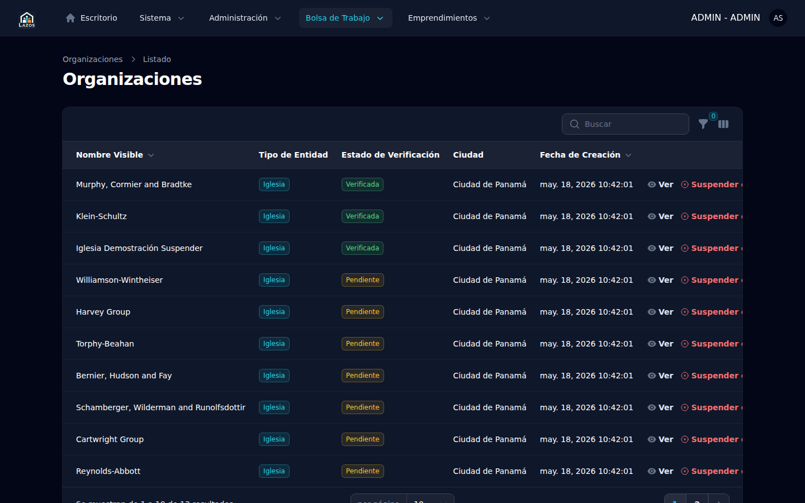
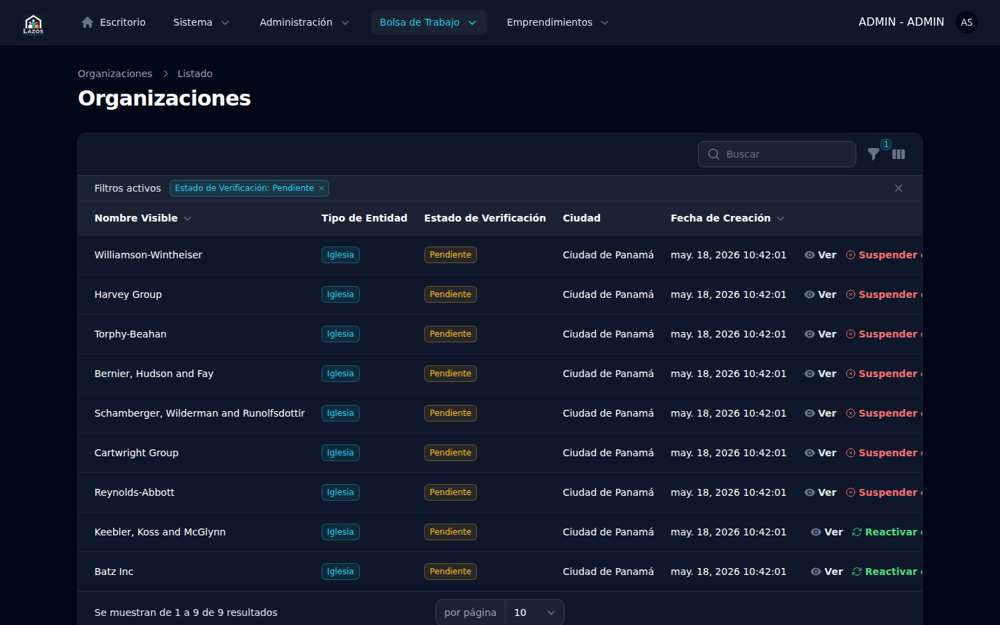
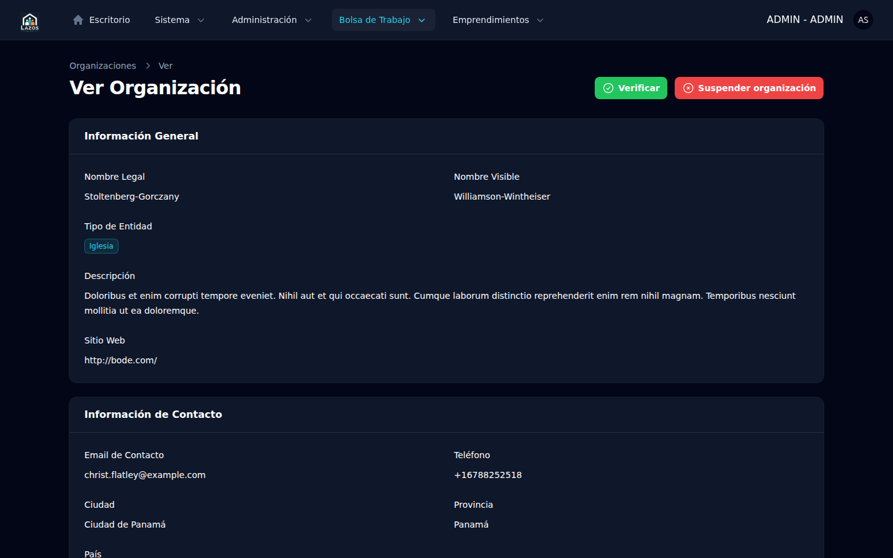
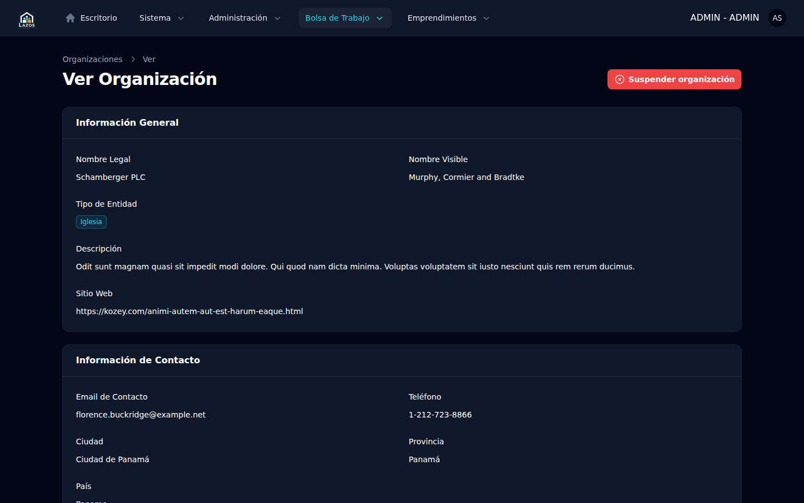
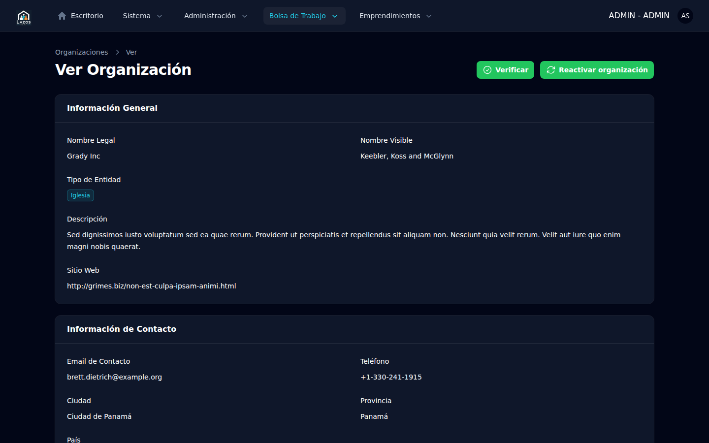

# Capítulo 4 — Organizaciones

Las organizaciones son la entidad central del módulo Bolsa de Trabajo: representan a las iglesias, ministerios y proyectos afines que publican empleos en el portal. Este capítulo cubre los cuatro flujos principales del administrador sobre organizaciones: explorar el listado, **verificar** una organización nueva, **suspender** una organización con problemas, y **reactivar** una organización previamente suspendida. Cada flujo se acompaña con las consecuencias operativas concretas (notificaciones por correo, cierres en cascada, eventos de auditoría) para que usted pueda anticipar el efecto antes de pulsar el botón.

## 4.1 Conceptos previos

### 4.1.1 Dos dimensiones independientes

Una organización tiene **dos** atributos de estado que son ortogonales entre sí:

- **Estado de verificación** (`verification_state`): toma dos valores, `PENDING` (0) o `VERIFIED` (1). Refleja si el equipo administrador ha validado la identidad de la organización. Definido en [`app/Enums/OrganizationVerificationState.php`](../../../app/Enums/OrganizationVerificationState.php).
- **Bandera de suspensión** (`suspended_at`, `suspended_by`, `suspension_reason`): tres columnas en `organizations` que, en conjunto, indican si la organización está congelada operacionalmente. Una organización verificada puede estar suspendida; una organización pendiente también.

> **Importante.** El valor `SUSPENDED` que aparecía como tercer estado de verificación en versiones anteriores fue eliminado en la PR #26 ([commit `0176383`](../../../)). Toda lógica de suspensión vive en columnas independientes para reflejar que es una **decisión operativa**, no una transición de la verificación. Si encuentra referencias antiguas a "estado SUSPENDED" en notas internas, considérelas obsoletas.

### 4.1.2 Acciones del administrador sobre una organización

| Acción | Pre-requisitos | Efecto principal |
|---|---|---|
| Verificar | `verification_state = PENDING` | Establece `verification_state = VERIFIED`, registra al revisor, envía correo a la organización |
| Suspender | `suspended_at IS NULL` | Marca la organización como suspendida, cierra automáticamente todas sus ofertas activas, notifica a la organización |
| Reactivar | `suspended_at IS NOT NULL` | Libera la suspensión. **No** reabre las ofertas cerradas en cascada |

Cada acción es implementada por una clase dedicada bajo `app/Actions/Admin/`, descrita en las secciones 4.3, 4.4 y 4.5.

## 4.2 Listado de organizaciones

Para abrir el listado:

1. En el sidebar, expanda el grupo **Bolsa de Trabajo**.
2. Seleccione **Organizaciones**.

*Figura 4.1 — Listado de organizaciones del panel `/admin`. Cada fila muestra el nombre, el estado de verificación y el indicador de suspensión cuando aplica.*

### 4.2.1 Filtros disponibles

El listado expone filtros para acotar la vista:

- **Estado de verificación**: filtra por `PENDING` o `VERIFIED`.
- **Suspendidas**: filtra organizaciones con `suspended_at IS NOT NULL`.

Para aplicar un filtro:

1. Pulse el ícono de filtros en la cabecera de la tabla.
2. Marque la casilla del filtro deseado.
3. La tabla se actualiza automáticamente.

*Figura 4.2 — Listado filtrado por estado **Pendiente**. Resultado equivalente al que abre el botón **Ver todas** del widget de verificaciones pendientes.*

### 4.2.2 Búsqueda por nombre

El campo de búsqueda en la parte superior izquierda de la tabla filtra por coincidencia con el `display_name` de la organización. La búsqueda es insensible a mayúsculas y minúsculas, y comienza a aplicar tras escribir tres caracteres.

> **Buena práctica.** Para localizar una organización por correo electrónico de su administrador, no use el buscador de la tabla (busca por nombre comercial), sino el **buscador global** de Filament en la cabecera del panel, que indexa más campos.

## 4.3 Verificar una organización

Cuando una organización se registra, queda con `verification_state = PENDING`. El equipo administrador debe revisar la documentación de respaldo (provista por el equipo de soporte externo a este panel) y, si todo es correcto, marcarla como verificada.

*Figura 4.3 — Detalle de una organización en estado **Pendiente**. La cabecera muestra los botones **Verificar** y **Suspender** disponibles.*

### Procedimiento: Verificar una organización pendiente

1. Abra el listado de organizaciones (sección 4.2) y aplique el filtro **Pendiente**, o ingrese al widget *Verificaciones pendientes* del dashboard (capítulo 3, sección 3.3).
2. Haga clic sobre la organización a verificar para abrir su vista de detalle.
3. Revise la información del formulario: nombre comercial, contacto, descripción.
4. En la cabecera, pulse el botón **Verificar**.
5. Confirme en el modal de confirmación.

**Qué esperar después.** El sistema ejecuta [`OrganizationVerification::run()`](../../../app/Actions/Admin/OrganizationVerification.php). Internamente esto:

- Cambia `verification_state` a `VERIFIED` ([`OrganizationVerification.php:46`](../../../app/Actions/Admin/OrganizationVerification.php)).
- Activa la organización (`is_active = true`).
- Registra el nombre del revisor en `verification_by` y la fecha en `verified_at`.
- Añade un comentario interno "Organización verificada" al historial.
- Envía un correo `Mail\Organization\Verified` al miembro administrador de la organización.
- Registra el evento `organization-verified` en la bitácora de auditoría (capítulo 10).

> **Atención.** El correo de verificación se envía sincrónicamente, no por cola (`Mail::to(...)->send(...)` en [`OrganizationVerification.php:52`](../../../app/Actions/Admin/OrganizationVerification.php)). Si el servicio de correo está caído, la operación de verificación fallará. Si esto ocurre, contacte al equipo técnico antes de reintentar.

*Figura 4.4 — Detalle de una organización verificada. La cabecera oculta el botón **Verificar** y deja disponible **Suspender**.*

### 4.3.1 ¿Por qué no existe la acción "Rechazar"?

A diferencia del flujo de aprobación de ofertas (capítulo 5), no hay una acción explícita de **rechazo** para organizaciones. Si una organización no cumple los requisitos, el procedimiento es no verificarla y dejarla en estado pendiente, o suspenderla (sección 4.4) si su presencia en el sistema causa fricción. La decisión arquitectónica está documentada en el comentario de [`OrganizationVerification.php:18-22`](../../../app/Actions/Admin/OrganizationVerification.php): la verificación es una transición unidireccional hacia VERIFIED; cualquier otro escenario se modela vía suspensión.

## 4.4 Suspender una organización

La suspensión es la herramienta para congelar operacionalmente una organización ante:

- Reportes de contenido inapropiado en sus publicaciones.
- Sospecha de uso fraudulento del sistema.
- Pedido explícito de la propia organización para pausar su actividad.
- Acciones legales o disciplinarias que requieran detener publicaciones.

> **Importante.** Suspender una organización **cierra automáticamente todas sus ofertas activas en cascada**. Las ofertas pasan a estado `CLOSED` con la fecha de cierre fijada al momento de la suspensión. Una reactivación posterior **no** reabre estas ofertas. Es decir, la suspensión es reversible pero no es idempotente respecto al catálogo de ofertas.

### Procedimiento: Suspender una organización

1. Abra el detalle de la organización a suspender (debe estar **no suspendida** previamente).
2. En la cabecera, pulse el botón **Suspender**.
3. En el modal, ingrese la **razón** de la suspensión. El campo es opcional pero altamente recomendado para futuras auditorías.
4. Confirme.

**Qué esperar después.** El sistema ejecuta [`SuspendOrganization::run()`](../../../app/Actions/Admin/SuspendOrganization.php) dentro de una transacción atómica que abarca el cambio en la organización y el cierre de ofertas. En orden, los efectos son:

1. Se registran `suspended_at = now()`, `suspended_by = <su nombre>` y `suspension_reason` ([`SuspendOrganization.php:33-37`](../../../app/Actions/Admin/SuspendOrganization.php)).
2. Todas las ofertas de la organización en estado `ACTIVE` pasan a `CLOSED` con `closed_at = now()` ([`SuspendOrganization.php:42-48`](../../../app/Actions/Admin/SuspendOrganization.php)).
3. Cada oferta cerrada recibe un comentario interno generado por el sistema, identificando que la causa fue la suspensión de la organización.
4. La organización recibe un comentario de auditoría con la misma referencia.
5. Se registra el evento `organization-suspended` en la bitácora, con metadatos: IP del operador, número de ofertas cerradas, razón.
6. Se encola un correo `Mail\Organization\Suspended` para cada miembro administrador de la organización (la implementación actual maneja un único miembro por organización; ver [`SuspendOrganization.php:117-120`](../../../app/Actions/Admin/SuspendOrganization.php)).
7. Por cada correo encolado se registra `mail-suspension-dispatch-enqueued`; los fallos quedan como `mail-suspension-dispatch-failed`.

*Figura 4.5 — Detalle de una organización suspendida. La cabecera reemplaza el botón **Suspender** por **Reactivar**.*

> **Atención.** El correo de suspensión se envía vía cola (`Mail::to(...)->queue(...)` en [`SuspendOrganization.php:87`](../../../app/Actions/Admin/SuspendOrganization.php)). Si el worker de cola no está procesando, el correo permanecerá encolado. La acción de suspensión en sí ya quedó persistida en la base aunque el correo se retrase.

### 4.4.1 Idempotencia

Si la organización ya está suspendida y usted vuelve a pulsar **Suspender** (por ejemplo desde una pestaña antigua), la acción retorna `SuspendOrganizationResult::alreadySuspended()` sin efectos colaterales adicionales ([`SuspendOrganization.php:28-30`](../../../app/Actions/Admin/SuspendOrganization.php)). No se cierran más ofertas ni se envían más correos.

## 4.5 Reactivar una organización

La reactivación libera la suspensión. Es la acción inversa, pero **no es simétrica**: no se reabren las ofertas cerradas durante el cierre en cascada de la suspensión.

### Procedimiento: Reactivar una organización suspendida

1. Abra el detalle de la organización suspendida.
2. En la cabecera, pulse el botón **Reactivar**.
3. Confirme la operación.

**Qué esperar después.** El sistema ejecuta [`ReactivateOrganization::run()`](../../../app/Actions/Admin/ReactivateOrganization.php). Esto:

- Nulifica `suspended_at`, `suspended_by` y `suspension_reason`.
- Añade un comentario de auditoría a la organización.
- Registra el evento `organization-reactivated` en la bitácora con la IP del operador.

> **Importante.** La reactivación **no** reabre las ofertas que fueron cerradas en cascada por la suspensión previa. Si la organización quiere volver a publicar esas ofertas, deberá crearlas nuevamente desde su panel `/member` y pasar por el flujo de aprobación. Este comportamiento es intencional para mantener un registro histórico claro y forzar una revisión actualizada del contenido tras un período de suspensión.

### 4.5.1 Reactivación tras reactivación

La acción es idempotente: si la organización no está suspendida, retorna `ReactivateOrganizationResult::notSuspended()` sin tocar la base ([`ReactivateOrganization.php:18-20`](../../../app/Actions/Admin/ReactivateOrganization.php)).

## 4.6 Comentarios internos

El panel admite añadir comentarios libres a una organización desde su vista de detalle. Estos comentarios son privados (no visibles para la organización) y se conservan en la tabla `comments` con `commentable_type = Organization`. Son la herramienta recomendada para documentar conversaciones, acuerdos verbales o contexto que no encaja en los campos estructurados.

Para añadir un comentario interno:

1. Abra el detalle de la organización.
2. Diríjase a la sección de comentarios (al final de la vista).
3. Escriba el comentario y pulse **Guardar**.

**Qué esperar después.** El comentario queda anclado a la organización con marca temporal y autoría. No se notifica a la organización; estos comentarios son exclusivamente para uso interno del equipo administrador.

## 4.7 Bitácora de la organización

Cada acción descrita en este capítulo deja registro en la bitácora del sistema. El detalle de cómo consultar y filtrar la bitácora vive en el capítulo 10. Los eventos relevantes a organizaciones que usted verá en la bitácora son:

| Evento | Origen |
|---|---|
| `organization-verified` | Verificación manual desde el panel |
| `organization-suspended` | Suspensión manual desde el panel (con razón y conteo de ofertas cerradas) |
| `organization-reactivated` | Reactivación manual desde el panel |
| `mail-suspension-dispatch-enqueued` | Correo de suspensión exitosamente encolado |
| `mail-suspension-dispatch-failed` | Fallo al encolar correo (problemas con el servicio de cola) |

## 4.8 Resumen

| Pregunta operativa | Respuesta |
|---|---|
| ¿Cómo verifico una organización? | Detalle → **Verificar** (cabecera) |
| ¿Cómo suspendo una organización? | Detalle → **Suspender** → razón opcional → confirmar |
| ¿La suspensión cierra ofertas? | Sí, en cascada, todas las ACTIVE pasan a CLOSED |
| ¿La reactivación reabre ofertas? | No; las ofertas deben recrearse manualmente |
| ¿Hay acción de "rechazar"? | No para organizaciones; manténgalas en PENDING o suspéndalas |
| ¿Se notifica por correo? | Verificación: síncrono. Suspensión: por cola. Reactivación: no envía correo |

El siguiente capítulo (5) cubre el flujo de ofertas de empleo: aprobación, rechazo y cierre, incluyendo el cierre automático provocado por la suspensión descrita aquí.
