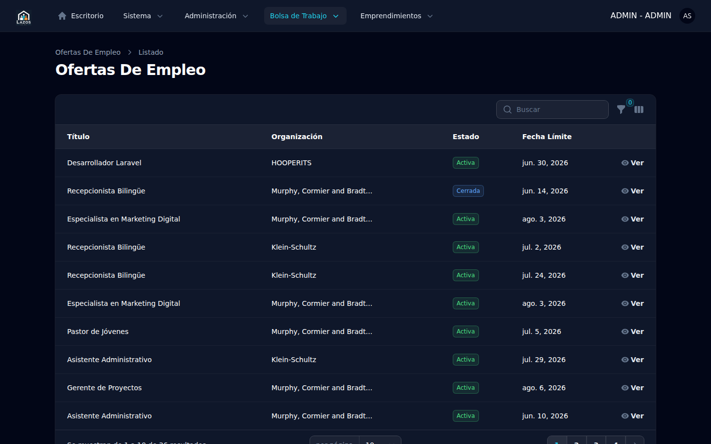
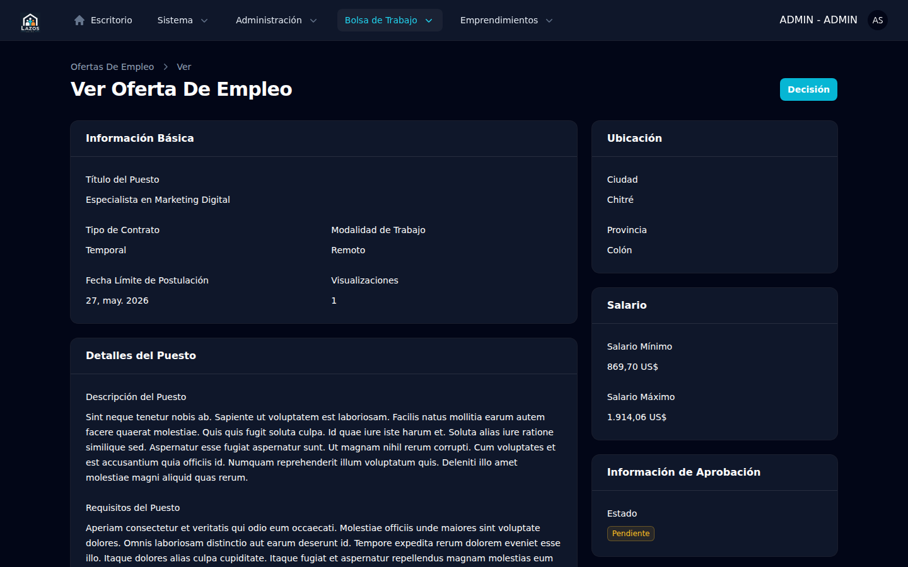
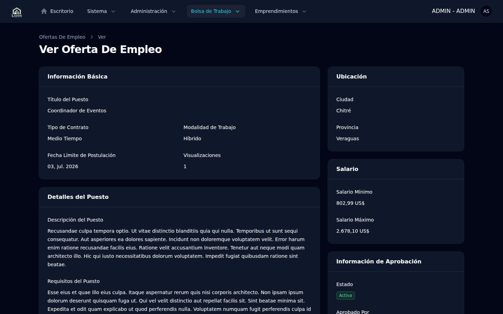

# Capítulo 5 — Empleos

Los empleos son la unidad de trabajo principal del módulo Bolsa de Trabajo. Cada empleo (modelo `JobListing`) atraviesa un ciclo de vida con seis estados posibles. El administrador interviene en dos puntos del ciclo: cuando una oferta llega a estado **Pendiente** y necesita aprobación o rechazo, y excepcionalmente cuando una organización suspendida cierra ofertas en cascada (descrito en el capítulo 4). Este capítulo describe los seis estados, el procedimiento de aprobación y rechazo, y las consecuencias en cada caso.

## 5.1 Ciclo de vida de un empleo

El enum `JobListingState` ([`app/Enums/JobListingState.php`](../../../app/Enums/JobListingState.php)) define los seis valores posibles:

| Estado | Valor | Significado |
|---|---|---|
| `DRAFT` | 0 | Borrador en edición por la organización publicadora. No visible en el panel admin ni en el portal público. |
| `PENDING` | 1 | Enviada a aprobación. Visible al administrador, esperando revisión. |
| `ACTIVE` | 2 | Aprobada y publicada. Visible en el portal público y en los criterios de alertas. |
| `REJECTED` | 3 | Rechazada por el administrador. Visible para la organización con la razón del rechazo. |
| `CLOSED` | 4 | Cerrada manualmente por la organización o automáticamente por suspensión (capítulo 4). |
| `EXPIRED` | 5 | Expirada por vencimiento de su `expires_at`. |

Las transiciones que el administrador inicia son únicamente:

- `PENDING → ACTIVE` (aprobación)
- `PENDING → REJECTED` (rechazo)
- `ACTIVE → CLOSED` en cascada (consecuencia de suspender la organización propietaria, capítulo 4 sección 4.4)

Las demás transiciones (DRAFT → PENDING, ACTIVE → CLOSED voluntario, * → EXPIRED) son responsabilidad de la organización o de procesos automáticos del sistema.

## 5.2 Listado de empleos

Para abrir el listado:

1. Expanda **Bolsa de Trabajo** en el sidebar.
2. Seleccione **Ofertas de empleo**.

*Figura 5.1 — Listado de ofertas en `/admin/job-listings`. La columna **Estado** usa el label localizado del enum `JobListingState`.*

El listado expone dos filtros, definidos en [`app/Filament/Admin/Resources/JobListingResource.php:30-38`](../../../app/Filament/Admin/Resources/JobListingResource.php):

- **Estado**: selector con los seis valores del enum.
- **Organización**: selector con todas las organizaciones registradas, útil para auditar la actividad de un publicador específico.

> **Buena práctica.** Para limpiar regularmente la cola de aprobaciones, aplique el filtro **Estado = Pendiente** desde el listado y trabaje fila por fila desde arriba (las más antiguas) hacia abajo.

## 5.3 Aprobar una oferta pendiente

Cuando una organización publica una oferta, ésta queda en estado `PENDING`. El widget *Aprobaciones de empleos pendientes* del dashboard (capítulo 3, sección 3.4) muestra hasta diez. Para revisar y decidir:

1. Haga clic sobre el título de la oferta en el widget o en el listado, lo que abre la vista de detalle.
2. Lea con atención: título, descripción, requisitos, salario, fecha de vencimiento, organización publicadora.
3. En la cabecera, pulse el botón **Decisión** (la etiqueta exacta depende de la traducción activa).

*Figura 5.2 — Vista de detalle de una oferta `PENDING`. La cabecera ofrece la acción **Decisión** que abre un modal con las opciones Aprobar / Rechazar.*

4. En el modal, seleccione **Aprobar** (mapeado a `ACTIVE`).
5. Opcionalmente añada una memo en el campo **Razón**. Para aprobaciones, la razón es **opcional**; es útil cuando la decisión exigió revisar contenido cuestionable y conviene dejar contexto para futuras auditorías.
6. Confirme.

**Qué esperar después.** El sistema ejecuta [`JobListingApproval::run()`](../../../app/Actions/Admin/JobListingApproval.php) con la rama de aprobación:

- Cambia `state` a `ACTIVE` ([`JobListingApproval.php:36`](../../../app/Actions/Admin/JobListingApproval.php)).
- Fija `published_at = now()`, lo cual marca el momento desde el cual la oferta cuenta para los criterios de alertas instantáneas.
- Registra al revisor en `approval_by` y la marca temporal en `approval_at`.
- Persiste la razón (si la indicó) en `approval_reason`.
- Añade un comentario interno con la decisión y la memo.
- Registra el evento `job-listing.approve` en la bitácora (capítulo 10).
- Envía sincrónicamente el correo `Mail\Member\JobListingApproved` a la organización publicadora.
- Despacha el evento `App\Events\JobListingApproved` que dispara, en cascada, el fan-out de alertas instantáneas a candidatos suscritos (especificación 008).

*Figura 5.3 — Vista de detalle de una oferta `ACTIVE`. La acción **Decisión** desaparece de la cabecera porque la transición ya se ejecutó.*

> **Atención.** El despacho del evento `JobListingApproved` es el último paso de la rama de aprobación ([`JobListingApproval.php:53`](../../../app/Actions/Admin/JobListingApproval.php)) y desencadena el envío de correos de alerta instantánea a los candidatos cuyos criterios coincidan con la oferta. Si el servicio de correo o la cola están degradados, los digests instantáneos pueden retrasarse, pero la aprobación en sí ya quedó persistida.

## 5.4 Rechazar una oferta pendiente

El rechazo se diferencia de la aprobación en tres puntos:

- La razón del rechazo es **obligatoria** (definida en [`ViewJobListing.php:47`](../../../app/Filament/Admin/Resources/JobListingResource/Pages/ViewJobListing.php) como `requiredIf decision = REJECTED`).
- No fija `published_at`, ya que la oferta no llega a publicarse.
- No despacha el evento de alertas: las ofertas rechazadas no entran al pipeline de notificaciones a candidatos.

Para rechazar:

1. Abra la vista de detalle de la oferta.
2. Pulse **Decisión**.
3. Seleccione **Rechazar** (mapeado a `REJECTED`).
4. Complete obligatoriamente la **Razón**. Sea específico: la organización publicadora recibirá un correo con este texto y lo verá en su panel `/member`, por lo que debe ser comprensible y procesable.
5. Confirme.

**Qué esperar después.** El sistema ejecuta `JobListingApproval` con la rama de rechazo:

- Cambia `state` a `REJECTED`.
- Registra `approval_by`, `approval_at`, `approval_reason`.
- Añade un comentario interno con la razón.
- Registra el evento `job-listing.reject` en la bitácora.
- Envía sincrónicamente `Mail\Member\JobListingRejected` a la organización con la razón del rechazo.

> **Importante.** Una vez rechazada, la oferta no se vuelve a aprobar desde el mismo registro. Si la organización quiere reintentar tras corregir el contenido, debe crear una oferta nueva. Esta restricción está protegida por la validación en [`JobListingApproval.php:21-23`](../../../app/Actions/Admin/JobListingApproval.php): la acción rechaza intentos de operar sobre ofertas que no estén en `PENDING`.

## 5.5 Cierres por suspensión

Como se detalla en el capítulo 4 sección 4.4, suspender una organización dispara el cierre en cascada de todas sus ofertas `ACTIVE`, llevándolas a `CLOSED`. Este flujo es automático y no requiere acción manual sobre cada oferta individual. Tras la suspensión, el listado de empleos mostrará las ofertas afectadas en estado `CLOSED` y con el campo `closed_at` igual a la marca temporal de la suspensión.

> **Atención.** La reactivación de la organización **no** revierte el cierre. Las ofertas siguen en `CLOSED` y la organización deberá recrearlas si desea volver a publicarlas.

## 5.6 Empleos expirados

Las ofertas con `expires_at` en el pasado son llevadas a `EXPIRED` por un proceso automatizado del sistema; el administrador no interviene en esta transición. Una oferta expirada permanece visible para fines históricos y de búsqueda interna, pero deja de aparecer en el portal público.

## 5.7 Empleos en estado DRAFT

Los borradores son privados de la organización publicadora. No aparecen en el listado del panel `/admin` filtrado por defecto, y no hay acción del administrador sobre ellos. Si necesita auditar un borrador específico (por ejemplo, ante un reporte), use el filtro **Estado = Borrador** y solicite al equipo técnico acceso de lectura puntual.

## 5.8 Resumen

| Operación | Pre-condición | Acción | Notificación |
|---|---|---|---|
| Aprobar | `state = PENDING` | **Decisión** → Aprobar (razón opcional) | Correo a la organización + evento de alertas |
| Rechazar | `state = PENDING` | **Decisión** → Rechazar (razón **obligatoria**) | Correo a la organización con la razón |
| Cerrar en cascada | Suspensión de la organización | Automático | Correo de suspensión a la organización |
| Reapertura | — | No existe; se debe crear oferta nueva | — |

El siguiente capítulo (6) cubre el mantenimiento de la taxonomía de categorías de empleo, que organiza las ofertas en el portal público.
