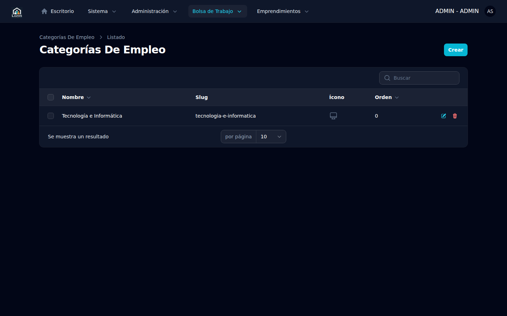

# Capítulo 6 — Categorías de empleo

Las categorías agrupan las ofertas en el portal público para facilitar la navegación de los candidatos. En CBC Workplace, las categorías de empleo se almacenan en la tabla genérica `categories` (reutilizada por varias áreas del producto) restringiendo el ámbito mediante el campo `scope = JobListing`. Este capítulo describe cómo crear, editar, reordenar y dar de baja categorías, así como las consideraciones que aplican a su nombre, slug y eventual archivado.

## 6.1 Modelo y alcance

Cada categoría tiene tres campos relevantes para esta vista:

- **Nombre**: etiqueta visible para candidatos. Debe ser breve y descriptiva (ej. *Pastoral*, *Administrativo*, *Música*).
- **Slug**: identificador URL-friendly derivado del nombre. Se usa en el filtro `/bolsa-de-trabajo?category=<slug>`.
- **Icono**: opcional, identificador de un ícono de Heroicons aplicable en la UI pública.

Estos tres campos viven en la tabla `categories`, ampliada por la migración `2026_03_23_000001_add_slug_icon_to_categories_table.php` cuando se introdujo el módulo Bolsa de Trabajo (especificación 002).

> **Nota.** La misma tabla `categories` aloja categorías de otros módulos del producto. El recurso de Filament en `/admin` filtra automáticamente por `scope = JobListing`, por lo que usted solo verá y editará las categorías relevantes para empleos.

## 6.2 Listado de categorías

Para acceder al listado:

1. Expanda **Bolsa de Trabajo** en el sidebar.
2. Seleccione **Categorías**.

*Figura 6.1 — Listado de categorías. Cada fila muestra el nombre, el slug derivado y la cantidad de ofertas asociadas.*

El listado expone el conteo de ofertas asociadas en cada categoría como información de referencia. Las acciones disponibles son crear una categoría nueva, editar una existente y eliminar (con confirmación) una categoría que ya no se use.

## 6.3 Crear una categoría

Para crear:

1. En el listado, pulse el botón **Nueva** en la esquina superior derecha.
2. Complete los campos:
   - **Nombre**: el texto visible para candidatos.
   - **Icono** (opcional): identificador de Heroicons (ej. `heroicon-o-briefcase`).
3. El campo **slug** se genera automáticamente a partir del nombre. Puede editarlo manualmente si necesita un slug distinto del derivado.
4. Pulse **Crear**.

**Qué esperar después.** La categoría queda disponible inmediatamente como opción al publicar nuevas ofertas (en el panel `/member`) y como filtro en el portal público.

> **Buena práctica.** Mantenga el catálogo de categorías reducido y estable. Categorías muy específicas o duplicadas reducen la utilidad del filtro: los candidatos terminan navegando por una sola categoría grande cuando hay demasiadas opciones poco pobladas. Antes de crear una categoría nueva, verifique que las ofertas que motivan la creación no encajen razonablemente en alguna existente.

## 6.4 Editar una categoría

Para editar:

1. En el listado, haga clic sobre el nombre de la categoría.
2. Modifique los campos que requiera.
3. Pulse **Guardar**.

> **Atención.** Cambiar el **slug** de una categoría modifica las URLs públicas del filtro. Si un candidato tenía marcada una URL como favorita, esa URL dejará de funcionar y deberá redescubrir la categoría desde el portal. Cambiar el slug también puede afectar a páginas indexadas por motores de búsqueda. Evite cambiar el slug salvo que sea estrictamente necesario.

## 6.5 Eliminar una categoría

La eliminación de una categoría requiere precaución. Antes de eliminar, verifique:

- Que no haya ofertas activas asignadas a la categoría (consulte el conteo en el listado).
- Que las ofertas históricas asignadas a la categoría no necesiten conservar la información de categoría para fines de auditoría.

Para eliminar:

1. En el listado, identifique la categoría.
2. Use la acción **Eliminar** disponible en la fila o en la vista de detalle.
3. Confirme en el modal.

> **Importante.** La eliminación es una operación destructiva. Las ofertas históricas que apuntaban a la categoría quedarán con la referencia rota o redirigida a "sin categoría", según la configuración de la relación. Si la categoría tuvo uso significativo, prefiera **renombrarla** a algo descriptivo como "Histórico — <Nombre original>" en lugar de eliminarla, y deje de asignarla a ofertas nuevas.

## 6.6 Sin auditoría dedicada en bitácora

A diferencia de organizaciones y empleos, las acciones sobre categorías no producen entradas dedicadas en la bitácora de auditoría descrita en el capítulo 10. La trazabilidad de cambios depende de la información de timestamps de la tabla (`created_at`, `updated_at`) y del historial de Filament si está habilitado.

## 6.7 Resumen

| Operación | Ubicación | Consideración |
|---|---|---|
| Crear | Listado → **Nueva** | Slug se autogenera desde el nombre |
| Editar | Listado → fila → click | Cambiar slug afecta URLs públicas |
| Eliminar | Listado → acción **Eliminar** | Destructivo; preferir renombrar si la categoría tuvo uso |

El siguiente capítulo (7) describe la administración de usuarios del propio panel `/admin` y la matriz de roles.
