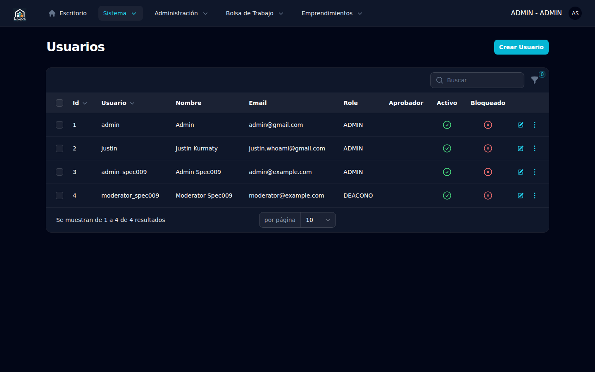

# Capítulo 7 — Usuarios y roles

Los **usuarios** del panel `/admin` son las personas con credenciales para entrar al propio panel y operarlo. Son distintos de los *miembros* (`Member`), que son los usuarios del panel `/member` y representan a candidatos y a representantes de organizaciones. Este capítulo describe cómo dar de alta a un nuevo administrador, asignarle un rol, gestionar la matriz de permisos y, en su caso, dar de baja a un administrador que ya no debe acceder al panel.

## 7.1 Conceptos

- **Usuario (`User`)**: cuenta con `username` y contraseña que se autentica contra el guard `admin` para acceder al panel `/admin`.
- **Rol (`Role`)**: agrupador de permisos. Cada usuario tiene asignado un rol (relación `belongsTo`).
- **Permiso**: capacidad específica (por ejemplo, "verificar organización", "aprobar oferta"). Cada rol tiene un conjunto de permisos.

Esta arquitectura se inspira en los patrones estándar de gestión de roles y permisos sobre Filament. Las páginas dedicadas a usuarios y a roles son páginas singulares de tipo `ManageRecords`, no recursos completos con listado y formularios separados.

## 7.2 Listado de usuarios administradores

Para acceder:

1. Expanda **Sistema** en el sidebar.
2. Seleccione **Usuarios**.

*Figura 7.1 — Listado de usuarios del panel `/admin`. Cada fila muestra el nombre, el username, el correo y el rol asignado.*

La página combina el listado, la creación y la edición en una sola vista de tipo `ManageRecords` ([`app/Filament/Admin/Resources/UserResource/Pages/ManageUsers.php`](../../../app/Filament/Admin/Resources/UserResource/Pages/ManageUsers.php)). Las acciones disponibles son:

- **Nuevo** en la cabecera, para crear un usuario.
- **Editar** y **Eliminar** por fila, accesibles desde el menú contextual de cada registro.

## 7.3 Crear un usuario administrador

Para crear:

1. Pulse el botón **Nuevo** en la esquina superior derecha.
2. Complete los campos del formulario:
   - **Nombre**: nombre real visible en la auditoría (`approval_by`, `verification_by`, etc.).
   - **Nombre de usuario** (`username`): identificador para iniciar sesión. Debe ser único en el sistema.
   - **Correo electrónico**: dirección de contacto del administrador. No es el identificador de login en este panel.
   - **Rol**: seleccione uno de los roles preconfigurados (sección 7.5).
   - **Contraseña**: ingrese una contraseña inicial. Comunique esta contraseña al usuario por un canal seguro y solicítele que la cambie en el primer inicio de sesión (capítulo 2, sección 2.5).
3. Pulse **Crear**.

**Qué esperar después.** El usuario queda activo de inmediato y puede iniciar sesión con las credenciales que le proporcionó. El sistema no envía un correo de bienvenida automático: la comunicación de la cuenta corre por su cuenta.

> **Importante.** Use canales seguros para comunicar la contraseña inicial. No la envíe por correo no cifrado ni por mensajería pública. Una alternativa preferible es entregar la contraseña en persona o por un gestor compartido de credenciales.

## 7.4 Editar o dar de baja un usuario

### Editar

Para modificar nombre, correo, rol o contraseña:

1. En el listado, localice al usuario.
2. Pulse el ícono de edición en la fila (o haga clic sobre la fila si la vista lo permite).
3. Modifique los campos. El campo de contraseña queda vacío al abrir el formulario; déjelo así para preservar la actual, o complételo con una nueva.
4. Pulse **Guardar**.

**Qué esperar después.** Los cambios se aplican inmediatamente. Si modificó la contraseña, la sesión activa del usuario afectado **no** se invalida automáticamente: deberá pedirle que cierre y vuelva a entrar.

### Dar de baja

Para eliminar definitivamente:

1. Localice al usuario.
2. Use la acción **Eliminar** en su fila.
3. Confirme.

> **Atención.** La eliminación de un usuario borra el registro de la tabla `users`. Las acciones que ese usuario haya ejecutado en el pasado (verificaciones, aprobaciones, suspensiones) conservan el nombre del operador en los campos `approval_by`, `verification_by`, `suspended_by` y en la bitácora porque esos campos almacenan el nombre como texto al momento del evento, no como referencia. Aun así, eliminar es una acción destructiva: prefiera **cambiar el rol** a uno con permisos mínimos si solo desea suspender el acceso operativamente.

## 7.5 Roles y matriz de permisos

Los roles se administran en una página separada bajo el mismo grupo **Sistema**.

1. Expanda **Sistema** en el sidebar.
2. Seleccione **Roles**.

La página presenta la lista de roles existentes y un formulario para crear, editar o eliminar. Los roles habituales del producto incluyen, a modo de referencia (los nombres exactos dependen de la configuración local):

| Rol típico | Capacidad esperada |
|---|---|
| Super-administrador | Acceso total: gestiona usuarios, roles, organizaciones, empleos, postulaciones |
| Moderador | Aprueba/rechaza empleos y verifica organizaciones; no gestiona usuarios ni roles |
| Soporte | Lectura amplia con escritura limitada a comentarios internos |

> **Nota.** La matriz exacta de permisos vive en `app/Policies/` y se aplica por cada modelo (Organization, JobListing, Application, etc.). Para ver qué método de policy controla cada acción, consulte la *Guía de Implementación*, capítulo 6.

### Procedimiento: Crear un rol nuevo

1. En la página de roles, pulse **Nuevo**.
2. Asigne un **nombre** descriptivo (ej. `editor-empleos`).
3. Seleccione los **permisos** que el rol incluirá, marcando las casillas correspondientes.
4. Pulse **Crear**.

**Qué esperar después.** El rol queda disponible para asignarlo a usuarios nuevos o existentes.

> **Buena práctica.** Antes de crear un rol nuevo, evalúe si los roles existentes cubren el caso. La proliferación de roles muy similares dificulta la auditoría posterior. Cuando cree uno nuevo, documente internamente el motivo y el conjunto de permisos asignado.

## 7.6 Cambio de rol de un usuario

Para cambiar el rol asignado:

1. Abra el listado de usuarios.
2. Edite al usuario afectado.
3. En el selector **Rol**, elija el nuevo rol.
4. Pulse **Guardar**.

**Qué esperar después.** El cambio es inmediato. La próxima vez que el usuario recargue una página del panel, las opciones visibles (sidebar, botones de acción) se ajustarán al nuevo rol.

> **Importante.** Cambiar el rol no invalida la sesión activa. Si el cambio implica restringir permisos por razones de seguridad o disciplinarias, considere también cerrar la sesión del usuario (no hay acción directa de "cerrar sesiones"; pida al equipo técnico una invalidación si es crítico).

## 7.7 Configuración avanzada de roles

La página de roles dispone de una pestaña adicional ("Configurar") donde un super-administrador puede ajustar parámetros globales del módulo de permisos, según la configuración del producto. Esta sección es de uso poco frecuente y se reserva para tareas específicas como sincronizar permisos tras una actualización mayor del producto. Consulte al equipo técnico antes de modificar nada en esta vista.

## 7.8 Resumen

| Operación | Ruta |
|---|---|
| Crear usuario | **Sistema** → **Usuarios** → **Nuevo** |
| Editar usuario | **Sistema** → **Usuarios** → fila → edición |
| Eliminar usuario | **Sistema** → **Usuarios** → fila → **Eliminar** |
| Gestionar roles | **Sistema** → **Roles** |
| Configurar módulo de permisos | **Sistema** → **Roles** → **Configurar** |

El próximo capítulo (8) aborda las postulaciones y los perfiles de candidato desde el punto de vista del administrador.
