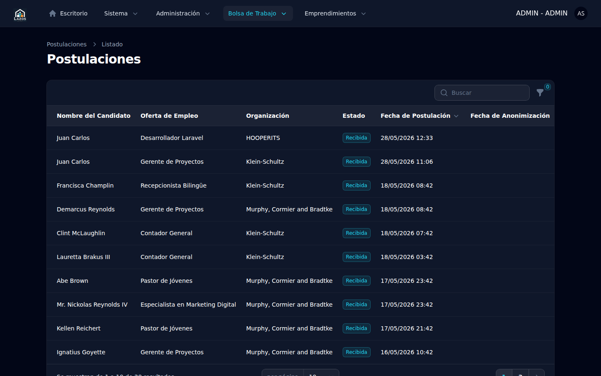
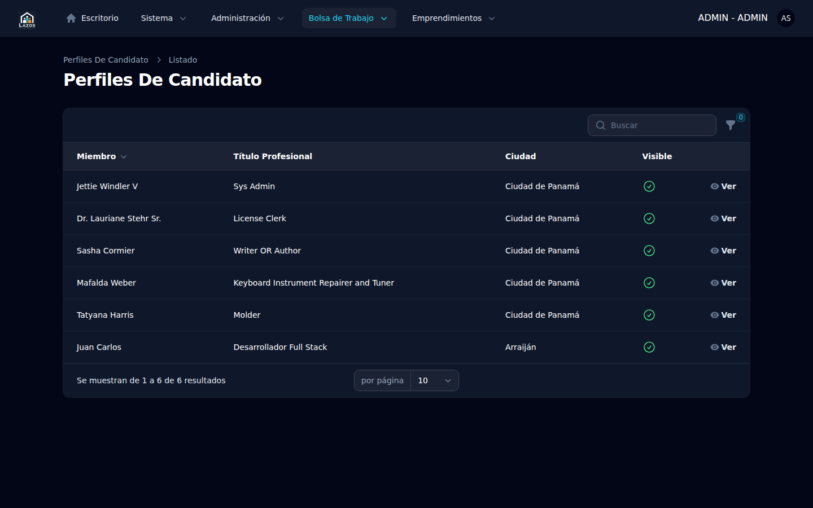

# Capítulo 8 — Postulaciones y candidatos

Una **postulación** (modelo `Application`) es la candidatura enviada por un *candidato* (un `Member` con `CandidateProfile` asociado) a una oferta de empleo `ACTIVE`. El administrador no aprueba ni rechaza postulaciones —esa responsabilidad es de la organización publicadora—, pero sí dispone de visibilidad completa sobre las postulaciones recibidas y los perfiles de los candidatos. Este capítulo describe los dos listados (postulaciones y candidatos), las vistas de detalle, y la acción excepcional de **anonimización** disponible para escenarios de privacidad.

## 8.1 Modelo de datos

- **Postulación (`Application`)**: relación entre un `Member` (candidato) y una `JobListing` (oferta). Atraviesa cinco estados (`ApplicationStatus`): `RECEIVED`, `IN_REVIEW`, `INTERVIEW`, `REJECTED`, `ACCEPTED`. Las transiciones son responsabilidad de la organización publicadora desde su panel `/member`.
- **Perfil de candidato (`CandidateProfile`)**: extensión 1:1 del `Member`. Incluye datos profesionales: experiencia laboral (`WorkExperience`), formación (`Education`), CV adjunto, expectativas salariales, disponibilidad.

Esta separación entre `Member` y `CandidateProfile` está documentada en el blueprint del proyecto como decisión arquitectónica de la especificación 004: no se crea una tabla de usuarios separada para candidatos; el perfil es un complemento opcional del miembro.

## 8.2 Listado de postulaciones

Para acceder:

1. Expanda **Bolsa de Trabajo** en el sidebar.
2. Seleccione **Postulaciones**.

*Figura 8.1 — Listado de todas las postulaciones del sistema. Permite filtrar por estado y por oferta.*

Cada fila del listado expone:

- **Candidato**: nombre del miembro postulante.
- **Oferta**: título de la oferta y enlace a su vista de detalle.
- **Estado de la postulación**: valor actual del `ApplicationStatus`.
- **Enviada**: fecha y hora de envío (`submitted_at`).

El listado es de **lectura** para el administrador. Los filtros típicos disponibles son por estado y por oferta. La búsqueda por nombre del candidato puede acotar resultados cuando la base crece.

## 8.3 Vista de detalle de una postulación

Para abrir el detalle:

1. En el listado, haga clic sobre la fila de la postulación deseada.

La vista muestra:

- Datos de cabecera: candidato, oferta, organización publicadora, estado.
- **Mensaje del candidato**: texto libre que el candidato escribió al postular.
- **CV adjunto**: enlace para descargar el CV en el formato que el candidato subió (PDF típico).
- **Snapshot del perfil**: copia del perfil del candidato al momento de postular, congelada para que cambios futuros en el perfil no alteren la información que la organización vio.
- **Notas administrativas** (`ApplicationNote`): comentarios internos que el administrador o la organización han añadido.

> **Importante.** El administrador no debe modificar el estado de una postulación. Esa responsabilidad pertenece a la organización publicadora desde su panel `/member`. Si el administrador interfiere, el flujo de comunicación entre la organización y el candidato se corrompe.

## 8.4 Listado de perfiles de candidato

Para acceder:

1. Expanda **Bolsa de Trabajo** en el sidebar.
2. Seleccione **Candidatos**.

*Figura 8.2 — Listado de perfiles de candidato. Cada fila representa un `Member` con `CandidateProfile` activo.*

El listado muestra el nombre del candidato, el correo electrónico y la disponibilidad declarada. Permite filtrar por disponibilidad y por la última actualización del perfil.

## 8.5 Vista de detalle de un candidato

La vista de un candidato consolida el `Member` con todas sus extensiones:

- Datos de contacto del `Member`.
- Bloque de **experiencia laboral**: tabla de `WorkExperience` ordenada cronológicamente.
- Bloque de **formación académica**: tabla de `Education`.
- **CV** descargable.
- **Postulaciones del candidato**: lista de todas las `Application` asociadas, con su estado.

> **Nota.** Los bloques de experiencia y formación se exponen como relation managers de Filament. Las tablas son de lectura para el administrador: el candidato es quien edita su propio perfil desde el panel `/member`.

## 8.6 Anonimización de postulaciones de un miembro

Existe una acción excepcional, [`AnonymizeMemberApplications`](../../../app/Actions/Admin/AnonymizeMemberApplications.php), pensada para escenarios donde el candidato solicita explícitamente la eliminación de su rastro de postulaciones (típicamente por una solicitud GDPR o equivalente local). La acción anonimiza el `Member` y todas sus `Application`, conservando las estadísticas agregadas pero borrando la información identificable.

> **Importante.** La anonimización es **irreversible**. Use esta acción únicamente ante una solicitud formal y documentada del candidato afectado. Registre el motivo y la fecha en una nota administrativa interna antes de ejecutarla.

El procedimiento exacto depende de la versión del producto y de cómo esté expuesta la acción en la interfaz (típicamente como una acción de cabecera en la vista del miembro). Si la acción no aparece en su panel, consulte con el equipo técnico antes de intentar anonimizar manualmente.

## 8.7 Resumen

| Acción | Disponible para el administrador |
|---|---|
| Ver listado de postulaciones | Sí |
| Ver detalle de postulación (con CV y mensaje) | Sí |
| Cambiar estado de postulación | **No** — corresponde a la organización publicadora |
| Ver listado de candidatos | Sí |
| Ver perfil completo de un candidato | Sí |
| Editar perfil del candidato | **No** — corresponde al propio candidato |
| Anonimizar miembro y sus postulaciones | Sí, vía acción excepcional documentada |

El próximo capítulo (9) explica el sistema de alertas de empleo, principalmente desde la perspectiva del administrador: qué se almacena, qué procesos automáticos lo dirigen y qué señales puede usted observar para detectar problemas.
