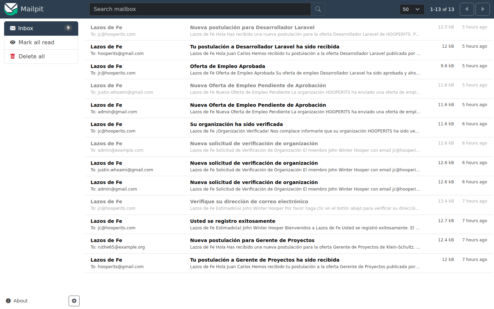

# Capítulo 9 — Alertas de empleo

Las **alertas de empleo** (modelo `JobAlert`) son suscripciones que los candidatos crean en su panel `/member` para recibir por correo electrónico las ofertas que coincidan con sus criterios. El administrador no crea ni edita alertas (eso lo hace el propio candidato), pero sí debe comprender cómo funciona el sistema para diagnosticar problemas operativos: digest que no llegan, retrasos en alertas instantáneas, fallos de despacho a una cuenta concreta. Este capítulo describe el modelo, las frecuencias soportadas, los procesos automáticos asociados y los puntos de observación útiles para el administrador.

## 9.1 Modelo y frecuencias

Una alerta `JobAlert` define:

- **Criterios** de búsqueda equivalentes al filtrado del portal público: palabra clave, categoría, ciudad, etc.
- **Frecuencia** de envío: una de tres opciones, definidas por el enum `JobAlertFrequency`:

| Valor | Nombre | Significado |
|---|---|---|
| 1 | `Daily` | Digest diario consolidando las ofertas nuevas del día |
| 2 | `Weekly` | Digest semanal consolidando las ofertas nuevas de los últimos siete días |
| 3 | `Instant` | Notificación instantánea cuando una oferta nueva coincide con los criterios |

La frecuencia es propiedad del propio `JobAlert`. Un candidato puede tener múltiples alertas con frecuencias distintas.

## 9.2 Procesos automáticos

Las tres frecuencias se procesan por mecanismos distintos:

### 9.2.1 Instant

Cuando una oferta pasa a `ACTIVE` (capítulo 5, sección 5.3), el evento `App\Events\JobListingApproved` se dispara como último paso de la rama de aprobación. Listeners suscritos al evento evalúan, para cada `JobAlert` con `frequency = Instant`, si la oferta cumple los criterios. Si cumple, se encola un correo digest con esa única oferta.

> **Atención.** El despacho instantáneo depende del procesamiento de la cola. Si el worker de Laravel no está corriendo, los correos instantáneos se acumulan sin enviarse. La *Guía de Implementación* detalla la configuración del worker; el administrador puede detectar el problema observando la bitácora (capítulo 10) o consultando con el equipo técnico.

### 9.2.2 Daily

Una tarea cron (programada por el sistema, no por el administrador) ejecuta `DispatchDailyDigestAction` una vez al día. La acción identifica todas las alertas activas con `frequency = Daily`, construye el digest correspondiente vía `BuildDigestForAlertAction` y encola el correo.

### 9.2.3 Weekly

Equivalente al diario, ejecutado una vez a la semana por `DispatchWeeklyDigestAction`.

> **Nota.** El día y la hora exactos del despacho diario y semanal están configurados en la programación del sistema y son responsabilidad del equipo de implementación. Si el cron deja de ejecutarse, ninguno de los dos digests programados saldrá. Consulte al equipo técnico cuando observe ausencia sistemática de envíos.

## 9.3 Lo que el administrador puede hacer

El panel `/admin` v1.0 **no expone** un recurso dedicado de alertas. El administrador no tiene una vista de listado ni de detalle para `JobAlert`. Esto es deliberado: las alertas son propiedad del candidato y administrarlas desde el panel admin abriría una superficie de privacidad innecesaria.

Las acciones disponibles para el administrador en relación con las alertas son indirectas:

- **Auditar** envíos exitosos y fallidos vía la bitácora (capítulo 10). Los eventos relevantes incluyen `mail-instant-dispatch-enqueued`, `mail-daily-dispatch-enqueued`, `mail-weekly-dispatch-enqueued` y sus equivalentes `-failed`.
- **Solicitar al equipo técnico** una consulta directa a la tabla `job_alerts` cuando un candidato reporta no estar recibiendo sus correos.
- **Verificar** que el portal Mailpit (entorno local) o el servicio de correo (en producción) está operativo. Si la sección Mailpit es accesible:

*Figura 9.1 — Bandeja Mailpit local. Permite observar correos generados por el sistema en entornos de desarrollo y testing.*

## 9.4 Mensaje de bienvenida y desuscripción

Cada digest incluye al pie un enlace de **desuscripción** firmado (URL con firma criptográfica que identifica la alerta a desuscribir). El candidato puede pulsar el enlace desde el correo para desactivar la alerta sin necesidad de iniciar sesión. La desuscripción es responsabilidad del candidato; el administrador no la opera.

> **Nota.** Si un candidato reporta que se desuscribió pero sigue recibiendo correos, lo más probable es que tenga **múltiples alertas** y solo haya desuscrito una. Pídale que entre a su panel `/member` y revise el listado completo de sus alertas activas.

## 9.5 Diagnóstico de problemas comunes

| Síntoma | Causa probable | Acción del administrador |
|---|---|---|
| Un candidato no recibe ningún correo de alerta | Worker de cola caído, servicio de correo caído, dirección rebotando | Consultar bitácora; escalar al equipo técnico |
| Una oferta aprobada no generó correos instantáneos | Worker caído al momento de la aprobación, dispatch del evento no ejecutado | Consultar bitácora del evento `JobListingApproved`; solicitar reprocesamiento al equipo |
| Digest diario o semanal no llegó a ningún candidato | Cron del sistema no ejecutó la tarea | Escalar al equipo técnico para revisar la programación del scheduler |
| Un candidato reporta recibir alertas que no creó | Verificar si la cuenta ha sido comprometida | Solicitar al candidato cambiar contraseña; auditar bitácora de creación de alertas |

## 9.6 Resumen

| Pregunta | Respuesta |
|---|---|
| ¿Puedo crear o editar alertas desde el panel admin? | No. Las alertas pertenecen al candidato. |
| ¿Cómo se entregan las alertas? | Instant: evento + listener al aprobar oferta. Daily/Weekly: cron del sistema. |
| ¿Dónde detecto problemas de envío? | Bitácora de auditoría con eventos `mail-*-dispatch-*` (capítulo 10). |
| ¿Cómo desuscribe un candidato una alerta? | Desde el panel `/member`, o desde el enlace firmado al pie de cualquier digest. |

El próximo capítulo (10) cubre la auditoría: dónde se registran los eventos, cómo consultarlos y qué eventos esperar de cada flujo administrativo descrito en capítulos previos.
