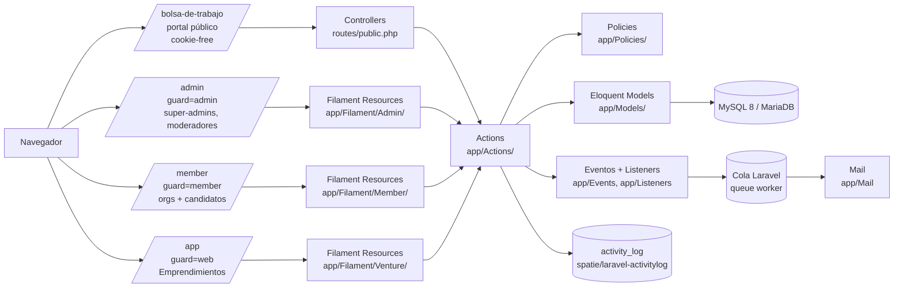
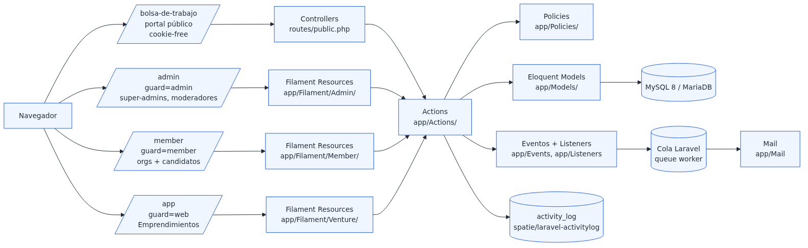
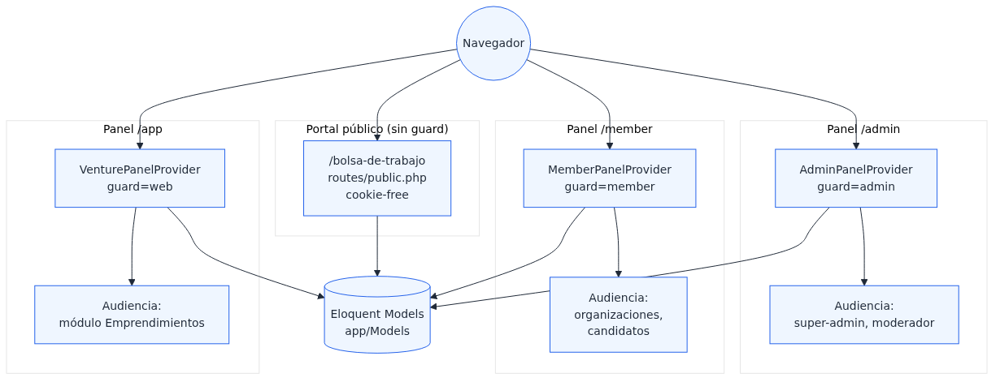

# Capítulo 1 — Arquitectura

**Resumen ejecutivo.** CBC Workplace es una aplicación Laravel 11 sobre PHP 8.3 con tres paneles Filament 3.3 (`/admin`, `/member`, `/app`) y un portal público sin sesión (`/bolsa-de-trabajo`). La lógica de negocio se concentra en *Actions* (patrón `lorisleiva/laravel-actions`), no en controladores; las decisiones de autorización viven en *Policies*. La capa de auditoría usa `spatie/laravel-activitylog`. El sistema de alertas (especificación 008) combina un fan-out síncrono por evento (instantáneo) con dos comandos programados (diario y semanal). Este capítulo enumera las capas, las decisiones arquitectónicas tomadas y las alternativas explícitamente descartadas.

## 1.1 Stack tecnológico

Verificable contra [`composer.json:10-25`](../../../composer.json):

| Capa | Tecnología | Versión |
|---|---|---|
| Lenguaje | PHP | `^8.3` |
| Framework | Laravel | `^11.0` |
| Panel administrativo | Filament | `^3.3` |
| Patrón de acciones | `lorisleiva/laravel-actions` | `^2.7` |
| Auditoría | `spatie/laravel-activitylog` | `^4.7` |
| Sitemap | `spatie/laravel-sitemap` | `^7.0` |
| CAPTCHA | `marcogermani87/filament-captcha` | `^1.4` |
| Tests | Pest 2 + PHPUnit 10 | `^2.34` / `^10.1` |
| Tooling local | Laravel Sail | `^1.25` |
| Linter | Laravel Pint | `^1.0` |

La base de datos canónica en desarrollo es **MySQL 8.0** vía Sail; producción usa **MariaDB**. Ambas soportan los `generated columns` y `utf8mb4_unicode_ci` que requieren las búsquedas acento-insensibles introducidas por la especificación 007.

## 1.2 Diagrama de panel y capas





## 1.3 Tres paneles, tres guards

El producto expone tres aplicaciones Filament autenticadas independientemente. Verificable en [`app/Providers/Filament/`](../../../app/Providers/Filament/):

| Panel | Ruta | Guard | Audiencia | PanelProvider |
|---|---|---|---|---|
| Admin | `/admin` | `admin` | Super-admins, moderadores | `AdminPanelProvider.php:25-93` |
| Member | `/member` | `member` | Organizaciones publicadoras, candidatos | `MemberPanelProvider.php:65-152` |
| Venture | `/app` | `web` (default) | Usuarios del módulo Emprendimientos | `VenturePanelProvider.php` |

Cada panel discovers sus resources, pages y widgets en `app/Filament/<Panel>/`. Esto permite que los tres compartan modelos pero cada uno exponga su propio CRUD y permisos.

```php
return $panel
    ->id('admin')
    ->path('admin')
    ->authGuard('admin')
    ->login(Login::class)
    ->discoverResources(in: app_path('Filament/Admin/Resources'), for: 'App\\Filament\\Admin\\Resources')
    ->discoverPages(in: app_path('Filament/Admin/Pages'), for: 'App\\Filament\\Admin\\Pages')
    ->discoverWidgets(in: app_path('Filament/Admin/Widgets'), for: 'App\\Filament\\Admin\\Widgets')
```

> Fuente: [`app/Providers/Filament/AdminPanelProvider.php:29-45`](../../../app/Providers/Filament/AdminPanelProvider.php).



### 1.3.1 Cuatro grupos de navegación en /admin

```php
->navigationGroups([
    NavigationGroup::make()->label('Sistema'),
    NavigationGroup::make()->label('Administración'),
    NavigationGroup::make()->label(__('navigation.bolsa-de-trabajo')),
    NavigationGroup::make()->label('Emprendimientos'),
])
```

> Fuente: [`app/Providers/Filament/AdminPanelProvider.php:47-56`](../../../app/Providers/Filament/AdminPanelProvider.php).

Cada `Resource` declara su `getNavigationGroup()` para integrarse en uno de los cuatro grupos.

### 1.3.2 Render hooks

Los tres paneles inyectan widgets vía render hooks:

- **Admin** (`AdminPanelProvider.php:71-74`): hook `GLOBAL_SEARCH_AFTER` muestra `'ADMIN - ' . $user->role->name` como indicador de contexto.
- **Member** (`MemberPanelProvider.php:48-62`): hook `CONTENT_START` renderiza el banner de organización suspendida cuando aplica.
- **Member** (`MemberPanelProvider.php:121-126`): hook `GLOBAL_SEARCH_AFTER` muestra `AFILIADO` o `REGISTRADO` según `membership_state`.

## 1.4 Capa de acciones (Actions)

CBC Workplace **no usa controladores gruesos**. Toda la lógica de negocio significativa vive en clases bajo `app/Actions/` que aplican el patrón `lorisleiva/laravel-actions`. Cada Action es invocable vía `::run()`, dispatchable como job (`::dispatch()`), o registrable como listener.

Subdirectorios:

```text
app/Actions/
├── Admin/                       # 10 acciones del panel admin
│   ├── SuspendOrganization.php
│   ├── ReactivateOrganization.php
│   ├── OrganizationVerification.php
│   ├── JobListingApproval.php
│   ├── AnonymizeMemberApplications.php
│   └── ...
├── Member/                      # 30+ acciones del panel member
│   ├── SubmitApplication.php
│   ├── CreateJobAlertAction.php
│   ├── BuildDigestForAlertAction.php
│   └── ...
├── Sponsor.php
└── ExpireJobListings.php        # comando programado
```

Detalles del patrón y de los traits `AsAction` / `AsJob` / `AsListener` se cubren en el capítulo 4.

## 1.5 Autorización

Cada modelo principal tiene una *Policy* explícita bajo [`app/Policies/`](../../../app/Policies/):

- `ApplicationPolicy.php`, `ApplicationNotePolicy.php`
- `CandidateProfilePolicy.php`
- `CategoryPolicy.php`
- `JobAlertPolicy.php`
- `JobListingPolicy.php`
- `MemberPolicy.php`
- `OrganizationPolicy.php`
- `VenturePolicy.php`

Todas heredan de `BasePolicy.php`, que implementa un `before()` hook que otorga acceso total a usuarios con flag de admin. Detalles en el capítulo 6.

## 1.6 Eventos y colas

Los flujos asincrónicos del sistema se modelan con eventos de Laravel:

- **`App\Events\JobListingApproved`** (en `app/Events/`): se dispara al final de la rama de aprobación de [`JobListingApproval::approve()`](../../../app/Actions/Admin/JobListingApproval.php:53). Sus listeners construyen los digests instantáneos.
- **Correos encolados**: los flujos no críticos en latencia (suspensión, digest diario, digest semanal) usan `Mail::to(...)->queue(...)` para diferir el envío.

El sistema de alertas completo se documenta en el capítulo 8.

## 1.7 Tareas programadas

Tres tareas viven en [`app/Console/Kernel.php:14-33`](../../../app/Console/Kernel.php):

| Comando | Frecuencia | Propósito |
|---|---|---|
| `app:generate-sitemap` | Cada hora | Regenera `public/sitemap.xml` con todas las ofertas activas |
| `alerts:dispatch-daily` | Diario 07:00 | Despacha los digests diarios de alertas (spec 008) |
| `alerts:dispatch-weekly` | Lunes 07:00 | Despacha los digests semanales |

Todas usan `withoutOverlapping()->onOneServer()` para ser seguras ante despliegues con múltiples workers.

## 1.8 Auditoría

`spatie/laravel-activitylog` provee la tabla `activity_log` y el trait `LogsActivity`. Los modelos `Organization` y `JobListing` declaran configuración explícita del log:

```php
public function getActivitylogOptions(): LogOptions
{
    return LogOptions::defaults()
        ->logOnly([/* campos auditados */])
        ->logOnlyDirty()
        ->dontSubmitEmptyLogs();
}
```

> Patrón en `app/Models/Organization.php:88+`. Detalles en el capítulo 10.

## 1.9 Portal público sin sesión

Las rutas en [`routes/public.php`](../../../routes/public.php) se cargan con un stack de middleware mínimo que **excluye** `StartSession`, `VerifyCsrfToken` y `EncryptCookies`. Esto permite que las respuestas sean cookie-free y cacheables en Cloudflare. La ruta de detalle de oferta (`/bolsa-de-trabajo/{slug}`) sí va por `routes/web.php` porque requiere sesión para detectar variantes de CTA (especificación 007). Detalles en el capítulo 7.

## 1.10 Decisiones arquitectónicas explícitamente descartadas

Para reducir superficie de mantenimiento y dependencia de paquetes externos, las siguientes alternativas se evaluaron y **se rechazaron**:

| Alternativa | Motivo del rechazo |
|---|---|
| **Laravel Scout + Meilisearch / Algolia** para búsqueda full-text | Volumen actual no justifica un servicio externo; columnas `*_folded` con `utf8mb4_unicode_ci` + índices simples cubren los casos (spec 007 §R3) |
| **`spatie/laravel-permission`** para roles y permisos | Modelo propio `Role` + relación `User->role` resulta más simple para los pocos roles del producto; reduce dependencias |
| **Inertia.js o frontend SPA separado** | Filament + Livewire cubren los tres paneles sin necesidad de SPA; el portal público usa Blade tradicional |
| **`OrganizationVerificationState::SUSPENDED`** como tercer estado de verificación | Confunde "estado de identidad" con "estado operacional"; PR #26 lo eliminó en favor de banderas ortogonales (spec 009 §R1) |
| **Tabla separada `candidates`** | `Member` + `CandidateProfile` 1:1 cubre el caso sin duplicación de usuarios (decisión spec 004) |
| **Cron de cierre de ofertas por suspensión** | La cascada se hace en transacción dentro de [`SuspendOrganization::handle()`](../../../app/Actions/Admin/SuspendOrganization.php:32-70), asegurando atomicidad |

## 1.11 Convenciones de código

- **PSR-12** formatting, aplicado vía `vendor/bin/pint`.
- **`declare(strict_types=1);`** en código nuevo de Actions, controllers y models recientes.
- **Type hints** en parámetros y return types.
- **Tests con Pest 2** (la base mezcla algunos PHPUnit clásicos; código nuevo usa Pest).
- **Spanish-Latin-American** en strings de UI; código y commits en inglés.

## 1.12 Glosario rápido

| Término | Significado en este documento |
|---|---|
| **Action** | Clase bajo `app/Actions/` con trait `AsAction` (lorisleiva/laravel-actions) |
| **Panel** | Aplicación Filament (`AdminPanelProvider`, `MemberPanelProvider`, `VenturePanelProvider`) |
| **Resource** | Clase bajo `app/Filament/<Panel>/Resources/` que expone un modelo a Filament |
| **Policy** | Clase bajo `app/Policies/` que define autorización por modelo |
| **Cascade** | Efecto colateral de una acción: típicamente cierre de ofertas activas al suspender una organización |
| **Digest** | Email agrupador de ofertas; instantáneo, diario o semanal |
| **Folded column** | Columna generada en MySQL con texto sin acentos para búsqueda acento-insensible (spec 007) |

El próximo capítulo (2) describe cómo levantar el sistema localmente desde cero.
