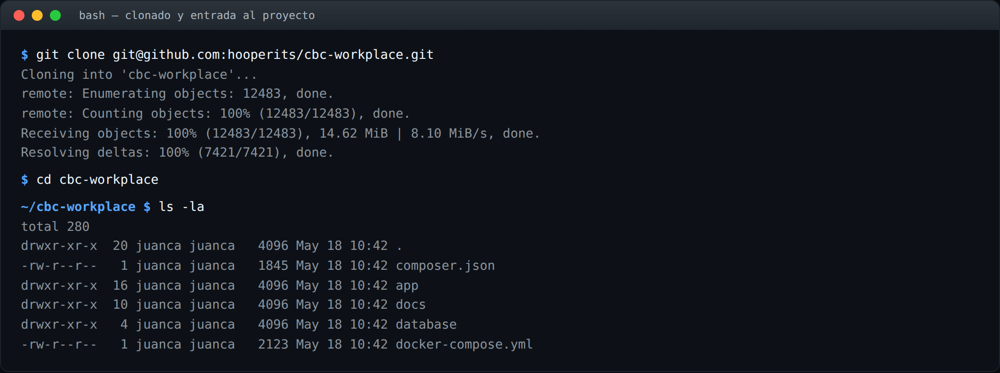
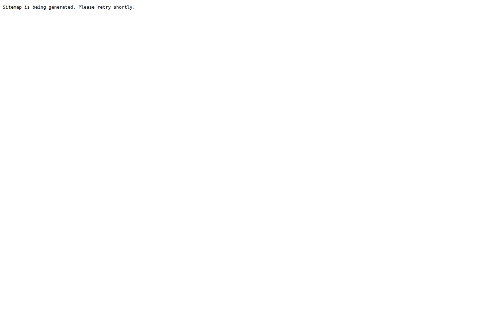

# Capítulo 2 — Setup local

**Resumen ejecutivo.** El entorno local de desarrollo usa **Laravel Sail** (Docker Compose) para los servicios (MySQL 8, Redis, Mailpit) y el binario `php artisan` del contenedor. Este capítulo describe el procedimiento para clonar, instalar dependencias, levantar Sail, ejecutar migraciones, sembrar datos demo, lanzar el worker de cola y verificar que el sistema esté operativo. Tiempo estimado para un setup fresco: **20–30 minutos** dependiendo del ancho de banda al pull de imágenes Docker.

## 2.1 Pre-requisitos del host

Antes de clonar, verifique en su máquina:

- **Docker Desktop** o **Docker Engine** + **Docker Compose** v2.
- **Git** 2.30+.
- **PHP 8.3+** instalado localmente solo para ejecutar `composer install` la primera vez (puede saltarse este paso usando `sail composer install` tras un boot inicial, descrito abajo).
- **Composer** 2.x.
- Espacio libre en disco: **~5 GB** (imágenes Docker + dependencias).
- En WSL2: integrar Docker Desktop con la distro elegida.

> **Nota.** Sail también funciona sin PHP en el host: la primera ejecución usa el binario interno del contenedor. Algunas operaciones (`composer require` ad-hoc, debugging) son más cómodas con PHP local instalado.

## 2.2 Clonar el repositorio



```bash
git clone git@github.com:hooperits/cbc-workplace.git
cd cbc-workplace
cp .env.example .env
```

El archivo `.env` resultante contiene defaults seguros para desarrollo. Ajustes habituales antes del primer boot:

```dotenv
APP_NAME="CBC Workplace"
APP_ENV=local
APP_DEBUG=true
APP_URL=http://localhost

DB_CONNECTION=mysql
DB_HOST=mysql
DB_PORT=3306
DB_DATABASE=cbc_workplace
DB_USERNAME=sail
DB_PASSWORD=password

MAIL_MAILER=smtp
MAIL_HOST=mailpit
MAIL_PORT=1025
MAIL_FROM_ADDRESS="no-reply@example.com"

QUEUE_CONNECTION=database
```

El detalle de cada variable y los rangos válidos está en el **Apéndice B**.

## 2.3 Instalar dependencias

```bash
composer install --ignore-platform-reqs
```

Si no tiene PHP local, alternativamente:

```bash
docker run --rm -u "$(id -u):$(id -g)" \
    -v "$(pwd):/var/www/html" \
    -w /var/www/html \
    laravelsail/php83-composer:latest \
    composer install
```

## 2.4 Levantar Sail


```bash
./vendor/bin/sail up -d
```

La primera ejecución descarga las imágenes (php83, mysql:8.0, mailpit, redis si está en el `docker-compose.yml`). Tarda 3–10 minutos según ancho de banda.

Verifique que los servicios están saludables:

```bash
./vendor/bin/sail ps
```

Salida esperada: contenedores `app`, `mysql`, `mailpit` en estado `Up (healthy)`.

> **Buena práctica.** Configure un alias para no escribir `./vendor/bin/sail` constantemente:
>
> ```bash
> alias sail='[ -f sail ] && sh sail || sh vendor/bin/sail'
> ```
>
> Añádalo a su `.bashrc` o `.zshrc`. Esta guía usa `sail` directamente en todos los ejemplos siguientes.

## 2.5 Generar la clave de aplicación

```bash
sail artisan key:generate
```

El comando escribe la variable `APP_KEY` en su `.env`. Si la variable ya existe, no es necesario regenerarla.

## 2.6 Migrar la base de datos


```bash
sail artisan migrate:fresh
```

`migrate:fresh` **borra todas las tablas** y vuelve a aplicarlas desde cero. Apropiado para inicializar un entorno limpio.

Verifique que el orden cronológico de las migraciones se aplicó correctamente; las introducidas por las especificaciones 002–009 son:

| Migración | Spec | Propósito |
|---|---|---|
| `2026_03_23_000001_add_slug_icon_to_categories_table.php` | 002 | Slug + icon para categorías de empleo |
| `2026_03_23_000002_create_organizations_table.php` | 003 | Tabla `organizations` |
| `2026_03_23_000003_create_candidate_profiles_table.php` | 004 | Tabla `candidate_profiles` |
| `2026_03_23_000004_create_work_experiences_table.php` | 004 | Tabla `work_experiences` |
| `2026_03_23_000005_create_educations_table.php` | 004 | Tabla `educations` |
| `2026_03_23_000006_create_job_listings_table.php` | 005 | Tabla `job_listings` |
| `2026_04_27_000001_create_applications_table.php` | 006 | Tabla `applications` |
| `2026_04_27_000002_create_application_notes_table.php` | 006 | Notas sobre postulaciones |
| `2026_05_07_000001_add_folded_columns_to_job_listings.php` | 007 | Columnas `*_folded` para búsqueda acento-insensible |
| `2026_05_07_000002_add_filter_indexes_to_job_listings.php` | 007 | Índices para filtros |
| `2026_05_07_000003_create_public_events_table.php` | 007 | Trazas analíticas anónimas |
| `2026_05_11_000000_add_city_folded_to_job_listings.php` | 007 | Columna folded adicional |
| `2026_05_11_000001_create_job_alerts_table.php` | 008 | Tabla `job_alerts` |
| `2026_05_11_000002_create_job_alert_dispatch_logs_table.php` | 008 | Logs de despacho de alertas |
| `2026_05_11_000003_add_alert_kinds_to_public_events_enum.php` | 008 | Nuevos kinds de eventos |
| `2026_05_17_000001_add_suspension_columns_to_organizations.php` | 009 | Banderas de suspensión |
| `2026_05_17_000002_drop_suspended_verification_state.php` | 009 | Limpieza del enum (PR #26) |

## 2.7 Sembrar datos demo

```bash
sail artisan db:seed --class=Spec009DemoSeeder
sail artisan db:seed --class=GuidesDemoSeeder
```

Ambos seeders son **idempotentes** y crean cuentas reproducibles para el pipeline de capturas de las guías. Las credenciales seedeadas están documentadas en [`database/seeders/Spec009DemoSeeder.php:44-65`](../../../database/seeders/Spec009DemoSeeder.php):

| Rol | Email / username | Password | Panel |
|---|---|---|---|
| Super-admin | `admin_spec009` | `password` | `/admin` |
| Organización verificada A | `org-verified-a@example.com` | `password` | `/member` |
| Organización suspendible | `org-suspend-target@example.com` | `password` | `/member` |
| Candidato 1 | `candidate-1@example.com` | `password` | `/member` |
| Candidato 2 | `candidate-2@example.com` | `password` | `/member` |


> **Importante.** Estos seeders están diseñados **exclusivamente** para entornos `local` y `testing`. **No** los ejecute en `production`. Su `.env` debe tener `APP_ENV=local` antes de continuar.

## 2.8 Lanzar el worker de cola

Para procesar correos encolados (suspensiones, digests, etc.) y jobs:


```bash
sail artisan queue:work --queue=instant,default --tries=3 --max-time=3600
```

Mantenga el worker corriendo en una terminal aparte mientras desarrolle. Si necesita levantar y olvidarse, ejecútelo con `nohup` o use Supervisor (capítulo 9).

## 2.9 Lanzar el scheduler

Para que los digests diarios y semanales se despachen en local:


```bash
sail artisan schedule:work
```

Mantenga este comando corriendo en otra terminal. Recuerde que los digests se despachan a las 07:00 hora del servidor; para pruebas, modifique temporalmente `app/Console/Kernel.php` o invoque manualmente la action vía Tinker.

## 2.10 Verificar el sistema

Tras los pasos anteriores, abra:

- **Panel admin:** `http://localhost/admin` → login con `admin_spec009` / `password`.
- **Panel member:** `http://localhost/member` → login con `org-verified-a@example.com` / `password`.
- **Portal público:** `http://localhost/bolsa-de-trabajo` → debe listar las ofertas activas del seeder.
- **Mailpit:** `http://localhost:8025` → bandeja de correos capturados.


*Figura 2.1 — Bandeja Mailpit local. Verifique que aparezcan los correos generados por los seeders (verificación de organización, etc.).*

## 2.11 Verificar el portal público y sitemap

```bash
curl -s http://localhost/sitemap.xml | head -20
```

Debe devolver XML con el namespace `http://www.sitemaps.org/schemas/sitemap/0.9` y al menos una entrada `<url>` por cada oferta activa.



*Figura 2.2 — `GET /sitemap.xml` devuelve XML con las URLs activas. Generado por [`SitemapController`](../../../app/Http/Controllers/Public/SitemapController.php) usando `spatie/laravel-sitemap`.*

## 2.12 Tests

```bash
sail artisan test
# o, equivalentemente:
sail bin pest
```

La primera ejecución de la suite tarda 2–5 minutos. Se documentan detalles de cobertura y patrones de testing en el capítulo 10.

## 2.13 Limpiar y volver a empezar

Si necesita resetear el entorno:

```bash
sail down -v          # apaga y elimina volúmenes (¡destruye la BD!)
sail up -d            # vuelve a levantar limpio
sail artisan migrate:fresh --seed
```

> **Importante.** `sail down -v` **borra el volumen de MySQL**. Toda la base de datos local se pierde. Es la operación correcta para empezar de cero pero confírmela antes de ejecutarla en un entorno donde tenga datos de trabajo no recuperables.

## 2.14 Checklist de setup completo

- [ ] Repo clonado y `.env` configurado.
- [ ] `composer install` ejecutado sin errores.
- [ ] `sail up -d` levanta los tres servicios (app, mysql, mailpit) en estado `healthy`.
- [ ] `APP_KEY` presente en `.env`.
- [ ] Migraciones aplicadas (`sail artisan migrate:fresh`).
- [ ] Seeders ejecutados (`Spec009DemoSeeder`, `GuidesDemoSeeder`).
- [ ] Worker de cola corriendo (`queue:work`).
- [ ] Scheduler corriendo o documentado como opcional.
- [ ] Panel `/admin` accesible con credenciales seedeadas.
- [ ] Mailpit accesible en `:8025`.

Una vez completado este checklist usted está listo para desarrollar contra el producto. El capítulo siguiente (3) profundiza en la configuración de los tres paneles Filament.
