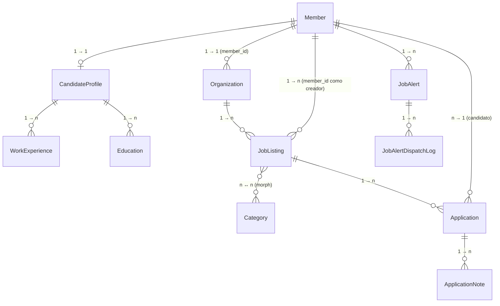
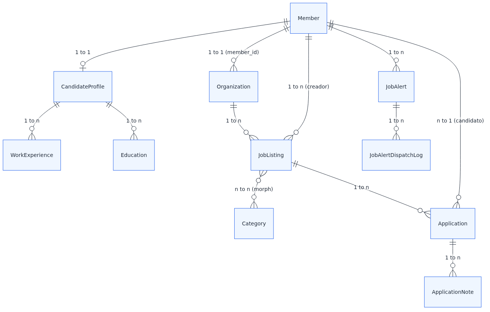

# Capítulo 5 — Modelos y relaciones

**Resumen ejecutivo.** El módulo Bolsa de Trabajo introduce ocho modelos principales bajo `app/Models/`: `Organization`, `JobListing`, `Application`, `ApplicationNote`, `CandidateProfile`, `WorkExperience`, `Education`, `JobAlert`, más `JobAlertDispatchLog` y `PublicEvent` para infraestructura. Este capítulo describe cada modelo, sus relaciones Eloquent, los enums asociados y los *scopes* más utilizados. Todas las referencias son verificables con `Read` contra `app/Models/`.

## 5.1 Diagrama de relaciones





## 5.2 Organization

Archivo: [`app/Models/Organization.php`](../../../app/Models/Organization.php).

### Campos clave

| Campo | Tipo | Notas |
|---|---|---|
| `id` | bigint | PK |
| `member_id` | bigint | FK a `members.id`; relación 1:1 inversa |
| `display_name` | string | Nombre comercial visible |
| `verification_state` | int (enum) | `OrganizationVerificationState`: `PENDING` (0), `VERIFIED` (1) |
| `verification_by` | string nullable | Nombre del admin que verificó |
| `verified_at` | timestamp nullable | Marca temporal de verificación |
| `is_active` | bool | Habilitada para publicar |
| `suspended_at` | timestamp nullable | Bandera de suspensión |
| `suspended_by` | string nullable | Nombre del admin que suspendió |
| `suspension_reason` | text nullable | Memo de suspensión |

### Relaciones

```php
public function member(): BelongsTo { return $this->belongsTo(Member::class); }
public function comments(): MorphMany { /* ... */ }
```

> Fuente: [`app/Models/Organization.php:47-52`](../../../app/Models/Organization.php).

`Organization` no tiene relación directa con `JobListing` (la inversa); las ofertas se enlazan al `member_id` o al `organization_id` según el contexto. Consulte la relación inversa desde `JobListing` en la sección 5.3.

### Métodos de dominio

| Método | Línea aprox. | Propósito |
|---|---|---|
| `is_suspended(): bool` | `63` | True si `suspended_at` está presente |
| `canBeSuspended(): bool` | `68` | True si actualmente no está suspendida |
| `canBeReactivated(): bool` | `73` | True si actualmente está suspendida |
| `profileShouldHidePublicData(): bool` | `78` | Privacidad: ocultar datos públicos cuando aplica |
| `scopeExcludingSuspended($query): Builder` | `83` | Scope para excluir orgs suspendidas |

### Auditoría

```php
public function getActivitylogOptions(): LogOptions { /* logOnly + dirty */ }
public function tapActivity(Activity $activity, string $eventName) { /* enrich properties */ }
```

> [`app/Models/Organization.php:88-110`](../../../app/Models/Organization.php). Patrón `spatie/laravel-activitylog`.

### Casts de enum

`verification_state` se castea a `OrganizationVerificationState`; `type` (cuando aplica) a `OrganizationType`.

## 5.3 JobListing

Archivo: [`app/Models/JobListing.php`](../../../app/Models/JobListing.php).

### Campos clave

| Campo | Tipo | Notas |
|---|---|---|
| `id`, `slug`, `title` | mixed | PK + identificadores |
| `organization_id` | FK | Org publicadora |
| `member_id` | FK | Creador (típicamente el representante de la organización) |
| `state` | int (enum) | `JobListingState`: DRAFT, PENDING, ACTIVE, REJECTED, CLOSED, EXPIRED |
| `published_at` | timestamp nullable | Marca cuando pasa a ACTIVE |
| `expires_at` | timestamp nullable | Para EXPIRED automático |
| `closed_at` | timestamp nullable | Marca cuándo se cerró |
| `approval_by`, `approval_at`, `approval_reason` | varios | Auditoría de aprobación/rechazo |
| `*_folded` | string | Columnas generadas sin acentos para búsqueda (spec 007) |

### Relaciones

```php
public function organization(): BelongsTo;
public function member(): BelongsTo;
public function categories(): MorphToMany;
public function applications(): HasMany;
public function comments(): MorphMany;
```

> Fuente: [`app/Models/JobListing.php:84-106`](../../../app/Models/JobListing.php).

La relación `categories` es **morph** (la tabla `categories` sirve a varios contextos vía `scope = JobListing`).

### Scopes

| Scope | Línea | Uso |
|---|---|---|
| `ofMember(Member|int $member)` | `115` | Ofertas creadas por o pertenecientes a un miembro |
| `ofOrganization(Organization|int $org)` | `121` | Ofertas de una organización |
| `active()` | `127` | Solo `state = ACTIVE` |

### Métodos de dominio

| Método | Línea | Propósito |
|---|---|---|
| `canEdit(): bool` | `132` | Si el estado actual admite edición |
| `canSubmit(): bool` | `137` | Si puede pasar a `PENDING` |
| `isExpired(): bool` | `142` | Conveniencia para `expires_at < now()` |
| `updateViewCount(): void` | `148` | Incrementa contador al abrir detalle |

## 5.4 Application

Archivo: [`app/Models/Application.php`](../../../app/Models/Application.php).

### Campos

| Campo | Tipo | Notas |
|---|---|---|
| `id` | bigint | PK |
| `job_listing_id`, `member_id` | FK | Oferta + candidato |
| `status` | int (enum) | `ApplicationStatus`: RECEIVED, IN_REVIEW, INTERVIEW, REJECTED, ACCEPTED |
| `cv_snapshot_path` | string | Ruta al CV congelado al momento de postular |
| `profile_snapshot` | JSON | Snapshot del perfil del candidato |
| `submitted_at` | timestamp | Marca de envío |
| `message` | text nullable | Mensaje del candidato a la organización |

### Relaciones

```php
public function jobListing(): BelongsTo;
public function member(): BelongsTo;
public function notes(): HasMany;       // ApplicationNote
```

### Constraint de unicidad

Una candidatura `(job_listing_id, member_id)` debe ser única. La validación a nivel de aplicación está en [`SubmitApplication::handle()`](../../../app/Actions/Member/SubmitApplication.php) y a nivel de base en la migración de creación.

## 5.5 ApplicationNote

Notas internas que la organización añade a una postulación (no visibles para el candidato).

| Campo | Tipo |
|---|---|
| `application_id` | FK |
| `body` | text |
| `author_id` | FK al miembro autor de la nota |

Operaciones expuestas via Actions en `app/Actions/Member/{Add,Update,Delete}ApplicationNote.php`.

## 5.6 CandidateProfile

Extensión 1:1 del `Member`. Decisión de diseño spec 004: no crear tabla separada de candidatos.

### Campos típicos

`headline`, `summary`, `phone`, `linkedin_url`, `expected_salary`, `availability`, `cv_path`, etc.

### Relaciones

```php
public function member(): BelongsTo;
public function workExperiences(): HasMany;
public function educations(): HasMany;
```

## 5.7 WorkExperience y Education

Modelos colgados de `CandidateProfile` para describir trayectoria.

`WorkExperience`: `position`, `company`, `start_date`, `end_date`, `description`, `current` (bool).
`Education`: `institution`, `degree`, `field`, `start_date`, `end_date`, `description`.

Operaciones expuestas via relation managers en el panel `/member` (`WorkExperiencesRelationManager`, `EducationsRelationManager`).

## 5.8 JobAlert

Archivo: [`app/Models/JobAlert.php`](../../../app/Models/JobAlert.php).

### Campos

| Campo | Tipo | Notas |
|---|---|---|
| `member_id` | FK | Candidato dueño |
| `frequency` | int (enum) | `JobAlertFrequency`: `Daily` (1), `Weekly` (2), `Instant` (3) |
| `criteria` | JSON | Búsqueda: keyword, category_id, city, modality, etc. |
| `enabled` | bool | Toggle de pausa |
| `unsubscribe_token` | string | Identificador firmado para link de desuscripción |
| `last_dispatched_at` | timestamp nullable | Última vez que produjo un digest |

### Relaciones

```php
public function member(): BelongsTo;
public function dispatchLogs(): HasMany;  // JobAlertDispatchLog
```

## 5.9 JobAlertDispatchLog

Bitácora de despachos de alertas (spec 008). Permite el patrón de **dedup** descrito en el capítulo 8: si una oferta ya fue dispatched para una alerta, no se vuelve a enviar.

| Campo | Tipo |
|---|---|
| `job_alert_id` | FK |
| `job_listing_id` | FK |
| `dispatched_at` | timestamp |
| `dispatch_kind` | enum | `instant`, `daily`, `weekly` |

## 5.10 PublicEvent

Tabla de eventos analíticos del portal público (spec 007). Captura interacciones anónimas: vistas de detalle, clicks de CTA, búsquedas.

| Campo | Tipo | Notas |
|---|---|---|
| `kind` | enum | `PublicEventKind` (más kinds añadidos en spec 008) |
| `subject_type`, `subject_id` | morph | Objetivo del evento (típicamente `JobListing`) |
| `payload` | JSON | Datos adicionales contextuales |
| `cookie_id` | string | Identificador efímero sin sesión |
| `created_at` | timestamp | |

## 5.11 Enums asociados

Archivo: [`app/Enums/`](../../../app/Enums/).

| Enum | Valores | Implementa |
|---|---|---|
| `JobListingState` | DRAFT=0, PENDING=1, ACTIVE=2, REJECTED=3, CLOSED=4, EXPIRED=5 | `HasLabel` |
| `ApplicationStatus` | RECEIVED, IN_REVIEW, INTERVIEW, REJECTED, ACCEPTED | `HasLabel` |
| `OrganizationVerificationState` | PENDING=0, VERIFIED=1 | `HasLabel` |
| `OrganizationType` | (varía según el catálogo del producto) | `HasLabel` |
| `JobAlertFrequency` | Daily=1, Weekly=2, Instant=3 | `HasLabel` |
| `WorkModality` | (e.g., REMOTE, ONSITE, HYBRID) | `HasLabel` |
| `ContractType` | (e.g., FULL_TIME, PART_TIME, CONTRACT) | `HasLabel` |
| `MembershipState` | PENDING, APPROVED, REJECTED | `HasLabel` |
| `MemberType` | (varía) | `HasLabel` |
| `DispatchDecision` | (interno del pipeline de alertas) | — |
| `PublicEventKind` | (lista extensible) | `HasLabel` |
| `VentureApprovalState` | (módulo Emprendimientos) | `HasLabel` |
| `VisitorVariant` | (CTA variants spec 007) | — |

> **Atención.** Los enums `int` (no string) se castean con `protected $casts = ['state' => JobListingState::class]` en cada modelo. Si cambia el orden o el valor numérico, se rompen los datos existentes. Trate los valores como contrato estable.

## 5.12 Convenciones de modelos

- **`declare(strict_types=1);`** en código nuevo.
- **Traits**: `LogsActivity` para auditoría; `SoftDeletes` no se usa en este módulo (preferencia por hard deletes documentados en bitácora).
- **Casts** explícitos para `array`, `datetime`, enums.
- **`$fillable`** restrictivo (sin `$guarded = []` global) para prevenir mass assignment.
- **Relaciones tipadas** con return type explícito (`BelongsTo`, `HasMany`, etc.).
- **`comments()`** morph polymorphic: cualquier modelo del producto puede tener comentarios vía el modelo `Comments`.

## 5.13 Cómo añadir un campo a Organization

Patrón aplicable a cualquier modelo:

1. Crear migración:
   ```bash
   sail artisan make:migration add_<campo>_to_organizations_table
   ```
2. Editar `Schema::table('organizations', function ($table) { $table->string('<campo>')->nullable(); })`.
3. Ejecutar `sail artisan migrate`.
4. Añadir al `$fillable` del modelo si debe ser asignable masivamente.
5. Si es enum o tipo no primitivo, añadir `protected $casts = ['<campo>' => MyEnum::class];`.
6. Añadir al `LogOptions::logOnly([...])` si debe auditarse.
7. Actualizar resources, policies y tests según corresponda.

> **Importante.** En producción con MariaDB, prefiera migraciones aditivas (añadir columna nullable) antes que destructivas. Los cambios destructivos (drop column, rename) requieren ventana de mantenimiento y plan de rollback.

El próximo capítulo (6) cubre las policies y el modelo de autorización.
