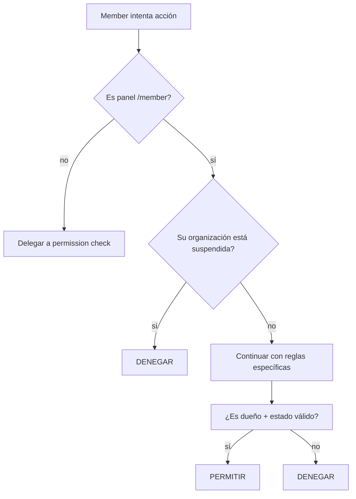

# Capítulo 6 — Policies y autorización

**Resumen ejecutivo.** Cada modelo principal de Bolsa de Trabajo tiene una *Policy* dedicada en [`app/Policies/`](../../../app/Policies/). Todas heredan de `BasePolicy` que define un `before()` hook que otorga acceso total a usuarios con flag de admin y un sistema de permisos basado en convención de nombres (`Panel.Model.method`). Este capítulo describe el patrón, las policies relevantes para Bolsa de Trabajo y un caso especialmente crítico: cómo la **suspensión** de una organización congela en cascada todas las operaciones de su miembro.

## 6.1 El patrón base

Verificable en [`app/Policies/BasePolicy.php`](../../../app/Policies/BasePolicy.php).

```php
class BasePolicy
{
    use HandlesAuthorization;

    public static $filamentPanel = true;
    public static $name = '';

    public function before(Model $user, string $ability): ?bool
    {
        if ($user instanceof User && $user->isAdmin()) {
            return true;
        }

        return null;
    }

    public function viewAny(Model $user)
    {
        return $user->hasPermission(static::prefix());
    }

    // ... view, create, update, delete, etc.
}
```

> Fuente: [`app/Policies/BasePolicy.php:10-92`](../../../app/Policies/BasePolicy.php).

Tres mecanismos coexisten:

1. **`before()` hook**: si el usuario es admin (`User` con `isAdmin() === true`), la policy responde `true` sin evaluar la regla específica. Esto permite que el rol super-admin acceda a todo sin enumerar permisos uno por uno.
2. **Permisos por convención**: cada método llama a `$user->hasPermission(static::prefix())` donde `prefix()` construye una clave compuesta `Panel.Model.method` (ej. `Admin.Organization.update`).
3. **Reglas custom por método**: una policy puede sobreescribir un método específico (p.ej. `update()`) con lógica adicional antes de delegar al permiso base.

## 6.2 Construcción de la clave de permiso

```php
public static function prefix($name = null)
{
    if (! $name) {
        $name = debug_backtrace()[1]['function'];
    }
    $tokens = [
        ucfirst(Filament::getCurrentPanel()->getId()),
        static::$name,
        $name,
    ];

    return implode('.', array_filter($tokens));
}
```

> Fuente: [`app/Policies/BasePolicy.php:77-91`](../../../app/Policies/BasePolicy.php).

Para una llamada `OrganizationPolicy::view($user)` en el panel `/admin`, la clave resultante es:

```
Admin.Organization.view
```

El método `Member::hasPermission(string $key)` (o `User::hasPermission`) consulta la relación con `Role` y verifica si el rol del usuario tiene ese permiso asignado. La implementación viva en `app/Models/User.php` y `app/Models/Member.php`.

## 6.3 Policies del módulo Bolsa de Trabajo

| Policy | Modelo | Reglas custom relevantes |
|---|---|---|
| `OrganizationPolicy` | `Organization` | `update`, `verify`, `suspend`, `reactivate`, helper `organizationFrozenForMember` |
| `JobListingPolicy` | `JobListing` | `viewAny`, `view`, `create`, `update`, `delete`, `close`, `submitForApproval` |
| `ApplicationPolicy` | `Application` | (override de `view`, `update` para que org propietaria pueda gestionar) |
| `ApplicationNotePolicy` | `ApplicationNote` | (idem) |
| `CandidateProfilePolicy` | `CandidateProfile` | (override para que el dueño pueda editar) |
| `JobAlertPolicy` | `JobAlert` | (override para que el dueño pueda gestionar sus alertas) |
| `CategoryPolicy` | `Category` | (estándar; solo admin crea/edita) |
| `MemberPolicy` | `Member` | (estándar; admin gestiona) |

## 6.4 OrganizationPolicy en detalle

```php
class OrganizationPolicy extends BasePolicy
{
    public static $name = 'Organization';

    public function update(Model $user, ?Organization $organization = null)
    {
        if ($user instanceof Member && $organization) {
            if ($this->organizationFrozenForMember($user, $organization)) {
                return false;
            }
            return $user->id === $organization->member_id;
        }
        return $user->hasPermission(static::prefix());
    }

    public function suspend(Model $user, ?Organization $organization = null)
    {
        if ($organization && ! $organization->canBeSuspended()) {
            return false;
        }
        return $user->hasPermission(static::prefix());
    }

    public function organizationFrozenForMember(Member $member, ?Organization $organization = null): bool
    {
        $org = $organization ?? $member->organization;
        return (bool) ($org?->is_suspended());
    }
}
```

> Fuente: [`app/Policies/OrganizationPolicy.php:11-62`](../../../app/Policies/OrganizationPolicy.php).

Lectura por método:

- **`update`**: si el actor es un `Member` (panel `/member`), exige que el miembro sea el dueño (`member_id`) **y** que su organización no esté suspendida. Si el actor es admin, delega al permiso base (`Admin.Organization.update`).
- **`verify`**: solo evalúa el permiso base; los admins pasan por el `before()` hook.
- **`suspend`**: comprueba el flag `canBeSuspended()` del modelo (que excluye orgs ya suspendidas) antes de evaluar permisos. Evita doble suspensión.
- **`reactivate`**: análogo a `suspend` pero con `canBeReactivated()`.
- **`organizationFrozenForMember`**: helper compartido por otras policies para evaluar si una org está suspendida y, por lo tanto, debe bloquear operaciones del miembro.

## 6.5 La cascada de congelamiento por suspensión

Cuando una organización es suspendida, no solo se cierran sus ofertas activas (capítulo 4 sección 4.4 de la *Guía de Admin*). Además, **todas las operaciones futuras del miembro asociado quedan bloqueadas** mientras la suspensión esté activa. Esta cascada se implementa por convención en cada policy.



<!-- TODO captura: impl-arch-suspension-cascade — render del diagrama mermaid arriba. -->

Ejemplo de [`JobListingPolicy::update()`](../../../app/Policies/JobListingPolicy.php:54-65):

```php
public function update(Model $user, ?JobListing $jobListing = null): bool
{
    if ($user instanceof Member && Util::isPanelActive('member') && $jobListing) {
        if ($this->organizationFrozenFor($user, $jobListing->organization)) {
            return false;
        }
        return $this->memberOwnsListing($user, $jobListing) && $jobListing->canEdit();
    }
    return false;
}
```

El método `organizationFrozenFor()` delega a `OrganizationPolicy::organizationFrozenForMember()`. Patrón replicado en `create`, `update`, `delete`, `close`, `submitForApproval`. Si una operación nueva del módulo necesita respetar la suspensión, debe seguir el mismo patrón.

> **Importante.** Si añade un método nuevo a una policy del módulo Bolsa de Trabajo, **considere si la suspensión debe bloquearlo** y, si la respuesta es sí, incluya la verificación `organizationFrozenFor` al inicio. Olvidar esta verificación es un bug operacional grave: la suspensión deja de cumplir su función.

## 6.6 JobListingPolicy en detalle

Las policies del módulo respetan el panel activo (admin vs. member) cuando la regla difiere:

```php
public function viewAny(Model $user)
{
    if ($user instanceof Member && Util::isPanelActive('member')) {
        return true;
    }
    return parent::viewAny($user);
}

public function create(Model $user): bool
{
    if ($user instanceof Member && Util::isPanelActive('member')) {
        $organization = Organization::where('member_id', $user->id)->first();
        return $organization
          && $organization->verification_state === OrganizationVerificationState::VERIFIED
          && ! $this->organizationFrozenFor($user, $organization);
    }
    return false;
}
```

> Fuente: [`app/Policies/JobListingPolicy.php:19-52`](../../../app/Policies/JobListingPolicy.php).

Reglas observables:

- **Crear una oferta** requiere: miembro con organización propia + organización en estado `VERIFIED` + organización no suspendida.
- **Editar/eliminar/cerrar** requiere ser dueño + estado de la oferta admite la operación (`canEdit()`, etc.) + organización no suspendida.
- **`viewAny`** desde el panel member es siempre permitido para que el usuario vea su listado; las consultas aplican filtros propios para mostrar solo sus ofertas.

## 6.7 Util::isPanelActive

Las policies usan `Util::isPanelActive('member')` para distinguir el panel desde el que se invocan. Esto es necesario porque un mismo modelo (p.ej. `JobListing`) tiene reglas distintas según el panel: en `/admin` se aplica el permiso base por convención; en `/member` se aplican reglas de propiedad + suspensión.

La implementación viva en `app/Helpers/Util.php`:

```php
public static function isPanelActive(string $id): bool
{
    return Filament::getCurrentPanel()?->getId() === $id;
}
```

> Verificable con `grep -n 'isPanelActive' app/Helpers/Util.php`.

## 6.8 Registro de policies

Las policies se auto-registran por convención (`App\Models\X` → `App\Policies\XPolicy`). Si una policy no sigue la convención, debe registrarse explícitamente en `AuthServiceProvider::$policies`.

## 6.9 Testing de policies

Patrón Pest típico:

```php
it('lets a verified organization member create a job listing', function () {
    $member = Member::factory()->create();
    $org = Organization::factory()->verified()->for($member, 'member')->create();

    Filament::setCurrentPanel(Filament::getPanel('member'));

    expect($member->can('create', JobListing::class))->toBeTrue();
});

it('blocks creation when the organization is suspended', function () {
    $member = Member::factory()->create();
    $org = Organization::factory()->verified()->suspended()->for($member, 'member')->create();

    Filament::setCurrentPanel(Filament::getPanel('member'));

    expect($member->can('create', JobListing::class))->toBeFalse();
});
```

Tests reales del módulo viven en `tests/Feature/Policies/` y `tests/Unit/Policies/`. Patrón a respetar: una assertion por test, factories con `verified()` / `suspended()` states para legibilidad.

## 6.10 Pitfalls comunes

1. **Olvidar setear `Filament::setCurrentPanel`** en tests de policies. Sin esto, `Util::isPanelActive()` devuelve `false` y la rama "panel member" no se ejecuta.
2. **Confundir `User` con `Member`**. `User` es el panel `/admin`, `Member` es `/member`. Una policy debe distinguirlos con `instanceof`.
3. **Saltar la verificación de suspensión al añadir reglas nuevas**. Repetir: si el método modifica datos del módulo y el actor es member, **verifique suspensión primero**.
4. **Asumir que el `before()` hook cubre toda autorización para admin**. El hook solo cubre `User` con `isAdmin() === true`. Si el rol admin no tiene la flag, la regla específica se ejecuta normalmente.

## 6.11 Resumen

| Pregunta | Respuesta |
|---|---|
| ¿Dónde viven las policies? | `app/Policies/*.php` |
| ¿Cómo se construye la clave de permiso? | `Panel.Model.method` vía `BasePolicy::prefix()` |
| ¿Cómo se desambigua admin vs. member en la policy? | `instanceof User` + `Util::isPanelActive('admin'|'member')` |
| ¿Cómo se bloquea una operación cuando la org está suspendida? | `(new OrganizationPolicy)->organizationFrozenForMember($member, $org)` |
| ¿Dónde está la lista de eventos auditados de cada policy? | En sus equivalentes `Actions/`; las policies no logean — las actions sí |

El próximo capítulo (7) describe el portal público sin sesión y la generación del sitemap.
