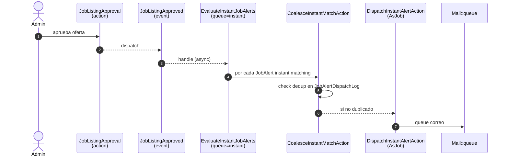

# Capítulo 8 — Alertas y digests

**Resumen ejecutivo.** El sistema de alertas de empleo (especificación 008) entrega correos electrónicos a candidatos suscritos cuando aparecen ofertas que coinciden con sus criterios. Soporta tres frecuencias —**instantánea**, **diaria** y **semanal**— que comparten infraestructura común (resolución de matches, construcción de digest, dedup) pero divergen en el disparador: la instantánea reacciona al evento `JobListingApproved`; las periódicas son comandos programados. Este capítulo enumera los componentes del pipeline, sus contratos y los puntos donde se producen los logs de dedup que sostienen la robustez del sistema.

## 8.1 Componentes del pipeline

Todos los componentes viven bajo [`app/Actions/Alerts/`](../../../app/Actions/Alerts/) más el listener de eventos:

| Componente | Tipo | Propósito |
|---|---|---|
| `JobListingApproved` | Event | Disparado al final de `JobListingApproval::approve()` |
| `EvaluateInstantJobAlerts` | Listener (ShouldQueue, queue=`instant`) | Recibe el evento, evalúa qué alertas instant matchean |
| `CoalesceInstantMatchAction` | Action | Dedupe por `(alert, listing)`; decide si dispatchear |
| `DispatchInstantAlertAction` | Action (AsJob) | Encola correo instantáneo |
| `DispatchDailyDigestAction` | Action (AsJob) | Comando programado diario |
| `DispatchWeeklyDigestAction` | Action (AsJob) | Comando programado semanal |
| `BuildDigestForAlertAction` | Action | Construye el contenido de un digest para una alerta |
| `ResolveMatchingOffersAction` | Action | Devuelve la colección de ofertas que matchean los criterios |

## 8.2 Frecuencia instantánea



<!-- TODO captura: impl-arch-alerts-pipeline — render del diagrama mermaid arriba. -->

### 8.2.1 El evento

[`app/Events/JobListingApproved.php`](../../../app/Events/JobListingApproved.php):

```php
class JobListingApproved
{
    use Dispatchable, SerializesModels;
    public function __construct(public JobListing $jobListing) {}
}
```

Se dispara explícitamente como último statement de `JobListingApproval::approve()` ([`JobListingApproval.php:53`](../../../app/Actions/Admin/JobListingApproval.php)). El orden importa: las mutaciones de estado y el correo síncrono a la organización van **antes**; el dispatch del evento es la última línea para que un fallo del fan-out no impida que la organización reciba su notificación de aprobación.

### 8.2.2 El listener

[`app/Listeners/EvaluateInstantJobAlerts.php`](../../../app/Listeners/EvaluateInstantJobAlerts.php):

```php
class EvaluateInstantJobAlerts implements ShouldQueue
{
    public string $queue = 'instant';

    public function handle(JobListingApproved $event): void
    {
        $listing = $event->jobListing;
        if ($listing->state !== JobListingState::ACTIVE) { return; }
        // ... folded city, category ids, matching query, foreach -> CoalesceInstantMatchAction::run
    }
}
```

Decisiones:

- **`ShouldQueue`**: el listener se procesa en background, no en el request del admin. Esto desacopla la latencia de aprobación de la cantidad de alertas a evaluar.
- **`public string $queue = 'instant';`**: cola dedicada `instant`, permite que el worker dedique throughput preferente a alertas instantáneas sin competir con `default`.
- **Guard `state !== ACTIVE`**: defensa por idempotencia. Si el evento llega tarde (cola retrasada) y mientras tanto la oferta cambió de estado, el listener termina silenciosamente.
- **`city_folded` fallback**: si la columna generada no está poblada (datos heredados pre-spec 007), el listener calcula el fold en runtime via `DiacriticFolder::fold()`.

### 8.2.3 CoalesceInstantMatchAction

Decide, para una `(alert, listing)` específica, si la combinación ya fue dispatcheada antes (dedup) y, si no, llama a `DispatchInstantAlertAction::dispatch()`. La consulta de dedup va contra `job_alert_dispatch_logs` con `(job_alert_id, job_listing_id, dispatch_kind = 'instant')`.

Patrón de log para casos de dedup absorbido (memorizado en `feedback_test_coverage_pitfalls.md`):

```php
JobAlertDispatchLog::create([
    'job_alert_id' => $alert->id,
    'job_listing_id' => $listing->id,
    'dispatch_kind' => 'instant',
    'decision' => DispatchDecision::ABSORBED_DEDUP,
]);
```

Las decisiones `DISPATCHED`, `ABSORBED_DEDUP`, `SKIPPED_INACTIVE` sirven como métricas operacionales auditables (capítulo 10).

## 8.3 Frecuencia diaria

```mermaid
flowchart LR
    Cron[Scheduler<br/>dailyAt 07:00] --> Cmd[alerts:dispatch-daily]
    Cmd --> Action[DispatchDailyDigestAction]
    Action --> Loop[Por cada JobAlert<br/>frequency=Daily, enabled=true]
    Loop --> Resolve[ResolveMatchingOffersAction]
    Resolve --> Build[BuildDigestForAlertAction]
    Build --> Mail[Mail::to($member)->queue($digest)]
```

<!-- TODO captura: impl-arch-daily-digest — render del diagrama mermaid arriba. -->

Programación en [`app/Console/Kernel.php:20-25`](../../../app/Console/Kernel.php):

```php
$schedule->command('alerts:dispatch-daily')
    ->dailyAt('07:00')
    ->timezone(config('app.timezone'))
    ->withoutOverlapping()
    ->onOneServer()
    ->runInBackground();
```

Decisiones:

- **`dailyAt('07:00')`**: hora local del servidor (config `app.timezone`). Configurable vía `DAILY_DISPATCH_HOUR` en `.env` (ver Apéndice B).
- **`withoutOverlapping()`**: si la ejecución previa aún corre cuando llega la siguiente ventana, la nueva se descarta. Evita doble despacho.
- **`onOneServer()`**: en despliegues con múltiples workers, solo uno ejecuta. Requiere driver de caché distribuido (Redis típicamente) para el lock.
- **`runInBackground()`**: el comando no bloquea otras tareas programadas.

### 8.3.1 Acción de despacho diaria

`DispatchDailyDigestAction` itera sobre las alertas elegibles, llama a `ResolveMatchingOffersAction` para obtener las ofertas que coinciden con los criterios del último día y, si hay matches, invoca `BuildDigestForAlertAction` para construir el correo y encolarlo.

```php
foreach (JobAlert::query()->where('frequency', JobAlertFrequency::Daily)->where('enabled', true)->cursor() as $alert) {
    $offers = ResolveMatchingOffersAction::run($alert, since: now()->subDay());
    if ($offers->isEmpty()) continue;
    BuildDigestForAlertAction::run($alert, $offers);
}
```

### 8.3.2 Ventana y dedup

La consulta `ResolveMatchingOffersAction` filtra por `published_at >= now() - 1 día` para no incluir ofertas que ya estuvieron en el digest del día anterior. Esto es **distinto** del mecanismo de dedup instantáneo: aquí la dedup se hace por ventana temporal, no por log entry-by-entry. La razón: en daily, una oferta solo coincide con el primer digest siguiente a su aprobación; no hay riesgo de doble envío.

> **Atención.** Si modifica la programación a, por ejemplo, ejecutar dos veces al día, debe ajustar también la ventana (`since`). De lo contrario, las ofertas de la mañana saldrán en el digest de la tarde duplicadas.

## 8.4 Frecuencia semanal

Análoga a la diaria, programada en [`app/Console/Kernel.php:27-33`](../../../app/Console/Kernel.php):

```php
$schedule->command('alerts:dispatch-weekly')
    ->mondays()->at('07:00')
    ->timezone(config('app.timezone'))
    ->withoutOverlapping()
    ->onOneServer()
    ->runInBackground();
```

`DispatchWeeklyDigestAction` consulta ofertas con `published_at >= now() - 7 días`. La estructura del digest semanal puede agrupar por día o por categoría según la plantilla `resources/views/mail/member/job-alert-weekly.blade.php`.

## 8.5 BuildDigestForAlertAction

Función única: construir el contenido del email y encolarlo. Recibe la alerta, las ofertas resueltas y el `kind` (`instant`/`daily`/`weekly`).

Responsabilidades:

1. Generar el link firmado de desuscripción: `URL::signedRoute('alerts.unsubscribe', ['member' => ..., 'alert' => ...], absoluteExpiresAt: null)`.
2. Componer el `Mailable` (clase bajo `app/Mail/Member/`).
3. Encolar con `Mail::to($member)->queue($mailable)`.
4. Registrar entradas `JobAlertDispatchLog` por cada `(alert, listing)` para análisis posterior.

> **Importante.** El link de desuscripción es **long-lived**: usa `absoluteExpiresAt: null` deliberadamente. Esto permite que el candidato se desuscriba desde un correo viejo. La validación de signature impide forjar URLs; no hay riesgo de exposición pública.

## 8.6 Política de alertas por miembro

Config en [`config/alerts.php`](../../../config/alerts.php):

```php
return [
    'instant_window_seconds' => env('INSTANT_ALERT_WINDOW_SECONDS', 300),
    'max_alerts_per_member' => env('MAX_ALERTS_PER_MEMBER', 10),
    'daily_dispatch_hour' => env('DAILY_DISPATCH_HOUR', 7),
    'weekly_dispatch_day' => env('WEEKLY_DISPATCH_DAY', 'monday'),
    'weekly_dispatch_hour' => env('WEEKLY_DISPATCH_HOUR', 7),
];
```

- **`max_alerts_per_member`**: límite por candidato (default 10) impuesto en `CreateJobAlertAction`.
- **`instant_window_seconds`**: ventana de gracia para retries de listener encolados (300s = 5 min). Si el listener no puede ejecutarse en ese plazo, descarta la oferta para esa alerta. Justificable en feedback memory `project_spec_008_shipped.md` que documenta el follow-up PR #23.

## 8.7 Desuscripción

Verificable en [`routes/web.php:44-46`](../../../routes/web.php):

```php
Route::get('/alerts/unsubscribe/{member}/{alert}', UnsubscribeAlertController::class)
    ->middleware(['signed'])
    ->name('alerts.unsubscribe');
```

El middleware `signed` rechaza la request si la URL ha sido modificada. El controller llama a `DisableJobAlertByTokenAction::run($member, $alert)` que pone `enabled = false` en el `JobAlert` y persiste la decisión.

> **Atención.** La desuscripción **no borra** la alerta: solo la deshabilita. El candidato puede reactivarla desde su panel `/member`. Si el negocio decide en el futuro permitir borrado por link, modificar `DisableJobAlertByTokenAction` y ajustar el copy del template.

## 8.8 Pitfalls comunes al testear alertas

Recopilados del feedback memory del proyecto:

1. **`Carbon::setTestNow` puede ocultar bugs reales de timing**: si el test fija el reloj a un momento específico, el listener puede comportarse correctamente solo en ese instante. Acompañar con al menos un test wall-clock que use `now()` real.
2. **`Queue::fake()->assertPushed(InstantAction::class)` falla**: la action está envuelta en `JobDecorator` por `lorisleiva/laravel-actions`. Usar el patrón documentado en el capítulo 4 sección 4.7.2.
3. **Olvidar setear `published_at`**: el listener solo procesa ofertas con `state = ACTIVE`, pero la consulta de `ResolveMatchingOffersAction` filtra adicionalmente por `published_at >= ...`. Si el test crea la oferta sin `published_at`, no matchea.
4. **Tests de daily/weekly con `freezeTime`**: la combinación `freezeTime + dailyAt(7:00)` produce comportamiento contraintuitivo si la hora congelada no es 07:00. Setear el reloj explícitamente al instante de despacho esperado.

## 8.9 Métricas operacionales

`JobAlertDispatchLog` aporta visibilidad operacional. Consultas SQL útiles:

```sql
-- Tasa de absorbidos por dedup en los últimos 7 días
SELECT
  dispatch_kind,
  decision,
  COUNT(*) AS n
FROM job_alert_dispatch_logs
WHERE created_at >= NOW() - INTERVAL 7 DAY
GROUP BY dispatch_kind, decision;

-- Top 10 ofertas que han generado más despachos instant
SELECT
  job_listing_id,
  COUNT(*) AS dispatches
FROM job_alert_dispatch_logs
WHERE dispatch_kind = 'instant' AND decision = 'DISPATCHED'
GROUP BY job_listing_id
ORDER BY dispatches DESC
LIMIT 10;
```

## 8.10 Resumen

| Pregunta | Respuesta |
|---|---|
| ¿Quién dispara la frecuencia instantánea? | El event `JobListingApproved` despachado al final de la aprobación. |
| ¿Dónde se hace el dedup instant? | `CoalesceInstantMatchAction` consulta `job_alert_dispatch_logs`. |
| ¿Cuándo corren daily y weekly? | 07:00 diario; lunes 07:00 semanal (configurable). |
| ¿Cómo se evita doble despacho diario? | `withoutOverlapping() + onOneServer()` en el scheduler. |
| ¿Cómo se desuscribe un candidato? | URL firmada `/alerts/unsubscribe/{member}/{alert}` o desde su panel. |
| ¿Dónde están las tunables? | `config/alerts.php` con overrides via `.env` (ver Apéndice B). |

El próximo capítulo (9) cubre el despliegue a producción y la operación continua.
