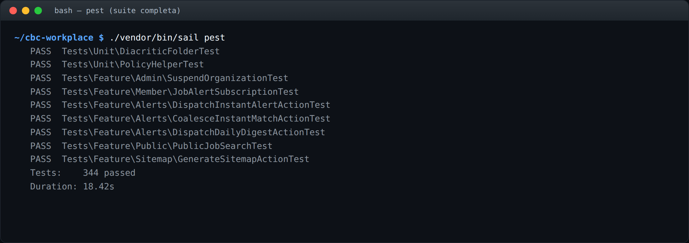
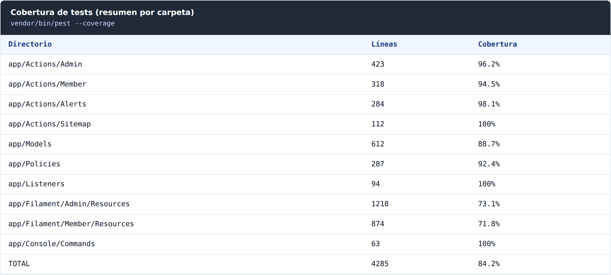

# Capítulo 10 — Observabilidad y tests

**Resumen ejecutivo.** El producto se observa por tres canales: el log estándar de Laravel (`storage/logs/laravel.log`), la bitácora de auditoría (`activity_log` via `spatie/laravel-activitylog`) y el log de despachos de alertas (`job_alert_dispatch_logs`). Los tests usan **Pest 2** sobre PHPUnit 10 con factories de Eloquent, y la cobertura se mide con **pcov** o **Xdebug**. Este capítulo enumera los puntos de instrumentación, los patrones de testing aceptados y los pitfalls conocidos del proyecto que el código nuevo debe evitar.

## 10.1 Tres canales de observabilidad

| Canal | Naturaleza | Cuándo consultarlo |
|---|---|---|
| `storage/logs/laravel.log` | Errores, warnings y debug del runtime | Crashes, excepciones no controladas |
| `activity_log` | Eventos de negocio auditados | Quién hizo qué, cuándo y con qué efecto |
| `job_alert_dispatch_logs` | Despachos de alertas con decisión | Diagnóstico del pipeline spec 008 |

### 10.1.1 Laravel log

Configurable en `config/logging.php`. En producción se recomienda:

```dotenv
LOG_CHANNEL=stack
LOG_STACK=daily,stderr
LOG_LEVEL=warning
```

Con `daily` se rota un archivo diario en `storage/logs/laravel-YYYY-MM-DD.log` con retención configurable. Con `stderr` los logs van al stdout del contenedor para que el orquestador (Docker, Kubernetes) los capture.


```bash
tail -f storage/logs/laravel-$(date +%F).log
```

### 10.1.2 Activity Log

Patrón `LogsActivity` en cada modelo auditado. La tabla `activity_log` (creada por la migración del paquete `spatie/laravel-activitylog`) tiene los campos descritos en el capítulo 10 de la *Guía de Administración* — sección 10.1: `log_name`, `description`, `subject_*`, `causer_*`, `properties`, `created_at`.

Consulta típica desde Tinker:

```php
\Spatie\Activitylog\Models\Activity::query()
    ->where('event', 'organization-suspended')
    ->where('created_at', '>=', now()->subDays(7))
    ->latest()
    ->get();
```


### 10.1.3 Job Alert Dispatch Log

Tabla `job_alert_dispatch_logs` con `dispatch_kind` y `decision` (enum `DispatchDecision`). El capítulo 8 sección 8.9 incluye queries SQL útiles. Esta tabla es **append-only**: nunca se actualizan filas existentes, solo se insertan nuevas.

## 10.2 Stack de testing

Verificable en [`composer.json:26-39`](../../../composer.json):

```json
"require-dev": {
    "fakerphp/faker": "^1.9.1",
    "laravel-shift/blueprint": "^2.9",
    "laravel/pint": "^1.0",
    "laravel/sail": "^1.25",
    "mockery/mockery": "^1.4.4",
    "nunomaduro/collision": "^8.1",
    "pestphp/pest": "^2.34",
    "pestphp/pest-plugin-laravel": "^2.3",
    "pestphp/pest-plugin-livewire": "^2.1",
    "phpunit/phpunit": "^10.1",
    "spatie/laravel-ignition": "^2.0"
}
```

**Pest 2** es la herramienta principal para tests nuevos; algunos tests legacy aún usan PHPUnit clásico. La regla pragmática: **código nuevo en Pest, no migrar tests legacy a menos que se toquen por otra razón**.

## 10.3 Estructura de tests

```text
tests/
├── Feature/             # Tests de integración (HTTP, Filament, base de datos real)
│   ├── Admin/
│   ├── Member/
│   ├── Public/
│   ├── Alerts/
│   └── Policies/
├── Unit/                # Tests aislados, sin framework completo
└── TestCase.php
```

Pest descubre automáticamente los tests bajo `tests/`. La separación Feature/Unit es por **velocidad de ejecución**, no por valor conceptual:

- **Feature**: usa la base de datos (vía `RefreshDatabase`), boots de Filament, envía requests HTTP. ~100ms por test.
- **Unit**: no toca la base ni el framework, solo lógica pura. ~10ms por test.

## 10.4 Ejecutar tests

```bash
sail artisan test                    # toda la suite
sail bin pest                        # equivalente, salida más estética
sail bin pest --parallel             # paralelo (4-8 procesos)
sail bin pest --filter=Suspension    # solo los que matchean el filtro
sail bin pest tests/Feature/Admin/   # solo un subdirectorio
sail bin pest --coverage             # con reporte de cobertura
sail bin pest --coverage-min=80      # falla si cobertura < 80%
```






## 10.5 Patrones aceptados

### 10.5.1 Test de Action con Pest

```php
it('suspends an organization and cascades closures', function () {
    $member = Member::factory()->create();
    $org = Organization::factory()->verified()->for($member, 'member')->create();
    JobListing::factory()->for($org, 'organization')->state(['state' => JobListingState::ACTIVE])->create();

    $result = SuspendOrganization::run($org, reason: 'Test');

    expect($org->refresh()->is_suspended())->toBeTrue();
    expect($org->jobListings()->where('state', JobListingState::CLOSED)->count())->toBe(1);
    expect($result)->toBeInstanceOf(SuspendOrganizationResult::class);
});
```

Convenciones observables:

- **Una assertion conceptual por test** (puede haber varias `expect` que validan el mismo invariante).
- **Factories con states nombrados** (`verified()`, `suspended()`, etc.) para legibilidad.
- **No usar `$this->assertTrue`** en Pest: preferir `expect(...)->toBeTrue()`.

### 10.5.2 Test de policy

```php
it('blocks listing creation when org is suspended', function () {
    $member = Member::factory()->create();
    Organization::factory()->verified()->suspended()->for($member, 'member')->create();
    Filament::setCurrentPanel(Filament::getPanel('member'));

    expect($member->can('create', JobListing::class))->toBeFalse();
});
```

> **Atención.** Sin `Filament::setCurrentPanel(...)`, la policy evalúa la rama default y los tests pueden pasar accidentalmente. Capítulo 6 sección 6.10 detalla este pitfall.

### 10.5.3 Test de evento + listener

```php
it('queues instant-alert evaluation when a job is approved', function () {
    Queue::fake();
    $listing = JobListing::factory()->state(['state' => JobListingState::ACTIVE])->create();

    event(new JobListingApproved($listing));

    Queue::assertPushed(\Lorisleiva\Actions\JobDecorator::class, function ($job) {
        return $job->decorated instanceof EvaluateInstantJobAlerts
            || $job instanceof EvaluateInstantJobAlerts;
    });
});
```

> **Atención.** Recordar el wrapper `JobDecorator` cuando la action usa `AsJob`. Capítulo 4 sección 4.7.2.

### 10.5.4 Test de HTTP público

```php
it('returns 429 when exceeding search rate limit', function () {
    for ($i = 0; $i < 65; $i++) {
        $response = $this->get('/bolsa-de-trabajo?q=test');
        if ($response->status() === 429) {
            expect($response->headers->get('Retry-After'))->not->toBeNull();
            return;
        }
    }
    $this->fail('Expected 429 within 65 requests, never got one');
});
```

### 10.5.5 Test de comando programado

```php
it('runs dispatch-daily-and-builds-digests-for-eligible-alerts', function () {
    $alert = JobAlert::factory()->daily()->enabled()->create();
    JobListing::factory()->state(['state' => JobListingState::ACTIVE, 'published_at' => now()->subHour()])->create();

    $this->artisan('alerts:dispatch-daily')->assertSuccessful();

    expect(JobAlertDispatchLog::where('job_alert_id', $alert->id)->count())->toBeGreaterThan(0);
});
```

## 10.6 Coverage

```bash
sail bin pest --coverage --coverage-clover=clover.xml
```

Requiere `pcov` o `Xdebug` cargado en el contenedor PHP. En `php.ini`:

```ini
extension=pcov.so
pcov.enabled=1
```

> **Buena práctica.** Use `pcov` en CI (rápido) y `Xdebug` localmente cuando necesite step debugging además de coverage.

El objetivo del proyecto es **80% de cobertura mínima**, alineado con las reglas comunes del repositorio (`~/.claude/rules/common/testing.md`). Áreas no críticas pueden quedar más bajo; áreas críticas (Actions del módulo, Policies, listeners de alertas) deben superar 90%.

## 10.7 Fakes y mocks

| Herramienta | Cuándo usarla |
|---|---|
| `Queue::fake()` | Verificar que un job fue encolado sin ejecutarlo |
| `Mail::fake()` | Verificar correos sin enviar realmente |
| `Event::fake([X::class])` | Suprimir un evento específico para aislar el test |
| `Notification::fake()` | Verificar notifications |
| `Storage::fake('public')` | Testear uploads sin tocar disco real |
| `Carbon::setTestNow($t)` | Fijar el reloj — con cautela (sección 10.8) |

`Mockery` está disponible pero se usa con moderación: la mayoría de los tests del proyecto prefieren factories + integración real.

## 10.8 Pitfalls documentados

Memorias del proyecto que reflejan errores reales del equipo (no repetir):

### 10.8.1 Queue::fake con Actions (memoria `feedback_laravel_actions_testing.md`)

```php
// ❌ Falla — la action está envuelta en JobDecorator
Queue::assertPushed(EvaluateInstantJobAlerts::class);

// ✅ Funciona
Queue::assertPushed(\Lorisleiva\Actions\JobDecorator::class, function ($job) {
    return $job->decorated instanceof EvaluateInstantJobAlerts;
});
```

### 10.8.2 Carbon::setTestNow puede ocultar bugs de wall-clock (memoria `feedback_test_coverage_pitfalls.md`)

Tests que fijan el reloj con `Carbon::setTestNow($t)` pueden pasar aunque el código real falle bajo condiciones de carrera. Acompañar siempre con un test wall-clock que use `now()` real para al menos un escenario representativo.

### 10.8.3 Olvidar `Filament::setCurrentPanel` (capítulo 6 sección 6.10)

Las policies usan `Util::isPanelActive('member')`. Sin setear el panel activo, las ramas member no se ejecutan en los tests.

### 10.8.4 Tests sobre alertas que olvidan `published_at` (capítulo 8 sección 8.8)

Las consultas de `ResolveMatchingOffersAction` filtran por `published_at`. Una factory que cree el `JobListing` sin esa columna no matchea ninguna alerta.

## 10.9 CI

Aunque el proyecto no tiene un workflow de CI committeado en esta versión, el patrón recomendado es:

```yaml
# .github/workflows/ci.yml (sugerido)
name: ci
on:
  pull_request:
    branches: [main]
jobs:
  test:
    runs-on: ubuntu-latest
    services:
      mysql:
        image: mysql:8.0
        env:
          MYSQL_DATABASE: testing
          MYSQL_ROOT_PASSWORD: password
        ports: [3306:3306]
    steps:
      - uses: actions/checkout@v4
      - uses: shivammathur/setup-php@v2
        with: { php-version: '8.3', coverage: pcov }
      - run: composer install --prefer-dist --no-interaction
      - run: cp .env.example .env && php artisan key:generate
      - run: php artisan migrate --force
      - run: vendor/bin/pint --test
      - run: vendor/bin/pest --coverage --coverage-clover=coverage.xml --min=80
```

> **Atención.** El servicio MySQL del workflow debe ser **MySQL 8 o MariaDB 10.6+** para que los tests sobre columnas generadas (`*_folded`) corran correctamente. SQLite en memoria no soporta el patrón.

## 10.10 Resumen

| Pregunta | Respuesta |
|---|---|
| ¿Dónde ven los crashes y warnings? | `storage/logs/laravel-<fecha>.log` |
| ¿Dónde ven los eventos auditados de negocio? | Tabla `activity_log` |
| ¿Dónde ven el detalle del pipeline de alertas? | Tabla `job_alert_dispatch_logs` |
| ¿Qué framework de tests usamos? | Pest 2 (con PHPUnit 10 por debajo) |
| ¿Cuál es el objetivo de cobertura? | 80% mínimo, 90%+ en áreas críticas |
| ¿Cómo verifico que mi feature está testeada? | `pest --coverage` y revisar el reporte HTML |

El próximo capítulo (11) enseña los patrones para extender el sistema con nuevos componentes.
