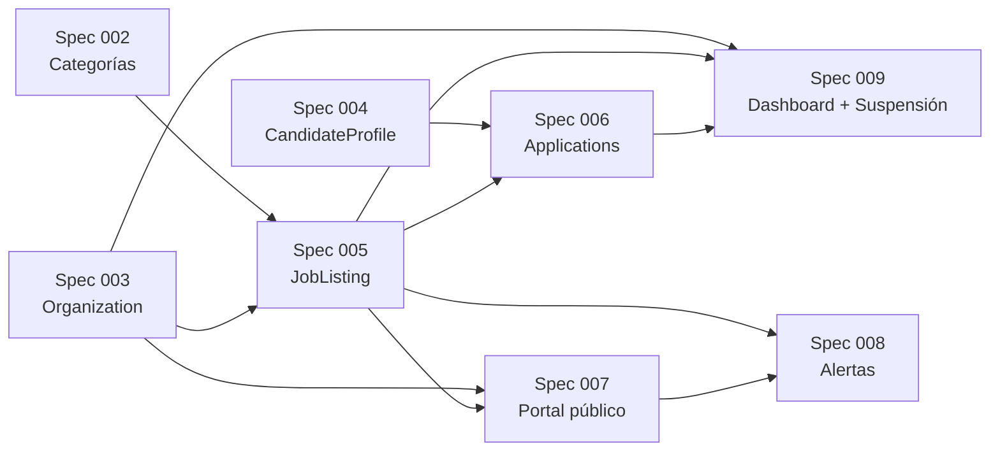

# Capítulo 12 — Changelog y versiones

**Resumen ejecutivo.** El módulo Bolsa de Trabajo se desarrolló incrementalmente entre marzo y mayo de 2026 en ocho especificaciones (`002` a `009`), todas mergeadas en `main` antes de la liberación v1.0 de esta guía. Cada spec entregó una pieza autocontenida del producto; el grafo de dependencias entre ellas es lineal con paralelismo solo en las migraciones de soporte. Este capítulo enumera cada spec, su contribución, las PRs y commits asociados, y deja una referencia para el equipo técnico que necesite trazar un comportamiento concreto hasta su origen.

## 12.1 Resumen cronológico

| Spec | Fecha approximada | Feature | PR |
|---|---|---|---|
| **002** | Marzo 2026 | Categorías de empleo (taxonomía con slug + icon) | (varios) |
| **003** | Marzo 2026 | Modelo `Organization` con verificación | (varios) |
| **004** | Marzo 2026 | `CandidateProfile` + WorkExperience + Education | (varios) |
| **005** | Marzo 2026 | Modelo `JobListing` con estados y CRUD member | (varios) |
| **006** | Abril 2026 | `Application` + `ApplicationNote` (postulaciones) | (varios) |
| **007** | Abril–Mayo 2026 | Portal público + búsqueda + sitemap | #19, #20 |
| **008** | Mayo 2026 | Sistema de alertas (instant/daily/weekly) | #21, #23, #24 |
| **009** | Mayo 2026 | Dashboard widgets + suspensión ortogonal | #25, #26 |

## 12.2 Spec 002 — Categorías

**Entrega:** taxonomía reutilizable con extensión para soportar empleos. Tabla `categories` ampliada con `slug` (URL-friendly) e `icon` (heroicon).

**Migraciones:**

- `2026_03_23_000001_add_slug_icon_to_categories_table.php`

**Decisiones:**

- Reutilizar tabla `categories` con campo `scope` para discriminar contextos.
- Slug autogenerado desde el nombre pero editable.

## 12.3 Spec 003 — Organization

**Entrega:** modelo y flujos de organización con verificación.

**Migraciones:**

- `2026_03_23_000002_create_organizations_table.php`

**Componentes clave:**

- [`app/Models/Organization.php`](../../../app/Models/Organization.php) con `verification_state` enum.
- [`OrganizationVerification` Action](../../../app/Actions/Admin/OrganizationVerification.php) (transición unidireccional a VERIFIED).
- [`OrganizationPolicy`](../../../app/Policies/OrganizationPolicy.php).

## 12.4 Spec 004 — CandidateProfile

**Entrega:** extensión del modelo `Member` con perfil profesional.

**Decisión arquitectónica clave:** **no** crear una tabla `candidates` separada. El `Member` con `CandidateProfile` 1:1 cubre el caso sin duplicar usuarios.

**Migraciones:**

- `2026_03_23_000003_create_candidate_profiles_table.php`
- `2026_03_23_000004_create_work_experiences_table.php`
- `2026_03_23_000005_create_educations_table.php`

## 12.5 Spec 005 — JobListing

**Entrega:** modelo de oferta de empleo con ciclo de vida de seis estados.

**Migraciones:**

- `2026_03_23_000006_create_job_listings_table.php`

**Componentes clave:**

- [`app/Models/JobListing.php`](../../../app/Models/JobListing.php).
- [`app/Enums/JobListingState.php`](../../../app/Enums/JobListingState.php): DRAFT(0), PENDING(1), ACTIVE(2), REJECTED(3), CLOSED(4), EXPIRED(5).
- [`JobListingApproval` Action](../../../app/Actions/Admin/JobListingApproval.php) para aprobar/rechazar.
- [`JobListingPolicy`](../../../app/Policies/JobListingPolicy.php) con el patrón panel-aware.

## 12.6 Spec 006 — Applications

**Entrega:** postulaciones del candidato a una oferta.

**Migraciones:**

- `2026_04_27_000001_create_applications_table.php`
- `2026_04_27_000002_create_application_notes_table.php`

**Componentes:**

- [`app/Models/Application.php`](../../../app/Models/Application.php) con snapshot de perfil al postular.
- [`app/Enums/ApplicationStatus.php`](../../../app/Enums/ApplicationStatus.php): RECEIVED, IN_REVIEW, INTERVIEW, REJECTED, ACCEPTED.
- [`SubmitApplication` Action](../../../app/Actions/Member/SubmitApplication.php).

## 12.7 Spec 007 — Portal público

**Entrega:** listado público sin sesión + sitemap + búsqueda acento-insensible.

**Estado:** shipped vía PR #19 (squash `e6da340`, 2026-05-08); follow-up de sitemap queue PR #20 (`317bcc8`, 2026-05-11).

**Migraciones:**

- `2026_05_07_000001_add_folded_columns_to_job_listings.php`
- `2026_05_07_000002_add_filter_indexes_to_job_listings.php`
- `2026_05_07_000003_create_public_events_table.php`
- `2026_05_11_000000_add_city_folded_to_job_listings.php`

**Componentes:**

- [`routes/public.php`](../../../routes/public.php) con middleware mínimo.
- [`PublicNoSessionCookie` middleware](../../../app/Http/Middleware/PublicNoSessionCookie.php).
- [`ThrottleOnQuery` middleware](../../../app/Http/Middleware/ThrottleOnQuery.php).
- [`SitemapController`](../../../app/Http/Controllers/Public/SitemapController.php) + [`GenerateSitemapAction`](../../../app/Actions/Public/GenerateSitemapAction.php).
- Columnas generadas `*_folded` para búsqueda acento-insensible.

**Pendiente diferido:** T123 Lighthouse audit + T127 performance probe manual.

## 12.8 Spec 008 — Alertas y digests

**Entrega:** sistema de alertas con tres frecuencias (instant/daily/weekly) y desuscripción por link firmado.

**Estado:** shipped vía PR #21 (squash `c5f5158`, 2026-05-12); hotfixes PR #23 (`50e419b`, lookback grace) y PR #24 (`cbb1efd`, AlreadySent dedup counter), ambos 2026-05-15.

**Migraciones:**

- `2026_05_11_000001_create_job_alerts_table.php`
- `2026_05_11_000002_create_job_alert_dispatch_logs_table.php`
- `2026_05_11_000003_add_alert_kinds_to_public_events_enum.php`

**Componentes:**

- [`app/Models/JobAlert.php`](../../../app/Models/JobAlert.php), [`JobAlertDispatchLog.php`](../../../app/Models/JobAlertDispatchLog.php).
- [`app/Enums/JobAlertFrequency.php`](../../../app/Enums/JobAlertFrequency.php): Daily(1), Weekly(2), Instant(3).
- [`config/alerts.php`](../../../config/alerts.php) con tunables.
- [`app/Events/JobListingApproved.php`](../../../app/Events/JobListingApproved.php).
- [`EvaluateInstantJobAlerts` listener](../../../app/Listeners/EvaluateInstantJobAlerts.php).
- 6 actions en [`app/Actions/Alerts/`](../../../app/Actions/Alerts/).
- [`routes/web.php:44-46`](../../../routes/web.php): ruta de desuscripción signed.

**Pendiente diferido:** T073 browser-side a11y check del template del digest.

## 12.9 Spec 009 — Dashboard + suspensión

**Entrega:** cuatro widgets en el dashboard admin + reorganización de la suspensión de organizaciones como bandera ortogonal al estado de verificación.

**Estado:** shipped vía PR #25 (squash `6145809`, 2026-05-17). Cleanup PR #26 (`0176383`, mismo día) eliminó el caso `OrganizationVerificationState::SUSPENDED` deprecado.

**Migraciones:**

- `2026_05_17_000001_add_suspension_columns_to_organizations.php` (añade `suspended_at`, `suspended_by`, `suspension_reason`)
- `2026_05_17_000002_drop_suspended_verification_state.php` (data migration: pasa `SUSPENDED` viejos a `VERIFIED` + bandera)

**Componentes:**

- 4 widgets bajo [`app/Filament/Admin/Widgets/`](../../../app/Filament/Admin/Widgets/): `JobBoardStatsOverview`, `PendingJobListingApprovalsWidget`, `PendingOrganizationVerificationsWidget`, `RecentApplicationsWidget`.
- Refactor de [`OrganizationVerification`](../../../app/Actions/Admin/OrganizationVerification.php): solo permite decisión `VERIFIED`.
- [`SuspendOrganization`](../../../app/Actions/Admin/SuspendOrganization.php) y [`ReactivateOrganization`](../../../app/Actions/Admin/ReactivateOrganization.php): banderas ortogonales con cascada de cierre de ofertas activas.
- Banner de suspensión en `MemberPanelProvider.php:48-62` para el panel `/member`.
- Cuarto grupo de navegación "Bolsa de Trabajo" en admin.

**Decisión arquitectónica clave:** la suspensión es **operacional**, no de verificación. PR #26 limpia código residual y datos legados.

## 12.10 Grafo de dependencias entre specs

Lectura: spec 009 depende de 005 (para los widgets que iteran sobre `JobListing`), de 003 (para la suspensión), y de 006 (para `RecentApplicationsWidget`). Las migraciones de spec 009 modifican `organizations` (creada en 003) pero no rompen el módulo de 006 ni 008.

## 12.11 Versionado del producto

Esta guía documenta **v1.0 — Mayo 2026**, alineada con el estado de `main` tras el merge de PR #26. Versiones futuras seguirán el patrón **semver** con interpretación pragmática:

- **MAJOR**: cambio incompatible en la base de datos o en la API que exige migración explícita.
- **MINOR**: nueva feature backward-compatible (un widget nuevo, una alerta nueva, etc.).
- **PATCH**: bug fix sin schema changes.

Tags Git se crean en el momento del deploy a producción y se referencian desde el procedimiento del capítulo 9 sección 9.6.

## 12.12 Convenciones de PRs

PRs del módulo Bolsa de Trabajo siguen el patrón:

- **Título**: `<tipo>(<área>): <descripción concisa>` (e.g., `feat(alerts): instant pipeline with dedup`).
- **Body**: resumen de cambios, lista de migraciones nuevas, test plan, links a issues.
- **Squash merge** a `main` con commit message del PR (no preserva el historial granular del branch).
- **Sin co-author lines de IA** (memoria `feedback_authorship.md`).
- **Atribución única**: Juan Carlos Hooper.

Squash merges se identifican como un único commit en `main` con el número del PR entre paréntesis al final, p.ej. `feat: admin dashboard widgets + bolsa de trabajo nav group + org suspension (spec 009) (#25)`.

## 12.13 Memorias del proyecto

El equipo mantiene memorias técnicas en `~/.claude/projects/-home-juanca-proys-cbc-workplace/memory/` que documentan decisiones y feedback recurrente. Las relevantes para este módulo:

- `project_bolsa_de_trabajo.md`: estado del módulo y dependency graph.
- `project_spec_007_shipped.md`: detalles del portal público y follow-ups.
- `project_spec_008_shipped.md`: detalles del sistema de alertas y hotfixes.
- `project_spec_009_shipped.md`: dashboard widgets y refactor de suspensión.
- `feedback_authorship.md`: solo Juan Carlos Hooper, sin co-author lines.
- `feedback_laravel_actions_testing.md`: patrón `JobDecorator` en Queue::fake.
- `feedback_test_coverage_pitfalls.md`: trampas de `Carbon::setTestNow`.

Estas memorias **no se versionan en el repo**; viven en el almacenamiento del herramental de desarrollo. Si una decisión documentada en memoria se vuelve relevante para alguien fuera del equipo original, debe migrarse a esta guía.

## 12.14 Próximas direcciones (no committed)

Sin compromiso de fechas, ideas en backlog identificadas durante el desarrollo:

- **Visor administrativo de bitácora** dentro del panel `/admin`.
- **Estadísticas históricas** del dashboard (no solo snapshot actual).
- **Cobertura del módulo de Emprendimientos** en la *Guía de Administración* (v2.0).
- **Mejoras de búsqueda**: orden por relevancia (BM25), no solo por fecha.
- **API pública JSON** para integraciones con sitios externos de iglesias.

Cualquiera de estos elementos, si se concreta, generará una spec dedicada (010, 011, …).

## 12.15 Cierre

Con este capítulo concluye el cuerpo principal de la *Guía de Implementación*. Los dos apéndices que siguen consolidan el glosario técnico extendido (apéndice A) y todas las variables de entorno con sus defaults y rangos (apéndice B), pensados como referencia rápida durante la operación.
