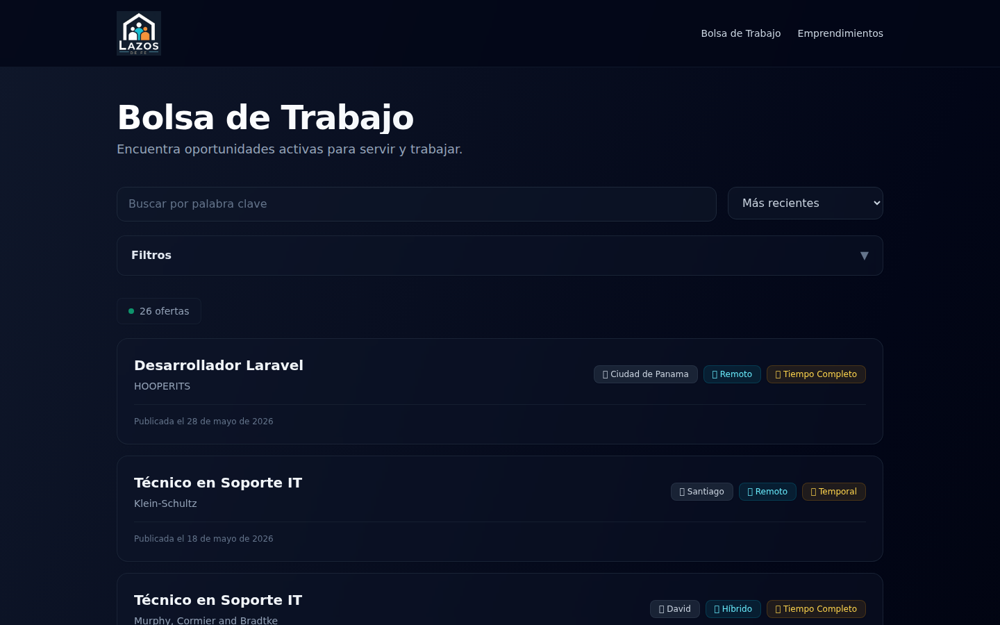

# Capítulo 1 — Bienvenida

¡Bienvenido a **CBC Workplace**! Si estás leyendo esto, probablemente buscas empleo o representas a una organización que necesita publicar uno. Esta guía está hecha para ti. No vas a necesitar conocimientos técnicos: solo seguir los pasos, sección por sección.

## 1.1 ¿Qué es CBC Workplace?

CBC Workplace es la plataforma de bolsa de trabajo de **Crossroads Bible Church**. Conecta a iglesias, ministerios y proyectos afines —que necesitan personas para roles concretos— con candidatos que buscan ese tipo de oportunidades.

En la plataforma hay tres formas de participar:

- Como **visitante**: puedes navegar el listado de empleos sin crear cuenta. Es público.
- Como **candidato**: creas una cuenta gratuita, completas tu perfil profesional y postulas a los empleos que te interesan. Además puedes suscribirte a alertas para recibir avisos por correo.
- Como **organización** (iglesia, ministerio, proyecto): creas una cuenta, esperas a que el equipo administrador verifique a tu organización, y desde ese momento puedes publicar empleos y recibir postulaciones.

*Figura 1.1 — Página principal del portal público. Aquí cualquier persona ve los empleos disponibles.*

## 1.2 ¿Qué encontrarás en esta guía?

La guía sigue el orden natural en que vas a usar la plataforma:

1. Cómo **buscar empleos** sin tener cuenta (capítulo 2).
2. Cómo **crear tu cuenta** y verificar tu correo (capítulo 3).
3. Si eres organización, cómo **completar el perfil** y solicitar verificación (capítulo 4).
4. Si eres organización, cómo **publicar y gestionar empleos** (capítulo 5).
5. Si eres organización, cómo **revisar las postulaciones** que recibes (capítulo 6).
6. Si eres candidato, cómo **completar tu perfil** y **postular** a un empleo (capítulo 7).
7. Si eres candidato, cómo **suscribirte a alertas** para no perderte oportunidades (capítulo 8).
8. Qué ocurre si **tu organización es suspendida** (capítulo 9).
9. Un capítulo final con **preguntas frecuentes** (capítulo 10).

Al final hay un **glosario** que define en palabras simples los términos que vas a encontrar.

## 1.3 ¿Tengo que leer todo?

No. La guía está pensada para que vayas directamente al capítulo que te interesa. Si solo quieres buscar empleos como candidato, los capítulos 2, 3, 7 y 8 son los importantes para ti. Si representas a una organización, los capítulos 3, 4, 5 y 6 cubren tu flujo completo.

> **Buena práctica.** Mantén esta guía a mano. Aunque parezca largo, cada capítulo es corto y los procedimientos están explicados paso a paso. Puedes consultarla cuando lo necesites.

## 1.4 Términos básicos que vas a ver

Estos cinco términos aparecen mucho. Vale la pena familiarizarse con ellos desde el principio:

**Empleo** u **oferta**
:   La publicación de un puesto vacante. Tiene título, descripción, requisitos y, a veces, fecha límite para postular.

**Postulación** o **aplicación**
:   El paso que da un candidato cuando se interesa por un empleo. Implica adjuntar el CV y un mensaje, y enviarlo a la organización.

**Organización**
:   La iglesia, ministerio o proyecto que publica el empleo.

**Candidato**
:   La persona que busca empleo y postula.

**Alerta de empleo**
:   Una suscripción que te avisa por correo cuando aparecen empleos nuevos que coinciden con lo que estás buscando.

El glosario al final de esta guía amplía estos términos y añade otros que irán apareciendo.

## 1.5 ¿Quién mantiene la plataforma?

CBC Workplace es un proyecto de **Crossroads Bible Church**. Detrás de la plataforma hay un equipo administrador que revisa las nuevas organizaciones, aprueba los empleos antes de que se publiquen y atiende cualquier reporte que se les envíe. No verás a ese equipo directamente, pero su trabajo es lo que hace posible que el catálogo sea confiable.

## 1.6 ¿Algo no funciona?

Si algo no funciona o no entiendes un paso, ve al **capítulo 10 — Preguntas frecuentes**. Si tu pregunta no está ahí, contacta al equipo administrador de la plataforma; te van a ayudar.

¡Listo! Vamos al capítulo 2, donde aprenderás a buscar empleos en el portal público sin necesidad de crear una cuenta.
