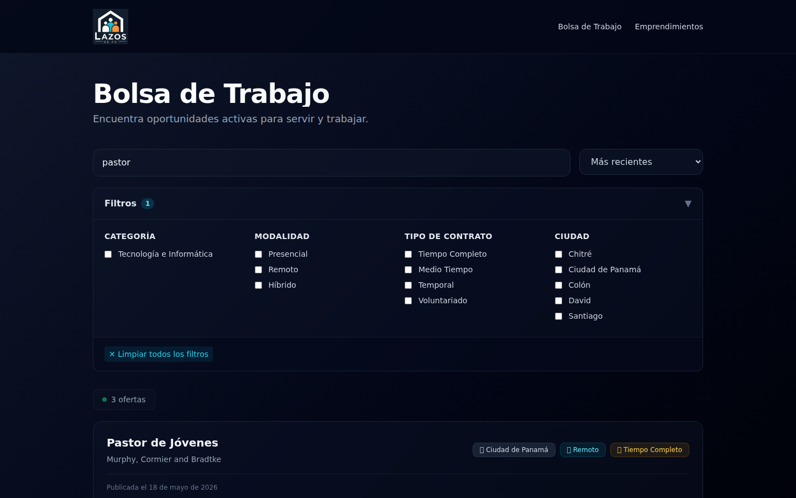
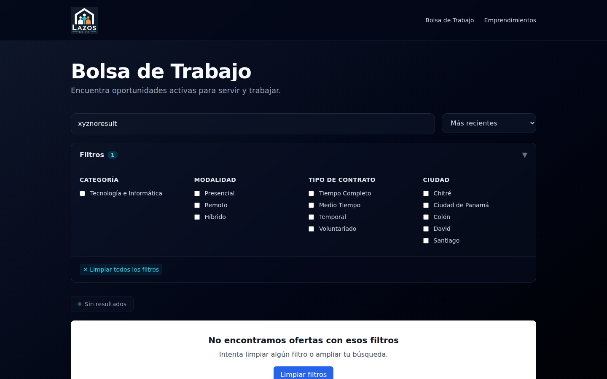
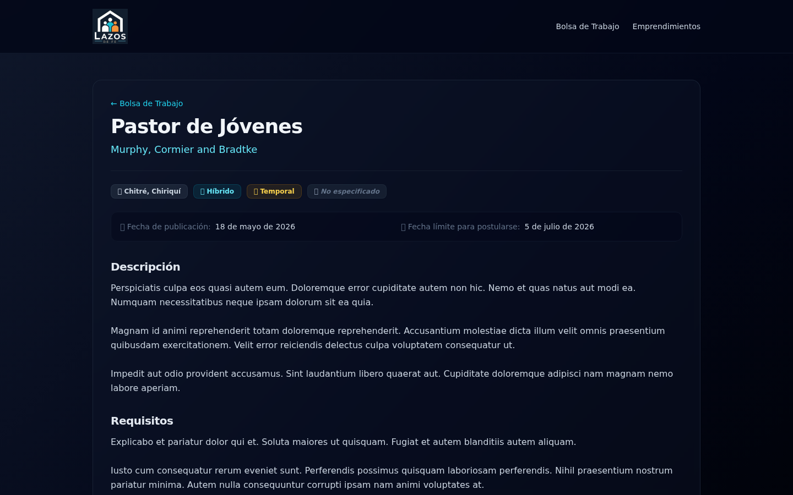

# Capítulo 2 — Buscando empleos

Este capítulo es para ti si estás buscando empleo. No necesitas tener cuenta para hacer la búsqueda: el portal público está abierto a todos. Vas a aprender a navegar el listado, usar el buscador por palabra clave, aplicar filtros y entrar al detalle de un empleo.

## 2.1 Cómo llegar al portal

Abre tu navegador y ve a la dirección del portal de Lazos de Fe. La página principal te muestra todos los empleos activos.

*Figura 2.1 — Vista del portal público. Cada tarjeta representa un empleo activo.*

Cada tarjeta del listado muestra cuatro datos clave:

- El **título** del empleo (ejemplo: "Pastor de jóvenes").
- La **organización** que lo publica.
- La **ciudad** donde se ofrece (cuando aplica).
- La **categoría** (Pastoral, Administrativo, Música, etc.).

## 2.2 Buscar por palabra clave

Si tienes una idea concreta de lo que buscas —por ejemplo, "pastor", "música", "diseño"—, el buscador en la parte superior del listado es lo más rápido.

**Para buscar por palabra clave:**

1. Escribe la palabra o frase en el campo de búsqueda.
2. Pulsa <kbd>Enter</kbd> o el botón de búsqueda.

El listado se actualiza para mostrar solo los empleos cuyo título o descripción coincidan.

*Figura 2.2 — Búsqueda activa por la palabra "pastor". Los resultados se muestran filtrados.*

> **Nota.** La búsqueda **no distingue acentos**. Si escribes "ingles", encuentra resultados con "Inglés". También ignora mayúsculas y minúsculas.

## 2.3 Cuando no hay resultados

Si tu búsqueda no encuentra empleos, verás un mensaje claro indicándolo.

*Figura 2.3 — Mensaje que aparece cuando ninguna oferta coincide con tu búsqueda.*

Cuando esto ocurra, considera:

- Revisar la **ortografía**. Una letra equivocada puede arruinar el match.
- Probar con **menos palabras**. Si buscaste "pastor de jóvenes con experiencia bilingüe", prueba solo "pastor jóvenes".
- Eliminar **filtros** activos que puedan estar restringiendo demasiado.
- Suscribirte a una **alerta** con esos criterios. Si un empleo así aparece más adelante, te avisarán por correo. El capítulo 8 explica cómo hacerlo.

## 2.4 Filtros disponibles

Además del buscador, el portal ofrece filtros que acotan el listado. Los más comunes son:

- **Categoría**: para ver solo empleos de un área (Pastoral, Música, etc.).
- **Ciudad**: para ver solo empleos en una ubicación.
- **Modalidad**: presencial, remoto, híbrido.
- **Tipo de contrato**: tiempo completo, medio tiempo, voluntariado, etc.

**Para aplicar un filtro:**

1. Localiza la sección de filtros (suele estar a la izquierda del listado o en un panel desplegable).
2. Marca las opciones que te interesan.
3. El listado se actualiza automáticamente.

Puedes combinar filtros con la búsqueda por palabra clave: por ejemplo, "música" + ciudad "Santiago" + tipo "medio tiempo".

> **Buena práctica.** Empieza la búsqueda **sin filtros** para tener un panorama general. Aplica filtros solo si el listado es demasiado largo para revisar.

## 2.5 Ver el detalle de un empleo

Cuando un empleo te interese, haz clic sobre su tarjeta para abrir el detalle.

*Figura 2.4 — Página de detalle de un empleo. Aquí encuentras toda la información antes de postular.*

La página de detalle te muestra:

- **Título y organización** publicadora.
- **Descripción completa** del puesto: responsabilidades, perfil deseado, beneficios.
- **Requisitos** específicos (experiencia, formación, idiomas, etc.).
- **Salario** (cuando la organización lo indica).
- **Fecha límite** para postular (cuando aplica).
- **Botón Postular**, que te lleva al flujo de postulación.

Si no tienes cuenta y haces clic en **Postular**, el sistema te llevará primero al registro o al login (capítulo 3).

## 2.6 Compartir un empleo

Cada empleo tiene una URL propia. Puedes copiarla de la barra del navegador y compartirla por WhatsApp, correo o redes sociales. La persona que abra ese enlace verá el detalle exacto, aunque no tenga cuenta en la plataforma.

## 2.7 Paginación

Si hay más empleos que los que caben en una pantalla, encontrarás botones de paginación en la parte inferior. Avanza, retrocede o salta a una página específica.

> **Atención.** Cambiar de página **no borra** tus filtros. Si filtraste por "Pastoral" y vas a la página 2, sigues viendo solo empleos de esa categoría.

## 2.8 Ordenar resultados

El listado por defecto muestra primero los empleos **más recientes**. Las plataformas suelen ofrecer otras opciones de ordenamiento (por título, por fecha límite, etc.), revisables en el control de ordenamiento sobre el listado.

## 2.9 ¿Algo no funciona?

Si el portal no te muestra empleos, si la búsqueda no responde o si el detalle no abre correctamente, ve al **capítulo 10 — Preguntas frecuentes**. Si tu situación no aparece ahí, contacta al equipo administrador.

En el próximo capítulo (3) vamos a crear tu cuenta. Es el paso necesario tanto si quieres postular como si vas a publicar empleos.
