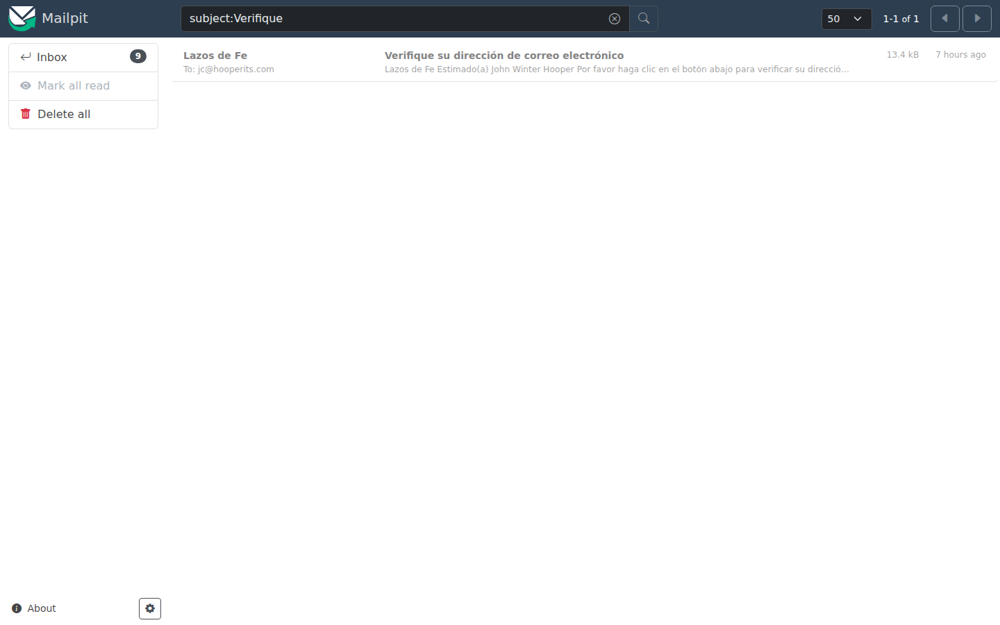
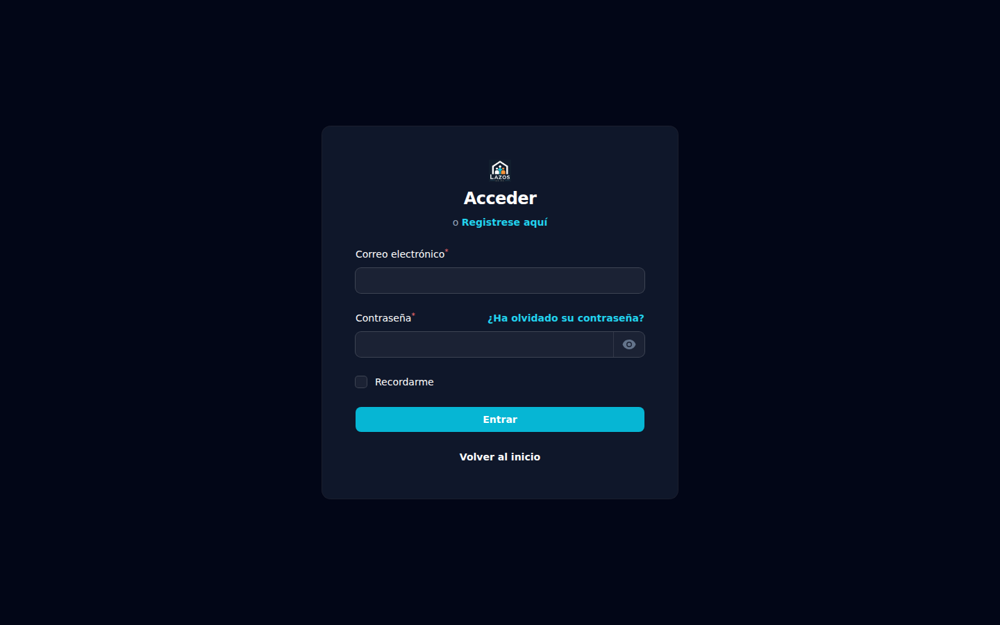
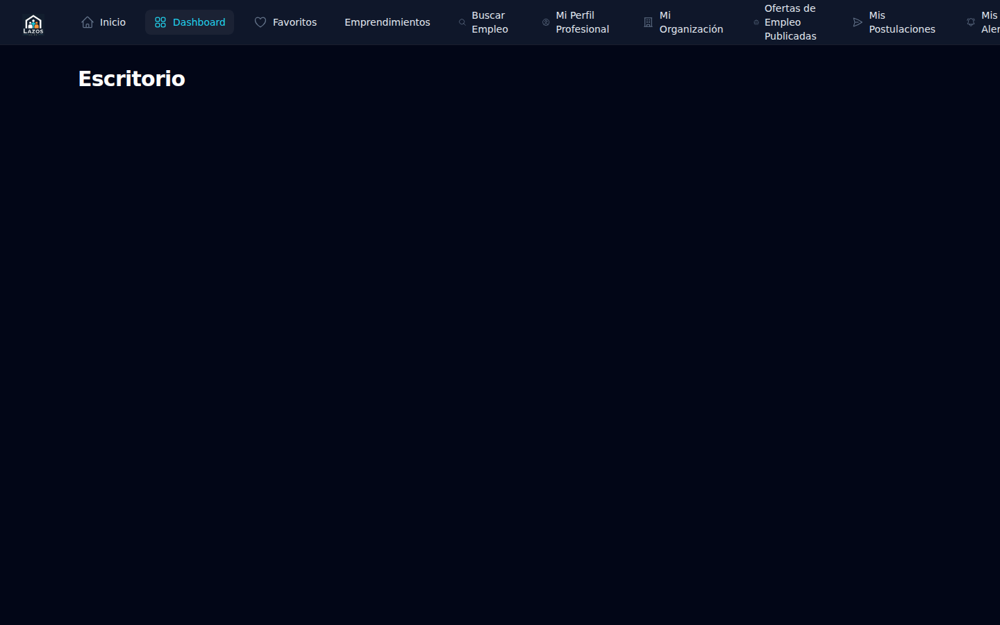

# Capítulo 3 — Registro y cuenta

Tener cuenta es lo que te permite **postular** a empleos, **suscribirte a alertas** y, si representas a una organización, **publicar empleos**. Este capítulo te explica cómo crear tu cuenta, verificar tu correo electrónico y entrar por primera vez.

## 3.1 ¿Cuál cuenta necesito?

En Lazos de Fe todos los usuarios finales (candidatos, representantes de organizaciones y emprendedores) entran al mismo panel: `/member`. La diferencia entre los roles no se decide en el registro inicial. Se decide después, completando uno u otro perfil:

- Si vas a **buscar empleo**, completas tu **perfil de candidato** (capítulo 7).
- Si representas a una iglesia, ministerio o proyecto que va a publicar empleos, creas el **perfil de organización** (capítulo 4).
- Si vas a **promover un emprendimiento**, completas tu perfil de miembro y registras tu negocio (capítulo 9).

Una misma cuenta puede tener ambos perfiles. Pero típicamente se usa para uno o el otro.

## 3.2 Crear tu cuenta

**Para crear una cuenta:**

1. Abre el portal y haz clic en **Crear cuenta** (o **Registrarse**) en la barra superior. La ubicación exacta puede variar según la versión; también puedes ir directamente a la URL `/member/register`.
2. Completa el formulario con:
   - Tu **nombre completo**.
   - Tu **correo electrónico**. Usa uno que revises con frecuencia: aquí llegarán los avisos de la plataforma.
   - Una **contraseña** que solo tú conozcas.
   - **Repite la contraseña** para confirmarla.
3. Acepta los términos y condiciones tras leerlos.
4. Haz clic en **Registrarse**.

**Qué pasa después.** El sistema crea tu cuenta y te envía un correo de verificación a la dirección que indicaste. Hasta que verifiques el correo, no podrás postular ni publicar.

> **Importante.** Tu contraseña no es recuperable: solo es **reseteable**. Si la olvidas, puedes pedir un enlace de reseteo, pero el sistema no te la mostrará. Usa un gestor de contraseñas o anótala en lugar seguro.

## 3.3 Verificar tu correo electrónico

Abre tu bandeja de entrada y busca un correo de Lazos de Fe. El asunto incluye una indicación clara: "Verifique su dirección de correo electrónico" o similar.

**Para verificar:**

1. Abre el correo.
2. Haz clic en el botón **Verifique Email** (o el enlace incluido en el cuerpo).
3. Te lleva de vuelta al portal con la verificación confirmada.

**Qué pasa después.** A partir de ahora, tu cuenta está plenamente activa. Puedes iniciar sesión y completar tu perfil de candidato o de organización.

### Si no recibes el correo

- Revisa la carpeta de **spam** o **correo no deseado**.
- Confirma que escribiste correctamente tu correo durante el registro. Un error tipográfico hace que el mensaje no llegue.
- Espera unos minutos: en horas pico el envío puede demorar.
- Si han pasado más de 30 minutos y no llegó, pide al equipo administrador que reenvíe la verificación.

## 3.4 Iniciar sesión

Tras verificar el correo, ya puedes entrar.

*Figura 3.1 — Formulario de inicio de sesión del panel `/member`. Ingresas con tu correo electrónico y la contraseña que creaste.*

**Para iniciar sesión:**

1. Ve a la URL `/member/login`.
2. Ingresa el **correo electrónico** que usaste al registrarte.
3. Ingresa tu **contraseña**.
4. Haz clic en **Iniciar sesión**.

**Qué pasa después.** El sistema te lleva al panel de miembros, también llamado *dashboard*. Desde ahí puedes navegar a tu perfil, tus empleos (si eres organización), tus postulaciones (si eres candidato) y tus alertas.

*Figura 3.2 — Vista del dashboard tras un login exitoso.*

## 3.5 Si olvidaste tu contraseña

**Para recuperar el acceso:**

1. En la página de login, haz clic en **¿Olvidaste tu contraseña?**.
2. Ingresa el correo de tu cuenta.
3. Recibirás un enlace por correo para crear una nueva contraseña.
4. Abre el enlace y elige una contraseña nueva.

> **Atención.** El enlace de reseteo es **temporal**. Si tarda mucho en usarse, expira y deberás solicitarlo de nuevo.

## 3.6 Cerrar sesión

Para cerrar tu sesión, haz clic en tu nombre en la esquina superior derecha del panel y selecciona **Cerrar sesión**.

> **Buena práctica.** Si entras desde una computadora compartida (cibercafé, biblioteca), cierra sesión explícitamente antes de irte. Cerrar la pestaña no es lo mismo: la sesión sigue activa.

## 3.7 Cambiar tu contraseña

Una vez dentro del panel, puedes cambiar tu contraseña en cualquier momento desde tu perfil:

1. Haz clic en tu nombre en la esquina superior derecha.
2. Selecciona **Editar perfil**.
3. Localiza la sección de contraseña.
4. Ingresa la contraseña actual y la nueva (dos veces).
5. Guarda los cambios.

## 3.8 Cambiar tu correo electrónico

Cambiar tu correo es delicado porque todo el sistema gira en torno a esa dirección (verificación, recuperación, alertas). El procedimiento depende de la versión del producto; consulta al equipo administrador antes de hacerlo. En general, si necesitas migrar a un correo nuevo:

1. Crea una cuenta nueva con el correo nuevo.
2. Termina los flujos pendientes (postulaciones, empleos publicados) con la cuenta vieja.
3. Pide al equipo que dé de baja la cuenta vieja cuando ya no la uses.

## 3.9 Eliminar tu cuenta

Si decides ya no usar la plataforma, puedes pedir al equipo administrador que dé de baja tu cuenta. Por respeto a las organizaciones que recibieron tus postulaciones, parte del registro histórico (postulaciones enviadas con tu nombre anonimizado) puede conservarse para fines estadísticos.

> **Importante.** Eliminar tu cuenta **no se puede deshacer**. Si decides volver más tarde, deberás crear una cuenta nueva desde cero.

## 3.10 ¿Algo no funciona?

- **No me llega el correo de verificación**: ver sección 3.3.
- **Olvidé mi contraseña**: ver sección 3.5.
- **El enlace de verificación dice que expiró**: pide al equipo administrador uno nuevo.
- **No puedo entrar aunque escribo bien**: prueba el reseteo de contraseña; quizá la dirección de correo tiene un error tipográfico que no recuerdas.

Si nada de esto resuelve tu problema, ve al **capítulo 10 — Preguntas frecuentes** o contacta al equipo administrador.

El próximo capítulo es para ti si representas a una **organización** y vas a publicar empleos. Si eres candidato, salta al capítulo 7.
