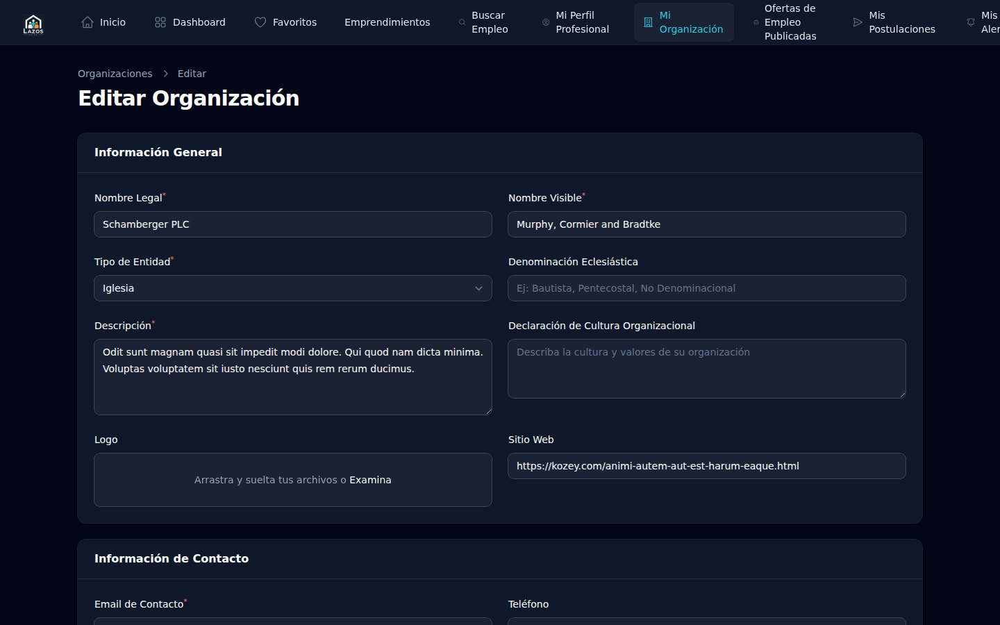

# Capítulo 4 — Perfil de organización

Este capítulo es para ti si representas a una iglesia, ministerio o proyecto que va a publicar empleos. Vas a aprender a crear el perfil de tu organización, completar la información requerida, solicitar la verificación al equipo administrador y entender qué puedes hacer durante el período de espera.

## 4.1 ¿Para qué sirve el perfil de organización?

El perfil de tu organización es lo que los candidatos verán cuando exploren los empleos que publiques. Una organización con perfil completo y bien presentado genera más confianza y, por lo tanto, atrae más postulaciones de calidad.

Además, **antes de poder publicar empleos**, tu organización debe ser **verificada** por el equipo administrador. La verificación confirma que tu organización es real y que está alineada con los propósitos de la plataforma. Esto protege a los candidatos de avisos falsos.

## 4.2 Crear el perfil

**Para crear el perfil de organización:**

1. Inicia sesión en `/member` con tu cuenta (capítulo 3).
2. En el menú de navegación, busca **Mi organización** o **Crear organización** (el texto exacto puede variar).
3. Completa el formulario con la información requerida (sección 4.3).
4. Guarda los cambios.

## 4.3 Información que necesitas tener a mano

Antes de empezar el formulario, ten lista esta información:

- **Nombre comercial** de tu organización: el nombre con el que la conocen las personas (no necesariamente el nombre legal).
- **Tipo de organización**: iglesia, ministerio, fundación, proyecto, etc.
- **Descripción**: dos o tres párrafos que expliquen qué hacen, dónde están, su historia breve.
- **Ciudad y país** donde operan principalmente.
- **Sitio web** y/o redes sociales (opcional pero altamente recomendado).
- **Logo** (imagen, formato JPG/PNG, fondo claro preferentemente).
- **Persona de contacto**: nombre y correo del responsable que el equipo administrador puede contactar si tiene preguntas.

> **Buena práctica.** Invierte tiempo en la descripción. No la escribas en cinco minutos. Una buena descripción incluye: misión de la organización, edad/historia, comunidad servida, valores. Esto hace una diferencia notoria en cómo te perciben los candidatos.

## 4.4 Solicitar verificación

Tras crear el perfil, **tu organización queda en estado pendiente**.

El equipo administrador revisará los datos que proporcionaste y, si todo está en orden, marcará tu organización como **verificada**. Recibirás un correo cuando esto ocurra.

> **Atención.** El plazo de verificación depende del volumen de trabajo del equipo administrador. No publicamos un compromiso de SLA específico en esta guía para no crear falsas expectativas. Si han pasado varios días y aún no recibes respuesta, contacta al equipo administrador.

## 4.5 Qué puedes hacer mientras esperas la verificación

Aunque aún no puedas publicar empleos, sí puedes:

- **Editar tu perfil** las veces que necesites. Las correcciones que hagas se reflejan inmediatamente y el equipo administrador verá la versión más reciente cuando revise.
- **Subir y refinar tu logo y descripción**.
- **Preparar borradores de empleos** offline (en un documento aparte), listos para ser publicados cuando se apruebe la verificación.

## 4.6 Cuando recibes la verificación

Cuando tu organización es verificada, ocurren tres cosas:

1. Recibes un **correo de confirmación**.
2. En tu perfil aparece un **indicador de verificación**.
3. En el menú de navegación aparece la opción para **publicar empleos** (capítulo 5).

> **Nota.** Una vez verificada, tu organización **no necesita re-verificarse** salvo que haya un cambio sustancial (cambio de razón social, cambio de propósito, etc.). En esos casos contacta al equipo administrador.

## 4.7 Mantener el perfil al día

Una vez verificado, sigue siendo importante mantener el perfil actualizado:

- Si cambias de **persona de contacto**, actualízala. Es el camino por el que el equipo administrador y los candidatos se comunican contigo.
- Si cambias de **sitio web** o **redes sociales**, actualiza los enlaces.
- Si cambia tu **logo** o **descripción**, refresca esos campos.

**Para editar tu perfil:**

1. Inicia sesión.
2. Ve a **Mi organización** en el menú.
3. Edita los campos que necesites.
4. Guarda los cambios.

## 4.8 ¿Mi perfil se ve público?

Sí. Cuando publicas un empleo, los candidatos pueden ver el perfil de tu organización para conocer quién está reclutando. Por eso conviene que la información que muestras esté pulida.

> **Atención.** No publiques en el perfil información que no quieras que sea pública: teléfonos personales, direcciones particulares, etc. El correo de contacto que aparece es el de la **persona de contacto institucional**, no necesariamente el correo personal del representante.

## 4.9 ¿Algo no funciona?

- **Mi solicitud lleva días en pendiente**: contacta al equipo administrador con el nombre de tu organización.
- **Quiero cambiar el correo de contacto pero no lo encuentro**: revisa la sección de edición del perfil; el campo suele estar en el bloque de datos institucionales.
- **El sistema dice que ya existe una organización con ese nombre**: probablemente ya hay un registro previo. Contacta al equipo para resolver la duplicación.

Si nada de esto resuelve tu situación, ve al **capítulo 10 — Preguntas frecuentes**.

En el siguiente capítulo (5) vas a aprender a publicar empleos y a gestionar su ciclo de vida.
