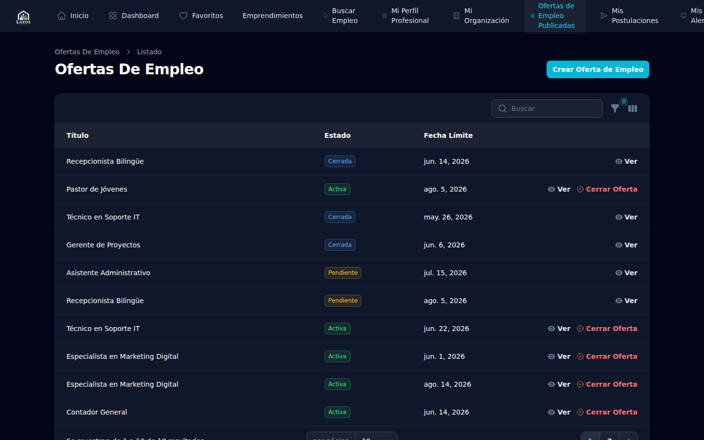

# Capítulo 5 — Publicar y gestionar empleos

Este capítulo es para representantes de organizaciones **ya verificadas**. Vas a aprender a publicar un empleo nuevo, entender su ciclo de vida desde borrador hasta cierre, editar uno publicado y cerrarlo cuando ya hayas cubierto la vacante.

## 5.1 El ciclo de vida de un empleo

Antes de publicar, te conviene entender los estados por los que pasa un empleo. Esto te ayuda a leer correctamente la lista de tus empleos.

**Borrador.** El empleo existe pero todavía no se envió a aprobación. Solo tú lo ves. Puedes editarlo sin restricciones.

**Pendiente.** Lo enviaste a aprobación. El equipo administrador lo está revisando. No es visible para el público.

**Activo.** Aprobado y publicado. Aparece en el portal público y los candidatos pueden postular.

**Rechazado.** El equipo administrador no aprobó la publicación. Recibirás un correo con la razón. Para volver a publicar, debes **crear un empleo nuevo** corrigiendo lo que se observó.

**Cerrado.** El empleo ya no acepta postulaciones. Puede haberse cerrado porque ya cubriste la vacante o porque tu organización fue suspendida (capítulo 9).

**Expirado.** Pasó la fecha límite que indicaste. El sistema lo cierra automáticamente.

## 5.2 Crear un empleo nuevo

**Para crear un empleo:**

1. Inicia sesión y ve a la sección **Empleos** (o **Mis empleos**) en el menú.
2. Haz clic en el botón **Crear empleo** o **Nuevo empleo** en la esquina superior.
3. Te aparece un formulario con varios pasos. Complétalo siguiendo las secciones 5.3 a 5.5.

*Figura 5.1 — Listado de empleos del panel de organización. Aquí aparecen todos los empleos en cualquier estado.*

## 5.3 Paso 1 — Información básica

Completa los datos esenciales del empleo:

- **Título**: corto y descriptivo. Ejemplo: "Pastor de jóvenes" (mejor que "Buscamos un pastor con muchas características...").
- **Categoría**: elige una del catálogo (Pastoral, Música, Administrativo, etc.). Si ninguna encaja, escribe al equipo administrador para que evalúe añadirla.
- **Ciudad** y **modalidad** (presencial, remoto, híbrido).
- **Tipo de contrato**: tiempo completo, medio tiempo, voluntariado, por proyecto.

> **Buena práctica.** El título es lo primero que ven los candidatos en el listado. Hazlo claro y específico. Evita títulos genéricos como "Persona para colaborar" — no atraen postulaciones de calidad.

## 5.4 Paso 2 — Descripción y requisitos

- **Descripción del puesto**: dos a cuatro párrafos describiendo las responsabilidades, el equipo, la cultura, el día a día. Sé honesto sobre la carga y los desafíos.
- **Perfil deseado**: cualidades personales y profesionales que buscas.
- **Requisitos**: formación, experiencia, idiomas, certificaciones específicas. Distingue entre **indispensables** y **deseables**.
- **Beneficios**: sueldo (si aplica), beneficios extra, oportunidades de desarrollo.

> **Importante.** Si tu organización ofrece **voluntariado** (sin pago), indícalo explícitamente. Publicar un empleo que parece remunerado y resulta no serlo daña tu reputación y desperdicia el tiempo de los candidatos.

## 5.5 Paso 3 — Fechas y publicación

- **Fecha límite para postular** (opcional): a partir de esa fecha la oferta se cierra automáticamente.
- **Fecha esperada de inicio** del puesto (opcional, ayuda a candidatos a planificar).
- **Modo de publicación**:
  - **Guardar como borrador**: el empleo queda en estado borrador. Lo puedes seguir editando.
  - **Enviar a aprobación**: el empleo pasa a estado pendiente. El equipo administrador lo va a revisar.

**Qué pasa después.** Si enviaste a aprobación, recibirás un correo cuando el equipo administrador apruebe (estado → activo) o rechace (estado → rechazado, con la razón). Mientras tanto, el empleo aparece en tu lista pero no en el portal público.

## 5.6 Editar un empleo

Si el empleo está en **borrador** o **rechazado**, puedes editarlo libremente. Si está en **pendiente** o **activo**, las opciones de edición son más limitadas para no confundir a los candidatos que ya lo vieron.

**Para editar:**

1. En la lista, haz clic sobre el empleo a editar.
2. Pulsa el botón **Editar**.
3. Modifica los campos permitidos.
4. Guarda.

> **Atención.** Cambiar el **título** o la **descripción** de un empleo activo puede confundir a los candidatos que ya lo vieron. Hazlo solo cuando sea estrictamente necesario.

## 5.7 Ver postulaciones a un empleo

Cuando un candidato postula a tu empleo, aparece en la lista de postulaciones de ese empleo.

**Para ver postulaciones:**

1. Abre el detalle del empleo.
2. Localiza la pestaña o sección **Postulaciones**.
3. Verás la lista de candidatos que postularon, ordenada por fecha.

El capítulo 6 cubre el flujo completo de revisión y respuesta a postulaciones.

## 5.8 Cerrar un empleo

Cuando ya cubriste la vacante o decidiste cancelar la búsqueda, **cierra el empleo** para que no siga apareciendo en el portal público.

**Para cerrar:**

1. Abre el detalle del empleo activo.
2. Pulsa el botón **Cerrar empleo**.
3. Confirma en el modal.

**Qué pasa después.** El empleo pasa a estado **cerrado**, desaparece del portal público inmediatamente y los candidatos ya no pueden postular. Las postulaciones recibidas siguen visibles para ti.

> **Importante.** **Cerrar un empleo no se puede deshacer**. Si necesitas reabrirlo, debes crear uno nuevo (puedes duplicarlo desde el cerrado, si esa opción está disponible en tu versión).

## 5.9 Cierre automático por fecha límite

Si especificaste una **fecha límite para postular** y esa fecha pasa, el sistema cierra el empleo automáticamente. Pasa de **activo** a **expirado**. Los candidatos no pueden seguir postulando, pero el empleo sigue visible en tu lista para fines históricos.

## 5.10 Cierre automático por suspensión

Si tu organización es **suspendida** por el equipo administrador (situación excepcional, capítulo 9), **todos tus empleos activos se cierran automáticamente** en cascada. Esto es independiente de tu acción individual.

## 5.11 Duplicar un empleo

Cuando necesites publicar uno similar a uno ya cerrado, puedes **duplicarlo** en lugar de crearlo desde cero.

**Para duplicar:**

1. Localiza el empleo original.
2. Usa la opción **Duplicar** (la disponibilidad depende de la versión).
3. Se crea un borrador con los datos del original. Edítalo y publícalo.

> **Buena práctica.** Cuando duplicas, **revisa todos los campos** antes de enviar a aprobación. Las fechas, la descripción y la fecha límite probablemente necesitan actualizarse.

## 5.12 Ver estadísticas de un empleo

Cada empleo registra cuántas veces fue visto y cuántas postulaciones recibió. Esta información te ayuda a entender si el empleo está siendo atractivo:

- **Pocas vistas, pocas postulaciones**: revisa el título y la categoría; quizás no aparece donde los candidatos buscan.
- **Muchas vistas, pocas postulaciones**: revisa la descripción y los requisitos; quizás algo está disuadiendo al candidato de postular.
- **Muchas vistas, muchas postulaciones**: estás haciendo bien tu trabajo.

## 5.13 ¿Algo no funciona?

- **No me aparece el botón "Crear empleo"**: probablemente tu organización todavía no está verificada (capítulo 4).
- **Envié a aprobación y no me han respondido**: contacta al equipo administrador.
- **Recibí un rechazo y no entiendo la razón**: revisa el correo de rechazo; si la razón no es clara, contacta al equipo.
- **No puedo editar mi empleo**: probablemente está en un estado que no admite edición; revisa la sección 5.6.

En el próximo capítulo (6) verás cómo manejar las postulaciones que recibas a tus empleos.
