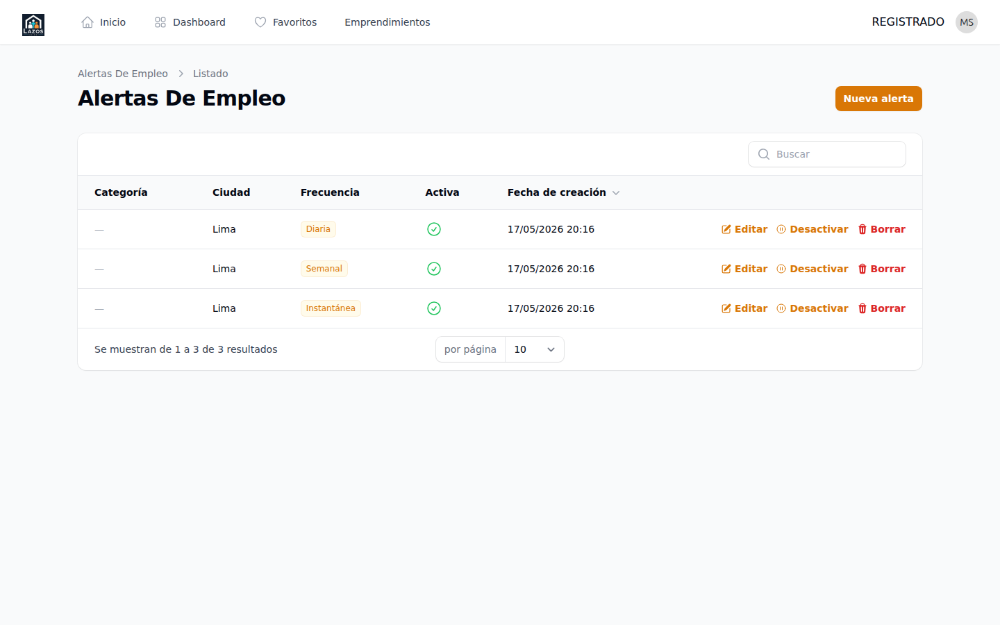
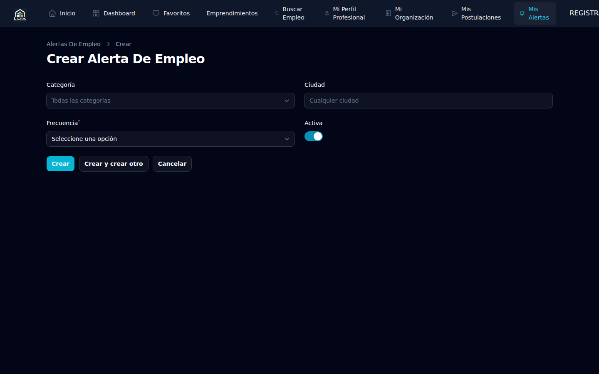

# Capítulo 8 — Alertas de empleo

Una **alerta de empleo** es una suscripción que te avisa por correo cuando aparece un empleo nuevo que coincide con criterios que tú defines. Es la forma de no perderte oportunidades sin tener que entrar a la plataforma todos los días. Este capítulo te explica cómo crear alertas, elegir la frecuencia, recibir los digests por correo y desuscribirte cuando ya no las necesites.

## 8.1 ¿Cómo funciona una alerta?

Cuando creas una alerta:

1. Defines **criterios de búsqueda** (palabra clave, categoría, ciudad, etc.).
2. Eliges la **frecuencia** con la que quieres recibir avisos.
3. Cada vez que aparece un empleo que cumple tus criterios, recibes un correo.

La plataforma soporta tres frecuencias:

**Instantánea.** Recibes un correo **inmediatamente** después de que un empleo coincidente sea publicado. Útil para búsquedas urgentes o muy específicas.

**Diaria.** Cada mañana recibes un correo agrupando los empleos coincidentes de las últimas 24 horas. Útil cuando quieres recibir resúmenes manejables sin saturar tu bandeja.

**Semanal.** Cada lunes por la mañana recibes un correo con los empleos coincidentes de la última semana. Útil cuando estás explorando sin urgencia.

Puedes tener **hasta diez alertas** activas al mismo tiempo, combinando frecuencias y criterios distintos.

## 8.2 Crear una alerta

**Para crear una alerta:**

1. Inicia sesión.
2. Ve a **Alertas** o **Mis alertas** en el menú.
3. Pulsa **Crear alerta** o **Nueva alerta**.
4. Completa los criterios y la frecuencia (sección 8.3).
5. Guarda.

*Figura 8.1 — Listado de alertas existentes en el panel del candidato.*

## 8.3 Configurar los criterios

El formulario de alerta te permite definir varios criterios. Combínalos para refinar lo que recibes.

- **Palabra clave**: como en el buscador del portal público (capítulo 2 sección 2.2).
- **Categoría**: una o varias categorías de empleo.
- **Ciudad**: ubicación geográfica.
- **Modalidad**: presencial, remoto, híbrido.
- **Tipo de contrato**: tiempo completo, voluntariado, etc.

Y la **frecuencia**: instantánea, diaria o semanal.

*Figura 8.2 — Formulario para definir los criterios y la frecuencia de la alerta.*

> **Buena práctica.** No crees alertas demasiado amplias (por ejemplo, sin criterios) ni demasiado estrechas (por ejemplo, una palabra clave muy específica más todos los filtros). La primera te satura; la segunda casi nunca dispara correos.

## 8.4 Recibir digests por correo

Cuando una alerta dispara, el correo que recibes incluye:

- **Asunto claro** indicando el tipo de digest (instantáneo, diario, semanal).
- **Listado de empleos** que coincidieron con tus criterios, con título, organización, ciudad y categoría.
- **Enlaces directos** a cada empleo en el portal público (no necesitas iniciar sesión para abrirlos).
- **Enlace de desuscripción** al pie del correo.

<!-- TODO captura: user-mailpit-digest-daily — correo digest diario en Mailpit. -->

> **Atención.** Los correos vienen desde una dirección oficial de la plataforma. Si los recibes de una dirección distinta, **no hagas clic** y reporta el hecho al equipo administrador (posible suplantación).

## 8.5 Editar una alerta

**Para editar:**

1. Ve a **Mis alertas**.
2. Haz clic sobre la alerta a editar.
3. Modifica criterios o frecuencia.
4. Guarda.

<!-- TODO captura: user-alert-edit — formulario de edición. -->

> **Nota.** Editar una alerta no envía un digest retroactivo. Los próximos disparos aplicarán los nuevos criterios.

## 8.6 Activar y desactivar una alerta

A veces conviene pausar una alerta sin borrarla del todo: por ejemplo, durante unas vacaciones, o mientras decides si los criterios son los correctos.

**Para pausar (desactivar):**

1. En **Mis alertas**, localiza la alerta.
2. Cambia el toggle de **Activa** a **Inactiva**.

<!-- TODO captura: user-alert-toggle-disable — toggle de pausa de alerta. -->

**Para reanudar:** vuelve a cambiar el toggle a **Activa**.

Una alerta inactiva **no dispara correos** mientras esté en ese estado, pero conserva los criterios para que puedas reactivarla cuando quieras.

## 8.7 Eliminar una alerta

**Para eliminar definitivamente:**

1. En **Mis alertas**, localiza la alerta.
2. Pulsa el icono o botón **Eliminar**.
3. Confirma.

> **Importante.** Eliminar es **irreversible**. Si crees que la podrías reutilizar, considera mejor desactivarla (sección 8.6).

## 8.8 Desuscribirte desde un correo digest

Cada digest tiene al pie un enlace de **desuscribirse**. Si pulsas ese enlace:

1. Se abre una página de confirmación.
2. Confirmas que quieres dejar de recibir esa alerta específica.
3. La alerta queda desactivada inmediatamente.

<!-- TODO captura: user-unsubscribe-landing — página de confirmación tras pulsar el enlace de desuscripción. -->

Este enlace **no requiere iniciar sesión**: la URL lleva una firma criptográfica que identifica tu alerta. Por seguridad, el enlace solo funciona para la alerta de ese correo, no afecta a tus otras alertas activas.

> **Atención.** Si estabas suscrito a varias alertas y solo quieres desuscribirte de una, asegúrate de pulsar el enlace en el correo de la alerta correcta. Cada alerta tiene su propio enlace.

## 8.9 Mejores prácticas para no saturarte

- Empieza con **una o dos alertas semanales** para tener panorama general.
- Añade una **alerta diaria** para tu área principal de interés.
- Reserva las **alertas instantáneas** para roles muy específicos o búsquedas urgentes.
- Revisa tus alertas cada **uno a dos meses** y elimina las que ya no te aportan.
- Si recibes muchos correos sin empleos relevantes, ajusta los criterios.

## 8.10 Privacidad

Las organizaciones **no ven tus alertas**. Una alerta no te marca como "interesado" en una organización ni revela tu búsqueda. Es información privada de tu cuenta.

## 8.11 ¿Algo no funciona?

- **No recibo correos**: revisa la carpeta de spam. Si está en spam, márcalo como "no es spam" para entrenar a tu proveedor. Confirma además que la alerta esté activa.
- **Recibo demasiados correos**: ajusta los criterios para que sean más estrictos, o cambia la frecuencia de instantánea a diaria/semanal.
- **No matchean los empleos que yo veo en el portal**: verifica los criterios; quizá el portal tiene empleos que cumplen distintos criterios.
- **Quiero recibir alertas en otro idioma**: la versión 1.0 envía digests en español. Idiomas adicionales pueden añadirse en futuras versiones.

En el siguiente capítulo (9) cubriremos qué hacer si tu **organización es suspendida** por el equipo administrador. Si eres candidato sin organización asociada, puedes saltar al capítulo 10 (FAQ).
